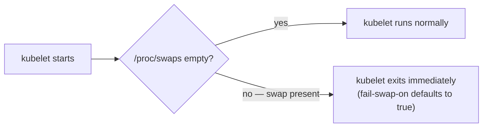
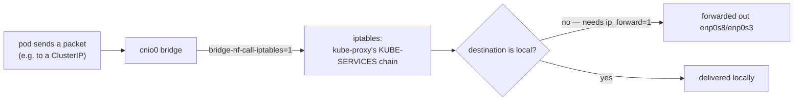

# 01 — Prerequisites

## Where to run things

Two kinds of steps in this guide:

- **Client machine** — wherever you run `ssh`/`scp` from. This is where
  certs and kubeconfigs get *generated*, then distributed out to the nodes
  that need them. **For this setup, that's `server` (`lab-server`,
  192.168.56.10)** — the guide is driven entirely from there, not from the
  desktop.
- **Node steps** — run directly on the named VM (`master1`, `node1`, etc.),
  usually via `ssh admin@<node>`.

Some upstream/generic advice below still mentions "your desktop" as an
alternative client machine (it already has passwordless SSH to every node,
see the root [README](../../README.md)) — ignore that for this setup;
every "client machine" block is meant to be run on `server`.

Docs that involve only one machine for their whole length (02, 03, 04, 07,
09, 11) say so once, right at the top. Docs that move between machines
(01, 05, 06, 08, 10, 12, 14, 16) put a **`Run on:`** line right before
every block that changes context, naming the exact machine(s).

One recurring pattern to watch for: if a block loops over multiple hosts
via `ssh admin@<host>` *inside* it, `Run on:` still says **client
machine** — the loop itself is what reaches out to the remote hosts; you
never leave your own shell. A block is only "on `masterN`"/"on `nodeN`"
when the instruction is to `ssh` in *first* and then paste the block
directly into that node's own shell.

Role ↔ hostname legend, since this guide uses both interchangeably:

| Role in conversation      | Actual hostname(s)      |
|----------------------------|--------------------------|
| load balancer / jump host  | `server`                 |
| control plane / master     | `master1`, `master2`, `master3` |
| worker / data plane        | `node1`, `node2`, `node3` |

## 1. Confirm connectivity to every node

**Run on:** client machine (this loops over every node via `ssh` — you
don't need to be logged into any node yourself).

```bash
for h in lab-server lab-master1 lab-master2 lab-master3 lab-node1 lab-node2 lab-node3; do
  echo "== $h =="; ssh admin@$h 'hostname; uname -r'
done
```

If `lab-*` hostnames aren't resolving, use the raw IPs instead
(`192.168.56.10-15`, plus `192.168.56.16` for `master3`), or check
`/etc/hosts` on `server` (populated by `ansible/playbooks/lab-hostnames.yml`
— note `master3` was added later, so re-run that playbook if its
`lab-master3` line is missing).

## 2. Confirm swap is off and sysctls are set

`vagrant/scripts/provision-common.sh` already did this at VM creation time,
but verify — a live kubelet will refuse to start with swap on:

**Run on:** client machine (loops over `master1-3` + `node1-3` via `ssh`).

```bash
for h in lab-master1 lab-master2 lab-master3 lab-node1 lab-node2 lab-node3; do
  echo "== $h =="
  ssh admin@$h 'swapon --show; sysctl net.ipv4.ip_forward net.bridge.bridge-nf-call-iptables'
done
```

Expect `swapon --show` to print nothing, and both sysctls to read `= 1`.

### What's actually happening

Swap is a hard gate, checked once at startup:



Kubelet's resource accounting (QoS classes, eviction thresholds, cgroup
memory limits) assumes a container that hits its memory limit gets OOM
killed — a deterministic, visible failure. Swap breaks that assumption
(the container just gets slow instead), so rather than run with unclear
semantics, kubelet refuses to start at all. This isn't a warning you can
miss; it's the whole reason the doc says "will refuse to start."

The two sysctls matter for a completely different reason — they're
gates in the kernel's own packet path, not kubelet's:



By default, Linux bridges are pure L2 switches — traffic crossing one
never touches the `iptables`/netfilter stack at all.
`bridge-nf-call-iptables=1` is what makes bridged traffic visible to
`iptables` in the first place. Without it, every rule `kube-proxy`
programs into its `KUBE-SERVICES` chain (see
[12 §7 — Services](12-smoke-test.md#7-services-nodeport)) would simply
never be consulted for pod-to-pod or pod-to-Service traffic — the packet
would just pass through as if Services didn't exist, even though
`kube-proxy` itself is running fine and the rules genuinely exist.
Separately, `net.ipv4.ip_forward=1` is what lets
this Linux box act as a router at all — by default a Linux host only
accepts packets addressed to *itself* and drops everything else at the
IP layer. Without it, [10 — Pod Network Routes](10-pod-network-routes.md)'s
entire static-route setup would sit in the routing table doing nothing —
routes present, but the kernel refusing to actually forward along them.

## 3. Install client-side tools

**Run on:** client machine.

```bash
cd /tmp
curl -L -o cfssl https://github.com/cloudflare/cfssl/releases/download/v1.6.5/cfssl_1.6.5_linux_amd64
curl -L -o cfssljson https://github.com/cloudflare/cfssl/releases/download/v1.6.5/cfssljson_1.6.5_linux_amd64
chmod +x cfssl cfssljson
sudo mv cfssl cfssljson /usr/local/bin/

curl -L -o kubectl https://dl.k8s.io/release/v1.31.0/bin/linux/amd64/kubectl
chmod +x kubectl
sudo mv kubectl /usr/local/bin/

cfssl version
kubectl version --client
```

## 4. Working directory

Everything generated in this guide (certs, keys, kubeconfigs) is created
under a scratch directory on the client machine, then scp'd out to nodes.
Create it now:

**Run on:** client machine.

```bash
mkdir -p ~/k8s-the-hard-way && cd ~/k8s-the-hard-way
```

Run every command block in the rest of this guide's "client machine"
sections from inside `~/k8s-the-hard-way` unless stated otherwise.

Within it, certs and kubeconfigs are kept apart rather than dumped flat:
[02](02-certificate-authority.md) creates `certificates/<component>/`
(one subdirectory per component — `certificates/ca/`,
`certificates/admin/`, `certificates/kube-apiserver/`, etc. — since every
component's cert gets generated here in one place), and
[03](03-kubernetes-configuration-files.md) creates a flat `kubeconfig/`
directory alongside it.

Each `master*`/`node*` gets its own `~/k8s-the-hard-way` too, as files are
`scp`'d out, but flatter — each node only ever receives a handful of
files, not the full generated set, so no per-component nesting is needed:
a flat `certificates/`, a flat `kubeconfig/`, and (masters only) an
`encryptionkey/` holding `encryption-config.yaml`. See the "Distribute"
steps in 02/03/04 and the note in
[16 — Cleanup](16-cleanup.md).

## 5. Node/IP reference

Reference only — not a command block to run anywhere. Keep it handy; it's
reused verbatim in cert SANs, etcd member lists, and kubeconfig server URLs
throughout the guide.

```
LB_IP=192.168.56.10       # server
MASTER1_IP=192.168.56.11
MASTER2_IP=192.168.56.12
MASTER3_IP=192.168.56.16
NODE1_IP=192.168.56.13
NODE2_IP=192.168.56.14
NODE3_IP=192.168.56.15

SERVICE_CIDR=10.32.0.0/24     # ClusterIP range
CLUSTER_DNS_IP=10.32.0.10     # CoreDNS ClusterIP, must be inside SERVICE_CIDR
POD_CIDR=10.200.0.0/16        # overall pod network
NODE1_POD_CIDR=10.200.0.0/24
NODE2_POD_CIDR=10.200.1.0/24
NODE3_POD_CIDR=10.200.2.0/24
```

Next: [02 — Certificate Authority](02-certificate-authority.md)
