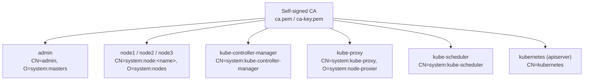
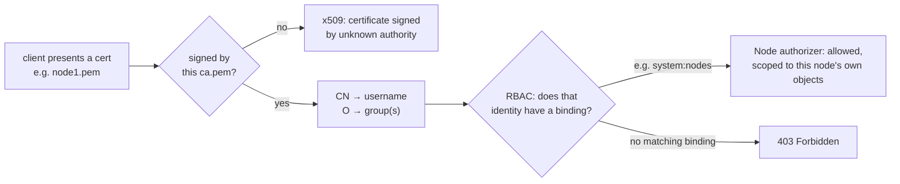

# 02 — Certificate Authority and TLS Certificates

Run all of this on the **client machine**, inside `~/k8s-the-hard-way`.

Every certificate below is signed by one self-signed CA. Kubernetes uses
client-cert auth for component-to-apiserver traffic, so the Common Name
(CN) on each cert maps to a Kubernetes identity, and the Organization (O)
maps to a group — this is what makes RBAC bindings like `system:masters`
or `system:nodes` work.

Everything here goes under `certificates/`, one subdirectory per component
(named for what the cert is *for*, e.g. `kube-apiserver/`, even where
cfssl's own output basename is `kubernetes` because that's the cert's CN)
rather than dumped flat into the working directory:

```bash
mkdir -p certificates/{ca,admin,kube-apiserver,kube-controller-manager,kube-proxy,kube-scheduler,service-account,node1,node2,node3}
```

## 1. Certificate Authority

```bash
cat > certificates/ca/ca-csr.json <<'EOF'
{
  "CN": "Kubernetes",
  "key": {"algo": "rsa", "size": 2048},
  "names": [
    {"C": "US", "L": "Portland", "O": "Kubernetes", "OU": "CA", "ST": "Oregon"}
  ]
}
EOF

cat > certificates/ca/ca-config.json <<'EOF'
{
  "signing": {
    "default": {"expiry": "8760h"},
    "profiles": {
      "kubernetes": {
        "usages": ["signing", "key encipherment", "server auth", "client auth"],
        "expiry": "8760h"
      }
    }
  }
}
EOF

cfssl gencert -initca certificates/ca/ca-csr.json | cfssljson -bare certificates/ca/ca
```

This produces `certificates/ca/ca-key.pem` (guard this — anyone with it
can mint valid cluster certs) and `certificates/ca/ca.pem` (the public
cert, distributed to every node).

## 2. Admin client cert

Used by `kubectl` as the cluster admin. `O: system:masters` binds it to the
built-in cluster-admin ClusterRole.

```bash
cat > certificates/admin/admin-csr.json <<'EOF'
{
  "CN": "admin",
  "key": {"algo": "rsa", "size": 2048},
  "names": [
    {"C": "US", "L": "Portland", "O": "system:masters", "OU": "Kubernetes The Hard Way", "ST": "Oregon"}
  ]
}
EOF

cfssl gencert \
  -ca=certificates/ca/ca.pem -ca-key=certificates/ca/ca-key.pem -config=certificates/ca/ca-config.json \
  -profile=kubernetes certificates/admin/admin-csr.json | cfssljson -bare certificates/admin/admin
```

## 3. Kubelet client certs (one per worker node)

The node authorizer requires CN `system:node:<nodename>` and
`O: system:nodes`, and the cert must include the node's hostname and IP as
SANs.

```bash
for i in 1 2 3; do
  node="node${i}"
  ip_var="NODE${i}_IP"
  ip="192.168.56.1$((2+i))"   # node1=.13 node2=.14 node3=.15

cat > certificates/${node}/${node}-csr.json <<EOF
{
  "CN": "system:node:${node}",
  "key": {"algo": "rsa", "size": 2048},
  "names": [
    {"C": "US", "L": "Portland", "O": "system:nodes", "OU": "Kubernetes The Hard Way", "ST": "Oregon"}
  ]
}
EOF

  cfssl gencert \
    -ca=certificates/ca/ca.pem -ca-key=certificates/ca/ca-key.pem -config=certificates/ca/ca-config.json \
    -hostname=${node},lab-${node},${ip} \
    -profile=kubernetes certificates/${node}/${node}-csr.json | cfssljson -bare certificates/${node}/${node}
done
```

## 4. kube-controller-manager, kube-proxy, kube-scheduler client certs

```bash
cat > certificates/kube-controller-manager/kube-controller-manager-csr.json <<'EOF'
{
  "CN": "system:kube-controller-manager",
  "key": {"algo": "rsa", "size": 2048},
  "names": [
    {"C": "US", "L": "Portland", "O": "system:kube-controller-manager", "OU": "Kubernetes The Hard Way", "ST": "Oregon"}
  ]
}
EOF
cfssl gencert -ca=certificates/ca/ca.pem -ca-key=certificates/ca/ca-key.pem -config=certificates/ca/ca-config.json \
  -profile=kubernetes certificates/kube-controller-manager/kube-controller-manager-csr.json | cfssljson -bare certificates/kube-controller-manager/kube-controller-manager

cat > certificates/kube-proxy/kube-proxy-csr.json <<'EOF'
{
  "CN": "system:kube-proxy",
  "key": {"algo": "rsa", "size": 2048},
  "names": [
    {"C": "US", "L": "Portland", "O": "system:node-proxier", "OU": "Kubernetes The Hard Way", "ST": "Oregon"}
  ]
}
EOF
cfssl gencert -ca=certificates/ca/ca.pem -ca-key=certificates/ca/ca-key.pem -config=certificates/ca/ca-config.json \
  -profile=kubernetes certificates/kube-proxy/kube-proxy-csr.json | cfssljson -bare certificates/kube-proxy/kube-proxy

cat > certificates/kube-scheduler/kube-scheduler-csr.json <<'EOF'
{
  "CN": "system:kube-scheduler",
  "key": {"algo": "rsa", "size": 2048},
  "names": [
    {"C": "US", "L": "Portland", "O": "system:kube-scheduler", "OU": "Kubernetes The Hard Way", "ST": "Oregon"}
  ]
}
EOF
cfssl gencert -ca=certificates/ca/ca.pem -ca-key=certificates/ca/ca-key.pem -config=certificates/ca/ca-config.json \
  -profile=kubernetes certificates/kube-scheduler/kube-scheduler-csr.json | cfssljson -bare certificates/kube-scheduler/kube-scheduler
```

## 5. kube-apiserver cert

This one needs every address a client might use to reach the API server as
a SAN: all three master IPs, the LB IP, the Kubernetes Service cluster IP
(`10.32.0.1`, first address in `SERVICE_CIDR`), localhost, and the internal
DNS names the `kubernetes` Service resolves to.

```bash
cat > certificates/kube-apiserver/kubernetes-csr.json <<'EOF'
{
  "CN": "kubernetes",
  "key": {"algo": "rsa", "size": 2048},
  "names": [
    {"C": "US", "L": "Portland", "O": "Kubernetes", "OU": "Kubernetes The Hard Way", "ST": "Oregon"}
  ]
}
EOF

cfssl gencert \
  -ca=certificates/ca/ca.pem -ca-key=certificates/ca/ca-key.pem -config=certificates/ca/ca-config.json \
  -hostname=10.32.0.1,192.168.56.10,192.168.56.11,192.168.56.12,192.168.56.16,127.0.0.1,lab-server,lab-master1,lab-master2,lab-master3,kubernetes.default \
  -profile=kubernetes certificates/kube-apiserver/kubernetes-csr.json | cfssljson -bare certificates/kube-apiserver/kubernetes
```

(the output files keep the `kubernetes` basename — `kubernetes.pem`/
`kubernetes-key.pem` — because that's the cert's CN; only the *directory*
is named for the component that consumes it, `kube-apiserver/`.)

## 6. Service account key pair

Not a cert — a plain RSA key pair the controller manager uses to sign
service account tokens, and the API server uses to verify them.

```bash
cat > certificates/service-account/service-account-csr.json <<'EOF'
{
  "CN": "service-accounts",
  "key": {"algo": "rsa", "size": 2048},
  "names": [
    {"C": "US", "L": "Portland", "O": "Kubernetes", "OU": "Kubernetes The Hard Way", "ST": "Oregon"}
  ]
}
EOF

cfssl gencert \
  -ca=certificates/ca/ca.pem -ca-key=certificates/ca/ca-key.pem -config=certificates/ca/ca-config.json \
  -profile=kubernetes certificates/service-account/service-account-csr.json | cfssljson -bare certificates/service-account/service-account
```

## 7. Distribute certificates

Unlike the client machine's `certificates/<component>/` split (useful
there since every component's cert gets generated in one place), each
node only ever receives a handful of files, so they land flat in a single
`~/k8s-the-hard-way/certificates/` — `mkdir -p` it first (`scp` doesn't
create missing directories). Workers only ever receive `ca.pem`, never
`ca-key.pem` (the CA private key stays on the client machine and the
masters that need it for signing).

```bash
for node in node1 node2 node3; do
  ssh admin@lab-${node} "mkdir -p ~/k8s-the-hard-way/certificates"
  scp certificates/ca/ca.pem certificates/${node}/${node}-key.pem certificates/${node}/${node}.pem \
      admin@lab-${node}:~/k8s-the-hard-way/certificates/
done

for master in master1 master2 master3; do
  ssh admin@lab-${master} "mkdir -p ~/k8s-the-hard-way/certificates"
  scp certificates/ca/ca.pem certificates/ca/ca-key.pem \
      certificates/kube-apiserver/kubernetes-key.pem certificates/kube-apiserver/kubernetes.pem \
      certificates/service-account/service-account-key.pem certificates/service-account/service-account.pem \
      admin@lab-${master}:~/k8s-the-hard-way/certificates/
done
```

`kube-proxy`, `kube-controller-manager`, `kube-scheduler`, and `admin`
certs stay on the client machine for now — they get embedded into
kubeconfigs in the next step rather than copied raw.

### What's actually happening

Every cert generated in this doc traces back to the one CA:



At connection time, `kube-apiserver` (configured with
`--client-ca-file=/var/lib/kubernetes/ca.pem`, doc 06 §2) does two
separate checks, and it's worth keeping them apart because they fail
differently:



The CN/O values aren't arbitrary strings — `system:masters`,
`system:nodes`, `system:kube-scheduler`, etc. are Kubernetes' own
built-in group names, already bound to built-in ClusterRoles before
you've created a single RBAC object yourself. That's *why* the JSON
templates above are so rigid: get the `O` field wrong and the cert still
passes TLS verification fine (it's correctly signed), but `kube-apiserver`
extracts a group nothing is bound to, and every request comes back `403`
instead of a TLS error — a completely different failure to debug for. A
missing SAN (a hostname/IP the cert doesn't list) fails at the TLS layer
instead, before RBAC is ever consulted — which is exactly the failure
mode the `master3` note right below walks through.

The `service-account` key pair from §6 is deliberately not part of
either diagram above — it's never presented in a TLS handshake at all.
`kube-controller-manager` uses its private half to *sign* service
account JWTs, and `kube-apiserver` uses the public half only to *verify*
a token's signature — a completely different trust mechanism (JWT
signing) riding on the same CA-issued keypair machinery for convenience.

**Adding `master3` to an already-running 2-master cluster:** the
`kubernetes` cert above was just regenerated with `master3`'s IP added to
its SAN list — that's a *new* cert, not an update to the old one, so
`master1` and `master2` also need the fresh
`certificates/kube-apiserver/kubernetes.pem`/`kubernetes-key.pem` copied
over (the `for master in ...` loop above already covers all three),
followed by `sudo systemctl restart kube-apiserver` on `master1` and
`master2` to pick it up. Skipping this leaves the old cert in place there,
which lacks `master3`'s SAN — harmless for `master1`/`master2` themselves
(clients aren't connecting to `master3`'s IP through them), but worth
doing so all three masters are running from the same cert going forward.

Next: [03 — Kubernetes Configuration Files](03-kubernetes-configuration-files.md)
