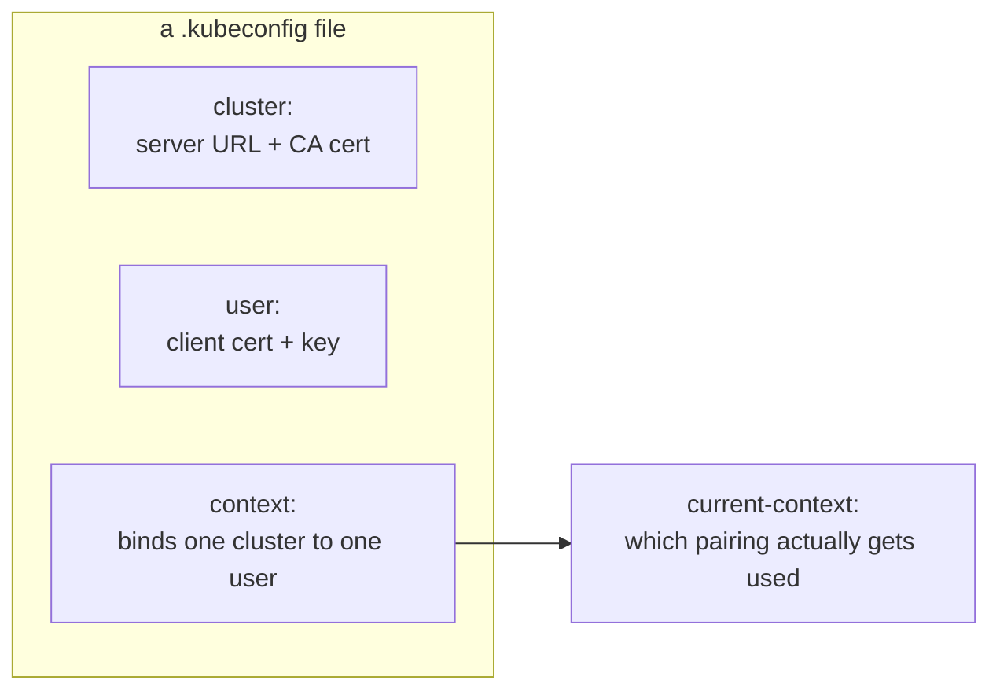
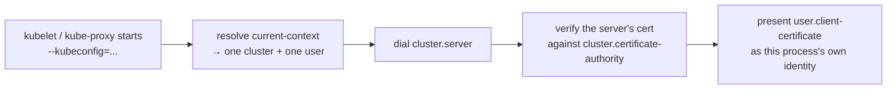

# 03 — Kubernetes Configuration Files (kubeconfigs)

Run all of this on the **client machine**, inside `~/k8s-the-hard-way`.

Each kubeconfig bundles a server URL, the CA cert, and a client
cert/key — this is what lets `kubectl`, `kubelet`, `kube-proxy`, etc. auth
to the API server. Worker-facing kubeconfigs point at the **load balancer**
(`192.168.56.10:6443`), not at either master directly, so they keep working
if one control-plane node goes down.

Kubeconfigs go in their own `kubeconfig/` directory (siblings of
`certificates/` from [02](02-certificate-authority.md)), not mixed in with
the certs they embed:

```bash
mkdir -p kubeconfig
LB_IP=192.168.56.10
```

### What's actually happening

Every `kubectl config set-*` call below is editing the same underlying
structure — three parts, one file:



And here's what that structure is *for*, once a process actually starts
using the file:



`--embed-certs=true` inlines the actual PEM bytes into the kubeconfig
(base64'd) rather than storing a file path — that's why these files are
self-contained and safe to `scp` to another machine without also copying
`certificates/` alongside them.

`cluster.server` is the field worth being paranoid about: it's just a
string, built here from a shell variable
(`--server=https://${LB_IP}:6443`), and nothing checks it's sane at
generation time. If `LB_IP` was ever empty in the shell that ran this —
easy to hit if the `LB_IP=192.168.56.10` line above and the block that
uses it end up run in separate sessions — the embedded server URL
becomes literally `https://:6443`. That's not a parse error; an empty
host in a URL is treated as `localhost`, so the process quietly tries to
reach an apiserver on *itself* instead of the LB, gets connection
refused (nothing listens on `:6443` locally), and every symptom points
at networking when the actual bug is a blank variable baked into a file
minutes earlier. Worth grepping for directly if something downstream
can't reach the API server for no visible reason:
`grep server: kubeconfig/*.kubeconfig`.

## 1. kubelet kubeconfigs (one per worker node)

```bash
for i in 1 2 3; do
  node="node${i}"

  kubectl config set-cluster kubernetes-the-hard-way \
    --certificate-authority=certificates/ca/ca.pem \
    --embed-certs=true \
    --server=https://${LB_IP}:6443 \
    --kubeconfig=kubeconfig/${node}.kubeconfig

  kubectl config set-credentials system:node:${node} \
    --client-certificate=certificates/${node}/${node}.pem \
    --client-key=certificates/${node}/${node}-key.pem \
    --embed-certs=true \
    --kubeconfig=kubeconfig/${node}.kubeconfig

  kubectl config set-context default \
    --cluster=kubernetes-the-hard-way \
    --user=system:node:${node} \
    --kubeconfig=kubeconfig/${node}.kubeconfig

  kubectl config use-context default --kubeconfig=kubeconfig/${node}.kubeconfig
done
```

## 2. kube-proxy kubeconfig

```bash
kubectl config set-cluster kubernetes-the-hard-way \
  --certificate-authority=certificates/ca/ca.pem \
  --embed-certs=true \
  --server=https://${LB_IP}:6443 \
  --kubeconfig=kubeconfig/kube-proxy.kubeconfig

kubectl config set-credentials system:kube-proxy \
  --client-certificate=certificates/kube-proxy/kube-proxy.pem \
  --client-key=certificates/kube-proxy/kube-proxy-key.pem \
  --embed-certs=true \
  --kubeconfig=kubeconfig/kube-proxy.kubeconfig

kubectl config set-context default \
  --cluster=kubernetes-the-hard-way \
  --user=system:kube-proxy \
  --kubeconfig=kubeconfig/kube-proxy.kubeconfig

kubectl config use-context default --kubeconfig=kubeconfig/kube-proxy.kubeconfig
```

## 3. kube-controller-manager kubeconfig

Talks to the **local** API server over loopback (each master runs its own
controller-manager against its own apiserver instance), so this one points
at `127.0.0.1:6443`, not the LB.

```bash
kubectl config set-cluster kubernetes-the-hard-way \
  --certificate-authority=certificates/ca/ca.pem \
  --embed-certs=true \
  --server=https://127.0.0.1:6443 \
  --kubeconfig=kubeconfig/kube-controller-manager.kubeconfig

kubectl config set-credentials system:kube-controller-manager \
  --client-certificate=certificates/kube-controller-manager/kube-controller-manager.pem \
  --client-key=certificates/kube-controller-manager/kube-controller-manager-key.pem \
  --embed-certs=true \
  --kubeconfig=kubeconfig/kube-controller-manager.kubeconfig

kubectl config set-context default \
  --cluster=kubernetes-the-hard-way \
  --user=system:kube-controller-manager \
  --kubeconfig=kubeconfig/kube-controller-manager.kubeconfig

kubectl config use-context default --kubeconfig=kubeconfig/kube-controller-manager.kubeconfig
```

## 4. kube-scheduler kubeconfig

Also loopback, same reasoning.

```bash
kubectl config set-cluster kubernetes-the-hard-way \
  --certificate-authority=certificates/ca/ca.pem \
  --embed-certs=true \
  --server=https://127.0.0.1:6443 \
  --kubeconfig=kubeconfig/kube-scheduler.kubeconfig

kubectl config set-credentials system:kube-scheduler \
  --client-certificate=certificates/kube-scheduler/kube-scheduler.pem \
  --client-key=certificates/kube-scheduler/kube-scheduler-key.pem \
  --embed-certs=true \
  --kubeconfig=kubeconfig/kube-scheduler.kubeconfig

kubectl config set-context default \
  --cluster=kubernetes-the-hard-way \
  --user=system:kube-scheduler \
  --kubeconfig=kubeconfig/kube-scheduler.kubeconfig

kubectl config use-context default --kubeconfig=kubeconfig/kube-scheduler.kubeconfig
```

## 5. admin kubeconfig

Also loopback — used for local `kubectl` diagnostics on a master itself.
The separate remote admin kubeconfig (pointed at the LB, for your client
machine — `server`) is built in [09 — Configuring kubectl](09-configuring-kubectl.md).

```bash
kubectl config set-cluster kubernetes-the-hard-way \
  --certificate-authority=certificates/ca/ca.pem \
  --embed-certs=true \
  --server=https://127.0.0.1:6443 \
  --kubeconfig=kubeconfig/admin.kubeconfig

kubectl config set-credentials admin \
  --client-certificate=certificates/admin/admin.pem \
  --client-key=certificates/admin/admin-key.pem \
  --embed-certs=true \
  --kubeconfig=kubeconfig/admin.kubeconfig

kubectl config set-context default \
  --cluster=kubernetes-the-hard-way \
  --user=admin \
  --kubeconfig=kubeconfig/admin.kubeconfig

kubectl config use-context default --kubeconfig=kubeconfig/admin.kubeconfig
```

## 6. Distribute kubeconfigs

```bash
for node in node1 node2 node3; do
  ssh admin@lab-${node} "mkdir -p ~/k8s-the-hard-way/kubeconfig"
  scp kubeconfig/${node}.kubeconfig kubeconfig/kube-proxy.kubeconfig \
      admin@lab-${node}:~/k8s-the-hard-way/kubeconfig/
done

for master in master1 master2 master3; do
  ssh admin@lab-${master} "mkdir -p ~/k8s-the-hard-way/kubeconfig"
  scp kubeconfig/admin.kubeconfig kubeconfig/kube-controller-manager.kubeconfig kubeconfig/kube-scheduler.kubeconfig \
      admin@lab-${master}:~/k8s-the-hard-way/kubeconfig/
done
```

Next: [04 — Data Encryption Config](04-data-encryption-config.md)
