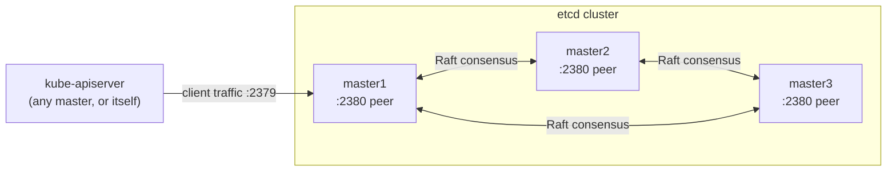
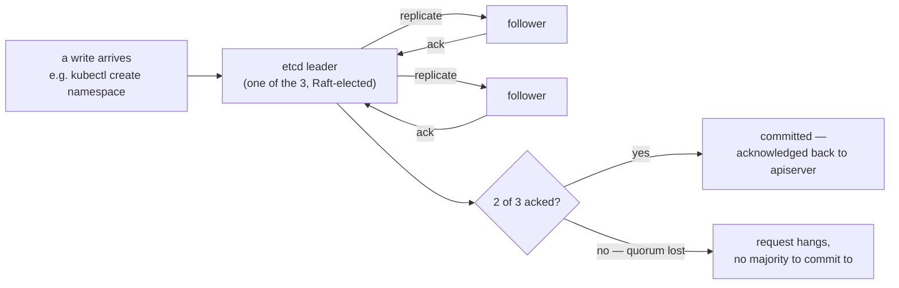
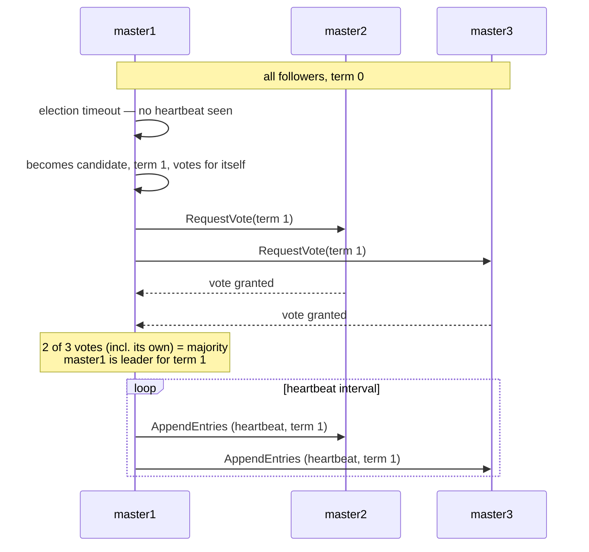
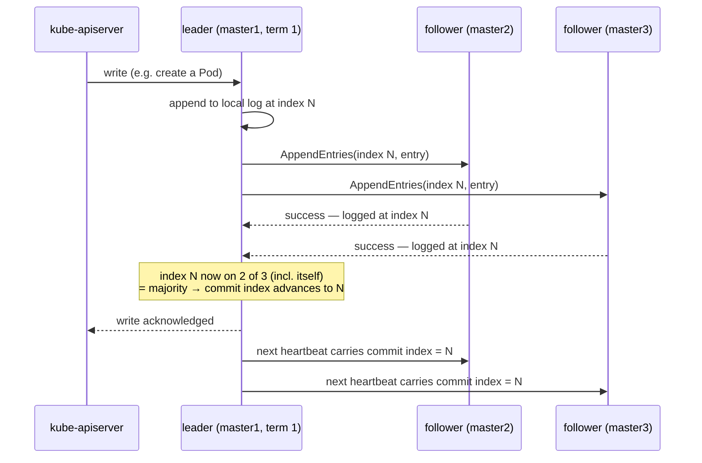
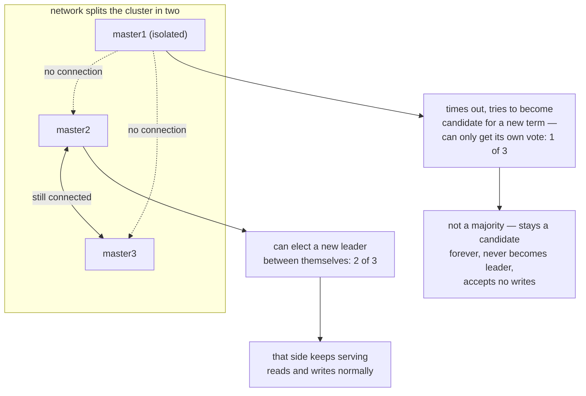

# 05 — Bootstrapping the etcd Cluster

Run on **`master1`, `master2`, and `master3`** unless a step says
otherwise. SSH in first: `ssh admin@lab-master1` (repeat for master2,
master3).

3 members gives this etcd cluster real fault tolerance — see
[the README](../README.md#etcd-fault-tolerance) for why an odd count
matters.

> **Already ran this guide with just `master1`/`master2` and now adding
> `master3` to a live cluster?** The steps below assume a fresh bootstrap
> of all three at once (`--initial-cluster-state new`). Skip to
> [§6 — Adding master3 to an already-running cluster](#6-adding-master3-to-an-already-running-cluster)
> instead — joining a live cluster needs a `member add` call first and a
> different `--initial-cluster-state`.

## 1. Download and install etcd

**Run on:** `master1`, `master2`, `master3` — repeat this whole doc's
steps 1-4 on each, one node at a time (`ssh admin@lab-master1`, do steps
1-4, then `ssh admin@lab-master2`, etc.) or interleaved — just make sure
each node finishes its own copy of every step.

```bash
wget -q --show-progress --https-only \
  "https://github.com/etcd-io/etcd/releases/download/v3.5.15/etcd-v3.5.15-linux-amd64.tar.gz"

tar -xvf etcd-v3.5.15-linux-amd64.tar.gz
sudo mv etcd-v3.5.15-linux-amd64/etcd* /usr/local/bin/
etcd --version
```

## 2. Configure the etcd server

```bash
sudo mkdir -p /etc/etcd /var/lib/etcd
sudo chmod 700 /var/lib/etcd
sudo cp ~/k8s-the-hard-way/certificates/ca.pem \
        ~/k8s-the-hard-way/certificates/kubernetes-key.pem \
        ~/k8s-the-hard-way/certificates/kubernetes.pem \
        /etc/etcd/
```

Set this node's own IP and name (run on each node with its own values):

```bash
# On master1:
INTERNAL_IP=192.168.56.11
ETCD_NAME=master1

# On master2:
INTERNAL_IP=192.168.56.12
ETCD_NAME=master2

# On master3:
INTERNAL_IP=192.168.56.16
ETCD_NAME=master3
```

## 3. Create the systemd unit

The `--initial-cluster` list is identical on all three nodes — every
member needs to agree on the full membership up front.

```bash
cat <<EOF | sudo tee /etc/systemd/system/etcd.service
[Unit]
Description=etcd
Documentation=https://github.com/etcd-io/etcd

[Service]
Type=notify
ExecStart=/usr/local/bin/etcd \\
  --name ${ETCD_NAME} \\
  --cert-file=/etc/etcd/kubernetes.pem \\
  --key-file=/etc/etcd/kubernetes-key.pem \\
  --peer-cert-file=/etc/etcd/kubernetes.pem \\
  --peer-key-file=/etc/etcd/kubernetes-key.pem \\
  --trusted-ca-file=/etc/etcd/ca.pem \\
  --peer-trusted-ca-file=/etc/etcd/ca.pem \\
  --peer-client-cert-auth \\
  --client-cert-auth \\
  --initial-advertise-peer-urls https://${INTERNAL_IP}:2380 \\
  --listen-peer-urls https://${INTERNAL_IP}:2380 \\
  --listen-client-urls https://${INTERNAL_IP}:2379,https://127.0.0.1:2379 \\
  --advertise-client-urls https://${INTERNAL_IP}:2379 \\
  --initial-cluster-token etcd-cluster-0 \\
  --initial-cluster master1=https://192.168.56.11:2380,master2=https://192.168.56.12:2380,master3=https://192.168.56.16:2380 \\
  --initial-cluster-state new \\
  --data-dir=/var/lib/etcd
Restart=on-failure
RestartSec=5

[Install]
WantedBy=multi-user.target
EOF
```

## 4. Start etcd

```bash
sudo systemctl daemon-reload
sudo systemctl enable etcd
sudo systemctl start etcd
sudo systemctl status etcd --no-pager
```

Do this on `master1`, `master2`, and `master3` roughly together — with
`--initial-cluster-state new` and all three members listed, each node will
wait to hear from its peers before forming quorum (a majority of 3, i.e.
2), so starting them one at a time with a delay is fine; the cluster just
won't report healthy until at least 2 are up.

## 5. Verify the cluster

**Run on:** any one of `master1`/`master2`/`master3` — this is a read
against the whole cluster, not a per-node step.

```bash
sudo ETCDCTL_API=3 etcdctl member list \
  --endpoints=https://127.0.0.1:2379 \
  --cacert=/etc/etcd/ca.pem \
  --cert=/etc/etcd/kubernetes.pem \
  --key=/etc/etcd/kubernetes-key.pem
```

Expect three members listed, all `started`, pointing at `.11:2380`,
`.12:2380`, and `.16:2380`.

### What's actually happening

Two separate ports, two separate jobs — worth not conflating them:



`:2380` (`--listen-peer-urls`) is exclusively etcd-to-etcd Raft traffic —
leader election and log replication, authenticated with the peer cert
flags. `:2379` (`--listen-client-urls`) is what `kube-apiserver` actually
talks to; it never touches `:2380` at all. Confusing the two when
reading `--initial-cluster master1=https://...:2380,...` is an easy
mistake — that list is peer addresses, not where you'd point an
apiserver.

What quorum actually buys you, on a write:



A write only counts as durable once a *majority* of members have it on
disk — for 3 members that's 2, which is exactly why losing any single
one still lets the cluster keep accepting writes (the surviving 2 are
still a majority of 3), but losing a second one stops it cold: 1
survivor can't out-vote nothing, so every write (and even reads, which
also require a quorum round-trip by default) just hangs rather than
serving possibly-stale data. That boundary — one loss tolerated, two
losses not — is exactly what
[14 §5](14-ha-deep-dive.md#5-the-etcd-quorum-boundary--where-ha-stops-and-dr-starts)
demonstrates live, and it's *why* an odd member count matters at all
(see [the README](../README.md#etcd-fault-tolerance)): an even count
would need the exact same majority to survive a loss, for no added
tolerance, just a wasted member.

This is also why `master3` joining an already-running cluster
(§6 below) can't just start up on its own with the full member list —
until the existing members explicitly `member add` it, it isn't part of
anyone's quorum math yet, so nothing it says would count as a vote.

### Raft in more detail: how "2 of 3" is actually enforced

The diagrams above show *what* quorum guarantees; this is *how* Raft (the
consensus algorithm etcd implements) actually makes only one leader and
only one committed history possible, even across network failures. Worth
understanding once, since **every single write Kubernetes ever makes** —
every `kubectl create`, every kubelet status update — bottoms out in this
exact mechanism. `kube-apiserver` itself keeps no state of its own and
has no separate "Kubernetes-level" quorum; it's stateless and defers
entirely to etcd for anything durable.

**Leader election.** Every member starts a follower. If a follower goes
too long without hearing from a leader, it assumes there isn't one and
starts an election:



The **term** number is the whole trick: it only ever increases, every
member votes at most once per term, and any message carrying an older
term than a member has already seen is rejected outright. That's what
makes two simultaneous leaders structurally impossible, not just
unlikely — a second candidate would need a majority of votes *in a term
no one else has already voted in*, and there's only one such term at a
time.

**Log replication and the commit index.** A write isn't "done" the
moment the leader has it — only once a majority have it durably:



This is the literal mechanics behind "2 of 3 acked" from the simpler
diagram above — the leader doesn't tell `kube-apiserver` "committed"
until a majority have the entry on disk, so even if the leader died the
instant after acknowledging, the entry survives on at least one
remaining member of any future majority.

**Why a network partition doesn't produce two leaders.** This is the
scenario the term mechanism above exists for:



The isolated minority can increment its own term and ask for votes all
it wants — it physically cannot reach enough members to form a majority,
so it can never produce a leader, ever, for as long as the partition
lasts. The majority side, meanwhile, can freely elect a new leader in a
higher term and keep going. That asymmetry — a minority can always be
outvoted, a majority never needs the missing members' permission — is
the entire reason "2 of 3" is safe to treat as "the cluster," full stop.

## 6. Adding master3 to an already-running cluster

Only relevant if `master1`/`master2` etcd were already up and running
before `master3` existed — skip this section on a fresh 3-node bootstrap.

Unlike a fresh bootstrap, a running cluster must be told about the new
member **before** it starts, and the new member joins with
`--initial-cluster-state existing` instead of `new`.

**On `master1` or `master2` (an existing, already-running member):**

```bash
sudo ETCDCTL_API=3 etcdctl member add master3 \
  --peer-urls=https://192.168.56.16:2380 \
  --endpoints=https://127.0.0.1:2379 \
  --cacert=/etc/etcd/ca.pem \
  --cert=/etc/etcd/kubernetes.pem \
  --key=/etc/etcd/kubernetes-key.pem
```

**On `master3`:** follow steps 1-2 above (install etcd, copy certs), then
create the systemd unit exactly as in step 3 but with
`--initial-cluster-state existing` instead of `new` — the
`--initial-cluster` value stays the same full 3-member list either way:

```bash
sudo sed -i 's/--initial-cluster-state new/--initial-cluster-state existing/' \
  /etc/systemd/system/etcd.service
sudo systemctl daemon-reload
sudo systemctl enable etcd
sudo systemctl start etcd
sudo systemctl status etcd --no-pager
```

Then re-run the `member list` command from step 5 (on any master) to
confirm all three show `started`. If `master3` hangs in a non-started
state, double check the `member add` call above actually completed on
`master1`/`master2` first — an etcd process refuses to join as a new
member until its peer URL is already registered in the existing cluster's
membership.

Next: [06 — Bootstrapping the Control Plane](06-bootstrapping-control-plane.md)
