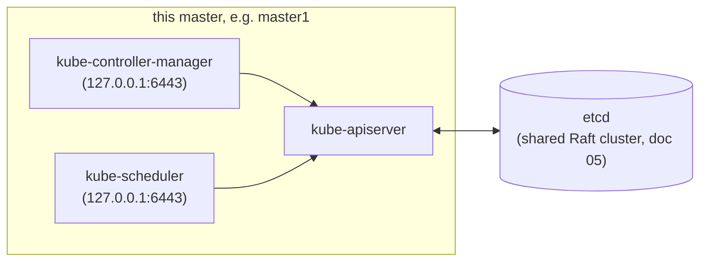
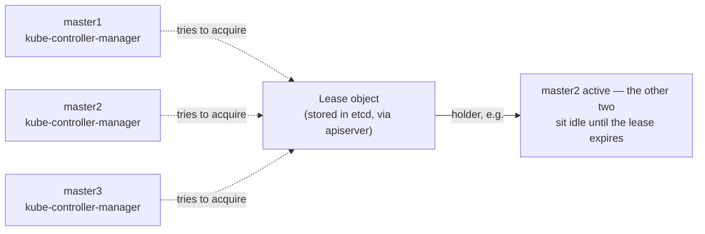

# 06 — Bootstrapping the Control Plane

Run on **`master1`, `master2`, and `master3`** unless stated otherwise.

Each master runs its own full set of `kube-apiserver`,
`kube-controller-manager`, and `kube-scheduler` — they're stateless aside
from leader-election locks they take out in etcd, so running three full
copies is the normal HA pattern (etcd itself needs an odd quorum for a
different reason — see the [README](../README.md#etcd-fault-tolerance) —
but apiserver/controller-manager/scheduler just need "more than one" for
redundancy, any count works).

## 1. Download and install binaries

**Run on:** `master1`, `master2`, `master3` — repeat steps 1-5 on each
(`ssh` in to one, do steps 1-5, move to the next).

```bash
sudo mkdir -p /etc/kubernetes/config

for binary in kube-apiserver kube-controller-manager kube-scheduler kubectl; do
  wget -q --show-progress --https-only \
    "https://dl.k8s.io/v1.31.0/bin/linux/amd64/${binary}"
  chmod +x ${binary}
done
sudo mv kube-apiserver kube-controller-manager kube-scheduler kubectl /usr/local/bin/
```

## 2. Configure kube-apiserver

```bash
sudo mkdir -p /var/lib/kubernetes/

sudo cp ~/k8s-the-hard-way/certificates/ca.pem ~/k8s-the-hard-way/certificates/ca-key.pem \
  ~/k8s-the-hard-way/certificates/kubernetes-key.pem ~/k8s-the-hard-way/certificates/kubernetes.pem \
  ~/k8s-the-hard-way/certificates/service-account-key.pem ~/k8s-the-hard-way/certificates/service-account.pem \
  ~/k8s-the-hard-way/encryptionkey/encryption-config.yaml /var/lib/kubernetes/
```

Set this node's own IP (run on each node with its own value):

```bash
# On master1:
INTERNAL_IP=192.168.56.11

# On master2:
INTERNAL_IP=192.168.56.12

# On master3:
INTERNAL_IP=192.168.56.16
```

```bash
cat <<EOF | sudo tee /etc/systemd/system/kube-apiserver.service
[Unit]
Description=Kubernetes API Server
Documentation=https://github.com/kubernetes/kubernetes

[Service]
ExecStart=/usr/local/bin/kube-apiserver \\
  --advertise-address=${INTERNAL_IP} \\
  --allow-privileged=true \\
  --apiserver-count=3 \\
  --audit-log-maxage=30 \\
  --audit-log-maxbackup=3 \\
  --audit-log-maxsize=100 \\
  --audit-log-path=/var/log/audit.log \\
  --authorization-mode=Node,RBAC \\
  --bind-address=0.0.0.0 \\
  --client-ca-file=/var/lib/kubernetes/ca.pem \\
  --enable-admission-plugins=NamespaceLifecycle,NodeRestriction,LimitRanger,ServiceAccount,DefaultStorageClass,ResourceQuota \\
  --etcd-cafile=/var/lib/kubernetes/ca.pem \\
  --etcd-certfile=/var/lib/kubernetes/kubernetes.pem \\
  --etcd-keyfile=/var/lib/kubernetes/kubernetes-key.pem \\
  --etcd-servers=https://192.168.56.11:2379,https://192.168.56.12:2379,https://192.168.56.16:2379 \\
  --encryption-provider-config=/var/lib/kubernetes/encryption-config.yaml \\
  --kubelet-certificate-authority=/var/lib/kubernetes/ca.pem \\
  --kubelet-client-certificate=/var/lib/kubernetes/kubernetes.pem \\
  --kubelet-client-key=/var/lib/kubernetes/kubernetes-key.pem \\
  --runtime-config='api/all=true' \\
  --service-account-key-file=/var/lib/kubernetes/service-account.pem \\
  --service-account-signing-key-file=/var/lib/kubernetes/service-account-key.pem \\
  --service-account-issuer=https://192.168.56.10:6443 \\
  --service-cluster-ip-range=10.32.0.0/24 \\
  --service-node-port-range=30000-32767 \\
  --tls-cert-file=/var/lib/kubernetes/kubernetes.pem \\
  --tls-private-key-file=/var/lib/kubernetes/kubernetes-key.pem \\
  --v=2
Restart=on-failure
RestartSec=5

[Install]
WantedBy=multi-user.target
EOF
```

`--service-account-issuer` points at the load balancer since that's the
address every client (including in-cluster ones validating tokens) will
actually reach the API through.

## 3. Configure kube-controller-manager

```bash
sudo cp ~/k8s-the-hard-way/kubeconfig/kube-controller-manager.kubeconfig /var/lib/kubernetes/

cat <<EOF | sudo tee /etc/systemd/system/kube-controller-manager.service
[Unit]
Description=Kubernetes Controller Manager
Documentation=https://github.com/kubernetes/kubernetes

[Service]
ExecStart=/usr/local/bin/kube-controller-manager \\
  --allocate-node-cidrs=true \\
  --cluster-cidr=10.200.0.0/16 \\
  --cluster-name=kubernetes \\
  --cluster-signing-cert-file=/var/lib/kubernetes/ca.pem \\
  --cluster-signing-key-file=/var/lib/kubernetes/ca-key.pem \\
  --kubeconfig=/var/lib/kubernetes/kube-controller-manager.kubeconfig \\
  --leader-elect=true \\
  --root-ca-file=/var/lib/kubernetes/ca.pem \\
  --service-account-private-key-file=/var/lib/kubernetes/service-account-key.pem \\
  --service-cluster-ip-range=10.32.0.0/24 \\
  --use-service-account-credentials=true \\
  --v=2
Restart=on-failure
RestartSec=5

[Install]
WantedBy=multi-user.target
EOF
```

`--leader-elect=true` is what makes running three copies (one per master)
safe — only one becomes active leader at a time, coordinated via a lease
in the API server.

## 4. Configure kube-scheduler

```bash
sudo cp ~/k8s-the-hard-way/kubeconfig/kube-scheduler.kubeconfig /var/lib/kubernetes/

cat <<EOF | sudo tee /etc/kubernetes/config/kube-scheduler.yaml
apiVersion: kubescheduler.config.k8s.io/v1
kind: KubeSchedulerConfiguration
clientConnection:
  kubeconfig: /var/lib/kubernetes/kube-scheduler.kubeconfig
leaderElection:
  leaderElect: true
EOF

cat <<EOF | sudo tee /etc/systemd/system/kube-scheduler.service
[Unit]
Description=Kubernetes Scheduler
Documentation=https://github.com/kubernetes/kubernetes

[Service]
ExecStart=/usr/local/bin/kube-scheduler \\
  --config=/etc/kubernetes/config/kube-scheduler.yaml \\
  --v=2
Restart=on-failure
RestartSec=5

[Install]
WantedBy=multi-user.target
EOF
```

### What's actually happening

`kube-apiserver` is the only component with `--etcd-servers`,
`--etcd-cafile`, etc. — nothing else in this cluster, ever, talks to
etcd directly. `kube-controller-manager` and `kube-scheduler` reach the
API server over loopback, not the LB, since they're running on the exact
same host as the apiserver instance they're using:



Every one of `kubectl`, `kubelet`, `kube-proxy`, `kube-controller-manager`,
and `kube-scheduler` only ever talks to `kube-apiserver` — it's the sole
front door to cluster state, which is exactly why the certs from doc 02
all follow the same client-cert-to-apiserver pattern regardless of which
component they belong to.

Running 3 full copies of this trio (one per master) means there are
actually **three independent leader-election processes** happening at
once, easy to conflate into one:



etcd already ran its own Raft leader election in doc 05 — that leader has
nothing to do with *this* one. `kube-controller-manager`'s active copy
and `kube-scheduler`'s active copy each hold a *separate* `Lease` object
of their own, and there's no rule that ties them to each other or to the
etcd Raft leader — it's entirely possible (and normal) for
`kube-scheduler`'s lease to be held by `master2` while
`kube-controller-manager`'s is held by `master3` and etcd's Raft leader
is `master1`, all at the same time. [14 §1](14-ha-deep-dive.md#1-baseline-whos-actually-in-charge-right-now)
has you check exactly this. Without `--leader-elect=true`, all 3 copies
of each component would act simultaneously — for `kube-scheduler` that
means racing to bind the same Pods to nodes, which is the actual failure
this flag exists to prevent, not just a performance nicety.

## 5. Start the control plane

```bash
sudo systemctl daemon-reload
sudo systemctl enable kube-apiserver kube-controller-manager kube-scheduler
sudo systemctl start kube-apiserver kube-controller-manager kube-scheduler

sleep 5
sudo systemctl status kube-apiserver kube-controller-manager kube-scheduler --no-pager
```

## 6. Verify

**Run on:** any one of `master1`/`master2`/`master3`.

```bash
sudo cp ~/k8s-the-hard-way/kubeconfig/admin.kubeconfig /var/lib/kubernetes/ 2>/dev/null || true
kubectl get componentstatuses --kubeconfig ~/k8s-the-hard-way/kubeconfig/admin.kubeconfig
curl -k https://127.0.0.1:6443/version
```

If `kube-apiserver` fails to start, check `journalctl -u kube-apiserver -n 100 --no-pager` —
the most common causes are a typo'd flag or etcd not reachable yet
(confirm `sudo systemctl status etcd` is healthy on all three masters
first).

**Adding `master3` to an already-running control plane:** this doc's
`--etcd-servers` and `-hostname` cert SANs already include `master3`, so
if `master1`/`master2` were bootstrapped before `master3` existed, restart
their `kube-apiserver` after copying the regenerated `kubernetes.pem`/
`kubernetes-key.pem` (see [02](02-certificate-authority.md)) so they pick
up the new etcd member and cert SANs:
`sudo systemctl restart kube-apiserver` on `master1` and `master2`.

## 7. RBAC: allow kube-apiserver to talk to kubelets

**Run on:** any one of `master1`/`master2`/`master3` — **once**, not on
all three (this is a cluster object, not per-node config — applying it
twice is harmless, just unnecessary).

The apiserver cert's CN is `kubernetes` (not `system:masters` group), so it
needs an explicit ClusterRole + binding to call kubelet APIs (logs, exec,
port-forward) — otherwise `kubectl logs`/`exec` will fail even though
everything else works.

```bash
cat <<EOF | kubectl apply --kubeconfig ~/k8s-the-hard-way/kubeconfig/admin.kubeconfig -f -
apiVersion: rbac.authorization.k8s.io/v1
kind: ClusterRole
metadata:
  annotations:
    rbac.authorization.kubernetes.io/autoupdate: "true"
  labels:
    kubernetes.io/bootstrapping: rbac-defaults
  name: system:kube-apiserver-to-kubelet
rules:
  - apiGroups: [""]
    resources: ["nodes/proxy", "nodes/stats", "nodes/log", "nodes/spec", "nodes/metrics"]
    verbs: ["*"]
---
apiVersion: rbac.authorization.k8s.io/v1
kind: ClusterRoleBinding
metadata:
  name: system:kube-apiserver
  namespace: ""
roleRef:
  apiGroup: rbac.authorization.k8s.io
  kind: ClusterRole
  name: system:kube-apiserver-to-kubelet
subjects:
  - apiGroup: rbac.authorization.k8s.io
    kind: User
    name: kubernetes
EOF
```

Next: [07 — Load Balancer](07-load-balancer.md)
