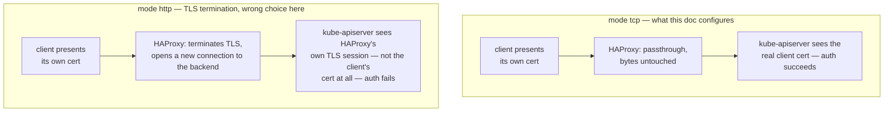

# 07 — Load Balancer

Run on **`server`** (`ssh admin@lab-server`).

The API server terminates its own TLS and does client-cert auth, so the LB
must do plain **TCP passthrough** on 6443 — not TLS termination, which
would break client-cert auth for everything behind it (kubelet, kube-proxy,
kubectl all present their own client certs directly to the apiserver).
HAProxy in `mode tcp` does exactly this.

## 1. Install HAProxy

```bash
sudo apt update
sudo apt install -y haproxy
haproxy -v
```

## 2. Configure

```bash
cat <<'EOF' | sudo tee /etc/haproxy/haproxy.cfg
global
    log /dev/log local0
    maxconn 4096

defaults
    log     global
    mode    tcp
    option  tcplog
    timeout connect 5s
    timeout client  50s
    timeout server  50s

frontend kubernetes-api
    bind *:6443
    default_backend kubernetes-masters

backend kubernetes-masters
    balance roundrobin
    option tcp-check
    server master1 192.168.56.11:6443 check
    server master2 192.168.56.12:6443 check
    server master3 192.168.56.16:6443 check

listen stats
    bind *:9000
    mode http
    stats enable
    stats uri /
    stats refresh 10s
EOF
```

`option tcp-check` makes HAProxy open (and immediately close) a TCP
connection to each backend to decide if it's up — good enough here since a
closed apiserver port is the dominant failure mode in this lab. The `stats`
listener on `:9000` is optional but useful for watching failover live —
reachable at `http://192.168.56.10:9000/` (host-only network only).

### What's actually happening

The single most important line in this config is `mode tcp` — it's the
difference between the LB being invisible to TLS and the LB silently
breaking every client cert that passes through it:



Every client in this guide — `kubectl`, `kubelet`, `kube-proxy` —
authenticates with its own client certificate presented *directly* to
`kube-apiserver` during the TLS handshake (doc 02/03). `mode http` would
have HAProxy decrypt the incoming connection, inspect it as HTTP, then
open a *separate* TLS connection to whichever master it picks — at which
point the apiserver is doing a handshake with HAProxy, not with the
original kubelet or kubectl, so the client cert never arrives. `mode tcp`
skips all of that: HAProxy just relays raw bytes at the TCP layer,
completely blind to what's inside, so the original TLS handshake
(client cert included) reaches `kube-apiserver` unmodified. This is also
why `option tcp-check` (not an HTTP health check) is the right choice —
HAProxy isn't equipped to understand anything above TCP here, by design.

One limitation worth knowing: `tcp-check` only proves the port is open,
not that `kube-apiserver` is actually healthy — a hung or degraded
apiserver process that still holds its listening socket open would keep
looking "up" to HAProxy while genuinely failing requests. Good enough for
this lab (a stopped process closing its socket is the failure mode
[§4](#4-verify) below actually exercises), but worth knowing where the
health check's blind spot is.

## 3. Validate and restart

```bash
sudo haproxy -c -f /etc/haproxy/haproxy.cfg
sudo systemctl restart haproxy
sudo systemctl enable haproxy
sudo systemctl status haproxy --no-pager
```

## 4. Verify

From `server` itself:

```bash
curl -k https://127.0.0.1:6443/version
```

You should get a Kubernetes version JSON response (a `401 Unauthorized`
body is also fine here — that's the apiserver correctly rejecting an
unauthenticated `curl`, and proves TCP passthrough is reaching it. A
connection *refused* or *timeout* means HAProxy or a master's apiserver is
down).

Watch it survive a master going away:

```bash
# on master1
sudo systemctl stop kube-apiserver
# from server
watch -n1 'curl -sk -o /dev/null -w "%{http_code}\n" https://127.0.0.1:6443/version'
# on master1, restore it
sudo systemctl start kube-apiserver
```

The stats page (`:9000/`) should show `master1` flip to red and traffic
shift entirely to `master2` within a couple of health-check intervals.

Next: [08 — Bootstrapping Worker Nodes](08-bootstrapping-worker-nodes.md)
