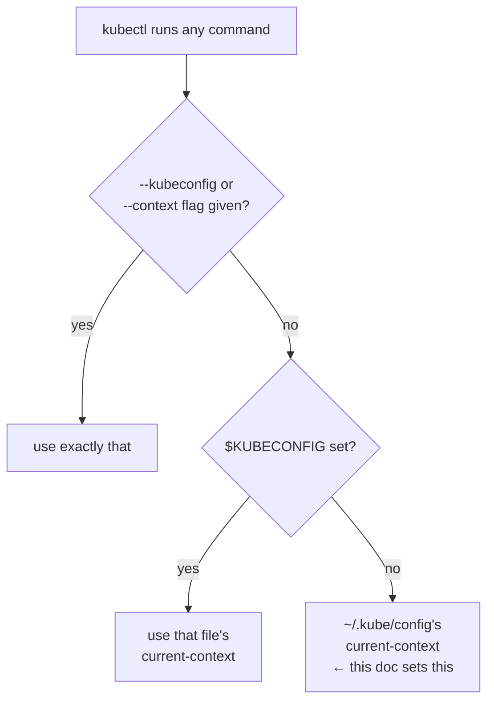

# 09 — Configuring kubectl for Remote Access

Run on your **client machine** (`server`), inside `~/k8s-the-hard-way`.

This builds a kubeconfig that talks to the cluster through the load
balancer, using the admin client cert generated in
[02](02-certificate-authority.md) — this is the config you'll actually use
day-to-day, distinct from the loopback `admin.kubeconfig` copies living on
each master (used only for local diagnostics on that node).

```bash
LB_IP=192.168.56.10

kubectl config set-cluster kubernetes-the-hard-way \
  --certificate-authority=certificates/ca/ca.pem \
  --embed-certs=true \
  --server=https://${LB_IP}:6443

kubectl config set-credentials admin \
  --client-certificate=certificates/admin/admin.pem \
  --client-key=certificates/admin/admin-key.pem

kubectl config set-context kubernetes-the-hard-way \
  --cluster=kubernetes-the-hard-way \
  --user=admin

kubectl config use-context kubernetes-the-hard-way
```

This writes into `~/.kube/config` on the client machine (kubectl's default
location) rather than a standalone file, so it becomes your normal
`kubectl` context immediately.

### What's actually happening

Every other kubeconfig in this guide (doc 03's per-node, per-master
files) was written to a standalone path and always needs an explicit
`--kubeconfig=...` flag to be used at all — that's deliberate, so a
master's loopback `admin.kubeconfig` can't get used by accident from
somewhere it shouldn't be. This doc is the one exception: it targets
`~/.kube/config` specifically so it becomes the *ambient default*,
resolved through a specific order every time `kubectl` runs with no
flags:



That's also why every `kubectl` invocation you've seen so far in docs
05/06/08/12 explicitly passes `--kubeconfig ~/k8s-the-hard-way/kubeconfig/admin.kubeconfig`
— those run *before* this doc, or on a master where `~/.kube/config`
was never populated, so there's no ambient default to fall back to yet.
From here on, plain `kubectl get nodes` with no flags on the client
machine resolves through the bottom path above.

## Verify

```bash
kubectl version
kubectl get componentstatuses
kubectl get nodes
```

Expect all 3 worker nodes `Ready`, and API version info returned without
TLS errors. If you get a certificate error mentioning an IP not in the
SAN list, double check [02](02-certificate-authority.md) step 5 included
`192.168.56.10` in `-hostname=` for the `kubernetes` cert.

Next: [10 — Pod Network Routes](10-pod-network-routes.md)
