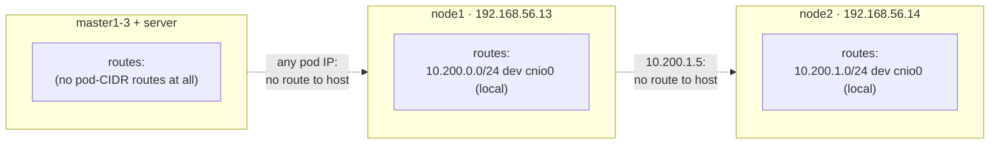
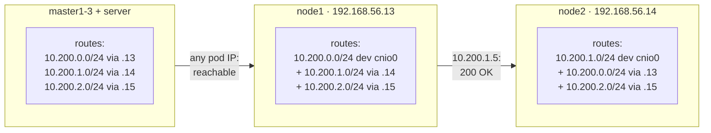

# 10 — Provisioning Pod Network Routes

Each node's CNI bridge only knows how to route to pods **on that node**.
For pod-to-pod traffic across nodes to work, every node needs a static
route for the other two nodes' pod CIDRs, via that node's private IP —
normally a cloud provider's VPC router does this automatically; here we do
it by hand. (An overlay CNI like Cilium's VXLAN mode makes this whole doc
unnecessary — see [13 — Migrating to Cilium](13-migrating-to-cilium.md) if
you go that route later; these routes get removed as part of that
migration.)

Recall the mapping:

| Node  | Node IP        | Pod CIDR       |
|-------|----------------|----------------|
| node1 | 192.168.56.13  | 10.200.0.0/24  |
| node2 | 192.168.56.14  | 10.200.1.0/24  |
| node3 | 192.168.56.15  | 10.200.2.0/24  |

## Add routes on every node (node1-3, master1-3, server)

(This is the manual static-route approach. The alternative — an overlay
network that makes these routes unnecessary — is exactly what
[13 — Migrating to Cilium](13-migrating-to-cilium.md) sets up later.)

**Run on:** all 7 VMs — `node1`, `node2`, `node3`, `master1`, `master2`,
`master3`, and `server` (masters and the LB need it too, so `kubectl
exec`/health checks/anything originating from them can reach pod IPs
directly). SSH into each one and paste only the block for that host below
— adjust to skip the node's own CIDR:

```bash
# Run on node1:
sudo ip route add 10.200.1.0/24 via 192.168.56.14
sudo ip route add 10.200.2.0/24 via 192.168.56.15

# Run on node2:
sudo ip route add 10.200.0.0/24 via 192.168.56.13
sudo ip route add 10.200.2.0/24 via 192.168.56.15

# Run on node3:
sudo ip route add 10.200.0.0/24 via 192.168.56.13
sudo ip route add 10.200.1.0/24 via 192.168.56.14

# Run on master1, master2, master3, and server (all three pod CIDRs):
sudo ip route add 10.200.0.0/24 via 192.168.56.13
sudo ip route add 10.200.1.0/24 via 192.168.56.14
sudo ip route add 10.200.2.0/24 via 192.168.56.15
```

These `ip route add` commands are **not persistent** across reboot. Make
them permanent with netplan (Ubuntu 24.04's default network manager).
This lab's VMs use predictable interface naming — `enp0s3` is the NAT
adapter (internet access), `enp0s8` is the host-only `192.168.56.0/24`
adapter these routes need — confirm with `ip addr show enp0s8` before
running any of these if you're not sure:

```bash
# node1
cat <<'EOF' | sudo tee /etc/netplan/90-pod-routes.yaml
network:
  version: 2
  ethernets:
    enp0s8:
      routes:
        - to: 10.200.1.0/24
          via: 192.168.56.14
        - to: 10.200.2.0/24
          via: 192.168.56.15
EOF
sudo chmod 600 /etc/netplan/90-pod-routes.yaml
sudo netplan apply
```

```bash
# node2
cat <<'EOF' | sudo tee /etc/netplan/90-pod-routes.yaml
network:
  version: 2
  ethernets:
    enp0s8:
      routes:
        - to: 10.200.0.0/24
          via: 192.168.56.13
        - to: 10.200.2.0/24
          via: 192.168.56.15
EOF
sudo chmod 600 /etc/netplan/90-pod-routes.yaml
sudo netplan apply
```

```bash
# node3
cat <<'EOF' | sudo tee /etc/netplan/90-pod-routes.yaml
network:
  version: 2
  ethernets:
    enp0s8:
      routes:
        - to: 10.200.0.0/24
          via: 192.168.56.13
        - to: 10.200.1.0/24
          via: 192.168.56.14
EOF
sudo chmod 600 /etc/netplan/90-pod-routes.yaml
sudo netplan apply
```

`master1`, `master2`, `master3`, and `server` all need routes to *all
three* pod CIDRs (none of them own one to exclude), so this same file
goes on all four unchanged:

```bash
# master1, master2, master3, and server — identical on all four
cat <<'EOF' | sudo tee /etc/netplan/90-pod-routes.yaml
network:
  version: 2
  ethernets:
    enp0s8:
      routes:
        - to: 10.200.0.0/24
          via: 192.168.56.13
        - to: 10.200.1.0/24
          via: 192.168.56.14
        - to: 10.200.2.0/24
          via: 192.168.56.15
EOF
sudo chmod 600 /etc/netplan/90-pod-routes.yaml
sudo netplan apply
```

### Before and after: what these routes actually establish

Before any of the above, every host's kernel routing table only has a
route to the one pod CIDR it's directly connected to (its own `cnio0`
bridge, if it's a worker) — nothing else. There's no cloud VPC router
inventing routes for you and no dynamic routing protocol (no BGP daemon)
running in this lab, so without an explicit entry, the kernel has no
idea `10.200.1.0/24` even exists:



After running the commands above, every host has an explicit route for
every pod CIDR it didn't already own — the kernel's longest-prefix-match
now hits a real entry instead of falling through to nothing:



`node3` isn't drawn separately above — it's symmetric with `node1`/`node2`
(owns `10.200.2.0/24` locally, routes to the other two via their node
IPs), and `master1-3`/`server` are drawn as one box because their routes
are genuinely identical: all three of the *other* CIDRs, none of their
own to exclude. That symmetry is also why the four of them can share one
netplan file byte-for-byte, while each `nodeN` needs its own.

Two details worth noticing:
- The `ip route add` commands take effect immediately but vanish on
  reboot — the netplan file is what makes the "after" state durable.
  Running only the `ip route add` block and skipping netplan leaves you
  in "after" until the next reboot, then silently back to "before."
- A missing pod-CIDR route doesn't fail fast the way you might expect.
  Every VM here also has a **default route** out `enp0s3` (the NAT
  adapter, for internet access) — so without a specific `/24` match, the
  kernel doesn't reject the packet as unroutable, it happily forwards it
  via that *default* route instead. It goes out toward VirtualBox's NAT
  gateway, which has never heard of `10.200.x.x` and just drops it, so
  the connection sits waiting for a SYN response that's never coming.
  That's exactly why [12 — Smoke Test](12-smoke-test.md) §3 says "a
  timeout almost always means a missing route" — it's a timeout
  specifically *because* a default route exists to (wrongly) accept the
  packet, not despite one.

## Verify

**Run on:** `node1`. Check the route to a pod IP that will land on `node2`
once you deploy something (or just verify routing is in place before pods
exist):

```bash
ip route get 10.200.1.5
# should show: via 192.168.56.14 dev enp0s8 ...
```

A full end-to-end check happens in [12 — Smoke Test](12-smoke-test.md)
once real pods exist on multiple nodes.

Next: [11 — DNS Cluster Add-on](11-dns-cluster-addon.md)
