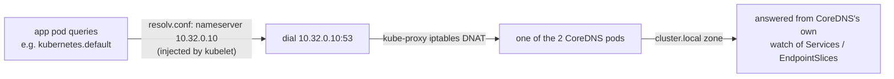
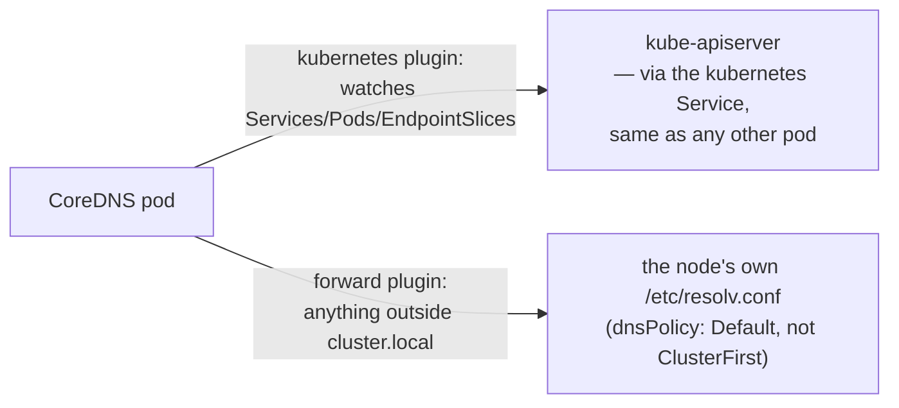

# 11 — Deploying the DNS Cluster Add-on (CoreDNS)

Run from your **client machine**, using the remote kubeconfig configured in
[09](09-configuring-kubectl.md).

This manifest is self-contained and pinned to CoreDNS `v1.11.3` (matching
the README's version table) instead of pulling a live manifest off an
external repo's `master` branch — that would give you whatever CoreDNS
version happens to be there today, not a reproducible one.

```bash
cat <<'EOF' > coredns.yaml
apiVersion: v1
kind: ServiceAccount
metadata:
  name: coredns
  namespace: kube-system
---
apiVersion: rbac.authorization.k8s.io/v1
kind: ClusterRole
metadata:
  labels:
    kubernetes.io/bootstrapping: rbac-defaults
  name: system:coredns
rules:
  - apiGroups: [""]
    resources: ["endpoints", "services", "pods", "namespaces"]
    verbs: ["list", "watch"]
  - apiGroups: [""]
    resources: ["nodes"]
    verbs: ["get"]
  - apiGroups: ["discovery.k8s.io"]
    resources: ["endpointslices"]
    verbs: ["list", "watch"]
---
apiVersion: rbac.authorization.k8s.io/v1
kind: ClusterRoleBinding
metadata:
  annotations:
    rbac.authorization.kubernetes.io/autoupdate: "true"
  labels:
    kubernetes.io/bootstrapping: rbac-defaults
  name: system:coredns
roleRef:
  apiGroup: rbac.authorization.k8s.io
  kind: ClusterRole
  name: system:coredns
subjects:
  - kind: ServiceAccount
    name: coredns
    namespace: kube-system
---
apiVersion: v1
kind: ConfigMap
metadata:
  name: coredns
  namespace: kube-system
data:
  Corefile: |
    .:53 {
        errors
        health {
           lameduck 5s
        }
        ready
        kubernetes cluster.local in-addr.arpa ip6.arpa {
           pods insecure
           fallthrough in-addr.arpa ip6.arpa
           ttl 30
        }
        prometheus :9153
        forward . /etc/resolv.conf {
           max_concurrent 1000
        }
        cache 30
        loop
        reload
        loadbalance
    }
---
apiVersion: apps/v1
kind: Deployment
metadata:
  name: coredns
  namespace: kube-system
  labels:
    k8s-app: kube-dns
spec:
  replicas: 2
  strategy:
    type: RollingUpdate
    rollingUpdate:
      maxUnavailable: 1
  selector:
    matchLabels:
      k8s-app: kube-dns
  template:
    metadata:
      labels:
        k8s-app: kube-dns
    spec:
      priorityClassName: system-cluster-critical
      serviceAccountName: coredns
      tolerations:
        - key: "CriticalAddonsOnly"
          operator: "Exists"
      containers:
        - name: coredns
          image: coredns/coredns:1.11.3
          imagePullPolicy: IfNotPresent
          resources:
            limits:
              memory: 170Mi
            requests:
              cpu: 100m
              memory: 70Mi
          args: ["-conf", "/etc/coredns/Corefile"]
          volumeMounts:
            - name: config-volume
              mountPath: /etc/coredns
              readOnly: true
          ports:
            - containerPort: 53
              name: dns
              protocol: UDP
            - containerPort: 53
              name: dns-tcp
              protocol: TCP
            - containerPort: 9153
              name: metrics
              protocol: TCP
          securityContext:
            allowPrivilegeEscalation: false
            capabilities:
              add: ["NET_BIND_SERVICE"]
              drop: ["all"]
            readOnlyRootFilesystem: true
          livenessProbe:
            httpGet:
              path: /health
              port: 8080
              scheme: HTTP
            initialDelaySeconds: 60
            timeoutSeconds: 5
            successThreshold: 1
            failureThreshold: 5
          readinessProbe:
            httpGet:
              path: /ready
              port: 8181
              scheme: HTTP
      dnsPolicy: Default
      volumes:
        - name: config-volume
          configMap:
            name: coredns
            items:
              - key: Corefile
                path: Corefile
---
apiVersion: v1
kind: Service
metadata:
  name: kube-dns
  namespace: kube-system
  labels:
    k8s-app: kube-dns
    kubernetes.io/cluster-service: "true"
    kubernetes.io/name: "CoreDNS"
spec:
  selector:
    k8s-app: kube-dns
  clusterIP: 10.32.0.10
  ports:
    - name: dns
      port: 53
      protocol: UDP
    - name: dns-tcp
      port: 53
      protocol: TCP
    - name: metrics
      port: 9153
      protocol: TCP
EOF

kubectl apply -f coredns.yaml
```

The Service's `clusterIP: 10.32.0.10` matches the `clusterDNS` value set in
every kubelet's config in [08](08-bootstrapping-worker-nodes.md), and sits
inside `SERVICE_CIDR` (`10.32.0.0/24`) from the apiserver flags in
[06](06-bootstrapping-control-plane.md). If you changed either of those
values, edit `clusterIP:` above (and the Corefile's `kubernetes` zone if you
changed `clusterDomain`) to match before applying.

### What's actually happening

A pod never picks its DNS server itself — `kubelet` writes it into every
pod's `/etc/resolv.conf` at creation time, straight from its own
`clusterDNS`/`clusterDomain` config (doc 08 §7), which is *why* changing
those values means editing this manifest to match rather than the other
way around:



That DNAT hop is the same `kube-proxy` mechanism every ClusterIP uses
([12 §7](12-smoke-test.md#7-services-nodeport)) — nothing DNS-specific
about it, which matters for a subtler reason below.

CoreDNS itself has two separate outbound paths, and conflating them is
an easy mistake:



The `kubernetes` plugin doesn't get cluster state some special way — it
watches the API server exactly like `kubelet` or `kube-proxy` do, through
the `kubernetes` Service's ClusterIP (`10.32.0.1`), subject to the same
`kube-proxy` DNAT as the top diagram. That's a real circular-looking
dependency worth being aware of: if `kube-proxy` isn't
routing Service traffic correctly, CoreDNS's own pod gets stuck logging
`Still waiting on: "kubernetes"` and never becomes `Ready` — a completely
different failure from "DNS lookups from *other* pods are timing out,"
even though both trace back to the same broken `kube-proxy`.

The `forward` plugin's target — the *node's* resolver, not
`10.32.0.10` — is also deliberate, not an oversight: CoreDNS runs with
`dnsPolicy: Default` instead of the `ClusterFirst` every other pod gets
by default, specifically so its own upstream (non-`cluster.local`)
lookups don't loop back into itself. Doc 08 §7's note about avoiding
"resolution loops" is this exact mechanism, from the other side.

## Verify

```bash
kubectl get pods -l k8s-app=kube-dns -n kube-system
kubectl get svc -n kube-system kube-dns
```

Expect the CoreDNS pod(s) `Running` and the Service showing
`ClusterIP 10.32.0.10`.

Functional DNS test:

```bash
kubectl run busybox --image=busybox:1.36 --restart=Never --command -- sleep 3600
kubectl wait --for=condition=Ready pod/busybox --timeout=60s
kubectl exec busybox -- nslookup kubernetes.default
kubectl delete pod busybox
```

Expect `nslookup` to resolve `kubernetes.default` to `10.32.0.1` (the
Kubernetes Service's ClusterIP, always the first address in
`SERVICE_CIDR`).

Next: [12 — Smoke Test](12-smoke-test.md)
