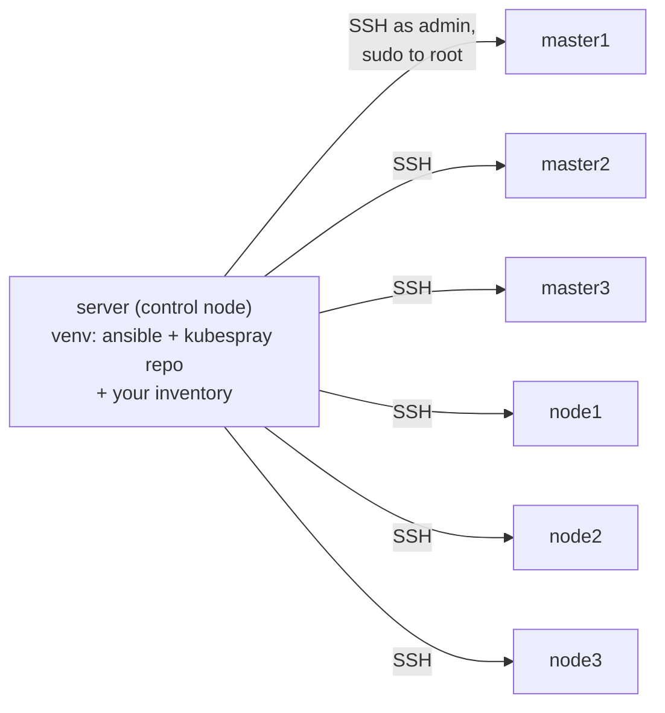

# 02 — Control Node Setup

All of this runs on `server` (192.168.56.10).

## What the control node actually is

Kubespray is "just" a very large Ansible project — there is no agent or
daemon on the cluster nodes. Everything the playbooks do happens over the
same SSH access you already verified in doc 01:



For each task in a playbook, Ansible copies a small Python module to the
target host over SSH, executes it there with sudo, collects the JSON result,
and moves on — so the versions that matter for correctness are the ones in
*this venv* (ansible itself, netaddr, jinja2), while the nodes only need
Python 3 and SSH. That's why this whole doc is about getting the control
node's Python environment exactly right, and why nothing gets installed on
the cluster nodes yet.

## 1. Install the venv module (if step 4 of the prereqs doc flagged it)

```bash
sudo apt-get update
sudo apt-get install -y python3.12-venv
```

## 2. Create an isolated virtualenv for Kubespray

Don't use the system `ansible` package (the one `~/ansible` already relies
on for connectivity checks) — Kubespray pins a specific `ansible` version
in its `requirements.txt`, and running a mismatched version is a common
source of playbook failures that look unrelated to your actual config.

```bash
cd ~
python3 -m venv kubespray-venv
source kubespray-venv/bin/activate
pip install --upgrade pip
```

Every command in the rest of this guide that invokes `ansible-playbook`
assumes this venv is activated. Re-activate it in any new shell:

```bash
source ~/kubespray-venv/bin/activate
```

## 3. Clone Kubespray, pinned to v2.31.0

Pin to a release tag, never `master` — `master` tracks in-development
changes and can break without notice. v2.31.0 is the current stable release
(Kubernetes v1.35.4 default) as of 2026-07.

```bash
git clone --depth 1 --branch v2.31.0 https://github.com/kubernetes-sigs/kubespray.git
cd kubespray
```

## 4. Install Kubespray's pinned Python requirements

```bash
pip install -r requirements.txt
```

This installs `ansible==11.13.0` (which brings in ansible-core ~2.18),
plus `netaddr`, `jmespath`, `cryptography`, and `passlib` at the exact
versions Kubespray's playbooks were tested against.

## 5. Verify

```bash
ansible --version        # should report ansible [core 2.18.x] from the venv path
python3 -c "import netaddr; print('netaddr OK')"
ls inventory/sample       # Kubespray's template inventory — copied in the next doc
```

If `ansible --version` still shows the apt-installed `2.16.3` instead of
the venv's version, the venv isn't activated — re-run step 2's `source`
command.

Next: [03 — Inventory & Topology](03-inventory-and-topology.md)
