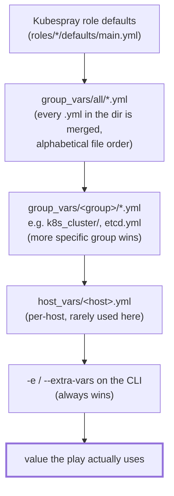

# 04 — Cluster Configuration

All of this runs on `server`, inside `~/kubespray`. These edits go in
`inventory/mycluster/group_vars/`, which the sample inventory already
populated with Kubespray's defaults — you're overriding a handful of keys,
not writing from scratch.

## How a variable actually gets its value

Before editing anything, understand where a value can come from — this is
the model behind both step 6's sanity check and the "my change didn't take
effect" entry in [12 — Troubleshooting](12-troubleshooting.md):



Lower boxes override upper ones. The trap in this lab isn't the precedence
between levels — it's *within* one level: `group_vars/all/` is a directory,
and Ansible loads **every** `.yml` file in it and merges them. Two files
defining the same key resolve by file-load order, silently. So if an
override "didn't take", grep the whole tree for the key before assuming
precedence is broken (step 6 and doc 12 both do exactly this).

## 1. `group_vars/all/all.yml` — the external load balancer

This is the single most important override for an HA setup like this one:
it tells every kubelet, and the admin kubeconfig, to talk to a stable
address instead of any one master directly. Without it, Kubespray defaults
to pointing everything at the *first* `kube_control_plane` host — if
`master1` goes down, every kubelet loses its apiserver.

Edit `inventory/mycluster/group_vars/all/all.yml`, set/uncomment:

```yaml
loadbalancer_apiserver:
  address: 192.168.56.10   # server
  port: 6443

loadbalancer_apiserver_localhost: false

# Belt-and-suspenders: make sure the LB's IP is a valid SAN on the
# apiserver certs, in case anything connects to it directly by IP.
supplementary_addresses_in_ssl_keys:
  - 192.168.56.10
```

This assumes HAProxy is listening on `server:6443` and forwarding to the
three masters — set that up in
[05 — Load Balancer](05-load-balancer-haproxy.md) *before* running
`cluster.yml`, since this address gets baked into certs and configs at
bootstrap time. Changing it after the fact means re-issuing certs.

## 2. `group_vars/all/all.yml` — container runtime and cluster identity

Also in the same file:

```yaml
container_manager: containerd    # Kubespray default; explicit here so it's not implicit

cluster_name: homelab.local
```

## 3. `group_vars/k8s_cluster/k8s-cluster.yml` — Kubernetes version and networking

```yaml
kube_version: v1.35.4             # matches Kubespray v2.31.0's tested default

kube_network_plugin: calico

# Defaults — verified they don't overlap with this lab's 192.168.56.0/24:
kube_service_addresses: 10.233.0.0/18
kube_pods_subnet: 10.233.64.0/18
```

If you ever add a lab network on a `10.233.0.0/16`-adjacent range, revisit
these — Kubespray won't detect the collision for you.

## 4. `group_vars/k8s_cluster/k8s-net-calico.yml` — Calico

Kubespray's sample already selects a tested Calico version; the defaults
in this file are fine for a single flat `/24` lab network (no BGP peering
with physical routers needed). Leave it as-is unless you have a specific
reason to change the Calico encapsulation mode — the default
(VXLAN/IP-in-IP, whichever the sample sets) works fine on VirtualBox's
host-only network.

## 5. `group_vars/etcd.yml` (or the `etcd` section of `all.yml`, depending on Kubespray release layout)

Stacked etcd (from doc 03) uses defaults; no override needed for this lab.
The one setting worth knowing about, if you later split etcd onto
dedicated hosts: `etcd_deployment_type` and the separate `etcd` inventory
group would then list different hosts than `kube_control_plane`.

## 6. Sanity-check the rendered variables

```bash
ansible-inventory -i inventory/mycluster/inventory.ini --host master1 | python3 -m json.tool | grep -A2 loadbalancer_apiserver
```

Confirm it shows `192.168.56.10` / `6443` — if it still shows a master's
own IP, the edit didn't land in the right file (Kubespray merges
`group_vars/all/*.yml` — any `.yml` file in that directory is read).

Next: [05 — Load Balancer](05-load-balancer-haproxy.md)
