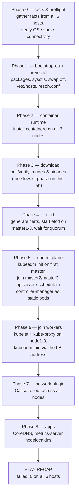
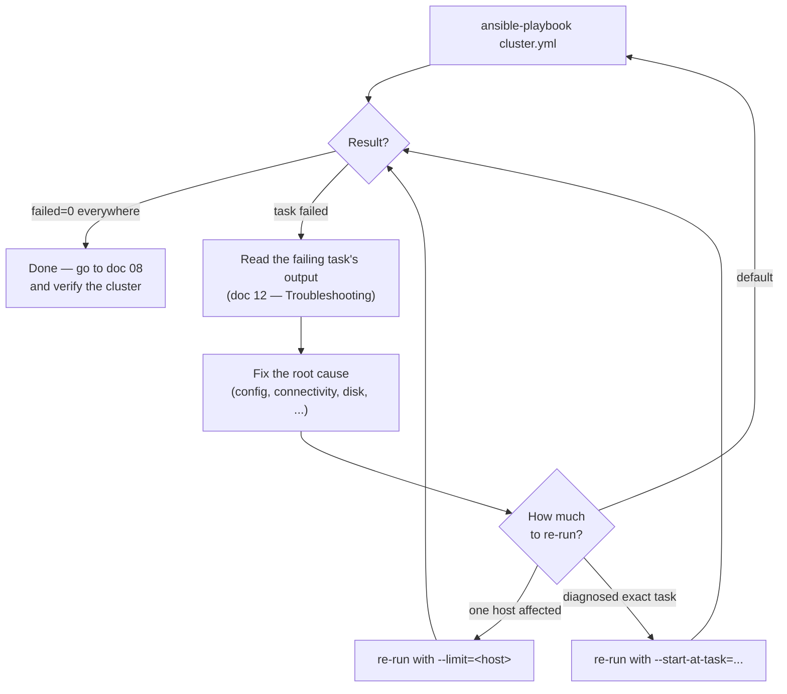

# 07 — Running the Playbook

All of this runs on `server`, inside `~/kubespray`, with the venv activated.
This is the step that actually changes state on `master1-3` and
`node1-3` — everything before this was read-only.

## What `cluster.yml` actually does under the hood

One command, but internally Kubespray runs through ordered phases — knowing
them turns a 30-minute wall of Ansible output into something you can follow,
and tells you *where* you are when it fails:



Two consequences worth internalizing:

- **Order is dependency order.** etcd must have quorum before the first
  apiserver can start; the control plane must answer on the LB address
  before workers can join; Calico needs the apiserver. A failure in phase N
  usually means the *real* problem is in phase N-1's output.
- **Every phase is idempotent** — which is what makes the "just re-run it"
  guidance below safe: completed phases verify state and skip ahead rather
  than redoing work.

## The run/failure loop



## 1. Run `cluster.yml`

```bash
ansible-playbook -i inventory/mycluster/inventory.ini \
  --become --become-user=root \
  cluster.yml
```

Expect **20–40 minutes** on hardware like this lab's (2 vCPU / 2GB masters,
1 vCPU / 2GB workers) — most of it is pulling container images and waiting
on etcd/apiserver health checks between masters, not raw CPU work.

Add `-v` (or `-vvv` for full task output) if you want to watch progress in
detail rather than just the per-play summary:

```bash
ansible-playbook -i inventory/mycluster/inventory.ini \
  --become --become-user=root -v \
  cluster.yml
```

## 2. If it fails partway

`cluster.yml` is designed to be safely re-run — Kubespray's tasks are
idempotent (they check current state before acting). The usual move on
failure:

```bash
# fix whatever the error pointed at, then just re-run the same command
ansible-playbook -i inventory/mycluster/inventory.ini \
  --become --become-user=root \
  cluster.yml
```

To resume from a specific task instead of the whole play (useful once
you've diagnosed exactly where it died — see
[12 — Troubleshooting](12-troubleshooting.md)):

```bash
ansible-playbook -i inventory/mycluster/inventory.ini \
  --become --become-user=root \
  --start-at-task="<task name from the failure output>" \
  cluster.yml
```

## 3. Limit a re-run to specific hosts

If only one node had a transient issue (e.g. a flaky image pull on
`node2`), you can re-target just it — Kubespray's control-plane tasks are
written to tolerate this:

```bash
ansible-playbook -i inventory/mycluster/inventory.ini \
  --become --become-user=root \
  --limit=node2 \
  cluster.yml
```

## 4. What success looks like

The final recap should show `failed=0` for every one of the 6 hosts, e.g.:

```
PLAY RECAP *********************************************************
master1  : ok=... changed=... unreachable=0 failed=0 ...
master2  : ok=... changed=... unreachable=0 failed=0 ...
master3  : ok=... changed=... unreachable=0 failed=0 ...
node1    : ok=... changed=... unreachable=0 failed=0 ...
node2    : ok=... changed=... unreachable=0 failed=0 ...
node3    : ok=... changed=... unreachable=0 failed=0 ...
```

Next: [08 — Verifying the Cluster](08-verifying-the-cluster.md)
