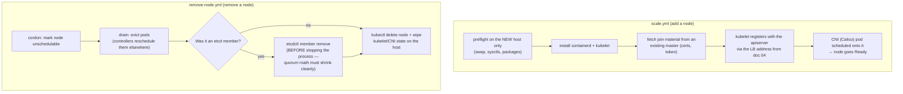

# 09 — Scaling Nodes

All of this runs on `server`, inside `~/kubespray`, with the venv activated.

## What scale.yml / remove-node.yml actually do



The key property of `scale.yml` is what it *doesn't* do: it never touches
existing masters' certs or etcd state, so it can't break a healthy control
plane the way an ill-timed `cluster.yml` rerun could. `remove-node.yml`
exists because deletion order matters — drain before delete (workloads move
instead of dying), and etcd member-remove before shutdown (the cluster
agrees quorum is now N-1, rather than seeing a permanently failed member).

## Adding a worker node

1. Provision the VM first (outside Kubespray) — extend the `NODES` array in
   `../vagrant/Vagrantfile` and `vagrant up <name>`, following the "Add/remove
   nodes" section of the root README. Re-run `vagrant provision` on existing
   nodes so `/etc/hosts` picks up the new one.

2. Add it to `inventory/mycluster/inventory.ini`, in `kube_node` and the
   `k8s_cluster:children` group already covers it:

   ```ini
   [kube_node]
   node1 ansible_host=192.168.56.13
   node2 ansible_host=192.168.56.14
   node3 ansible_host=192.168.56.15
   node4 ansible_host=192.168.56.17
   ```

3. Run `scale.yml`, **not** `cluster.yml` — it's written to safely add nodes
   without re-touching the existing control plane's certs/etcd state:

   ```bash
   ansible-playbook -i inventory/mycluster/inventory.ini \
     --become --become-user=root \
     scale.yml
   ```

4. Verify the node joined *and* can actually run workloads:

   ```bash
   kubectl get nodes                      # node4 Ready
   kubectl get pods -n kube-system -o wide | grep node4   # calico + kube-proxy Running on it
   kubectl run scale-check --image=nginx --restart=Never \
     --overrides='{"spec":{"nodeName":"node4"}}'
   kubectl wait --for=condition=Ready pod/scale-check --timeout=60s
   kubectl delete pod scale-check
   ```

   A node can show `Ready` while its CNI pod is crash-looping — the pinned
   pod is what proves end-to-end scheduling and networking. If any of this
   fails, start at [12 — Troubleshooting](12-troubleshooting.md) (the
   NotReady and image-pull sections cover the two common causes).

## Adding a control-plane node

Same shape as adding a worker, with these differences:

1. Provision the VM (step 1 above) — kubeadm preflight requires 2 vCPUs for
   control-plane hosts, so set `cpus: 2` in the `NODES` entry.

2. Add the new host to **both** `kube_control_plane` and `etcd` in the
   inventory (keep the stacked-etcd pattern from doc 03). Keep the total
   control-plane count **odd** (going 3→5, not 3→4) — an even etcd member
   count adds a host without adding fault tolerance.

3. Add it as a `server` line in the HAProxy backend from
   [05 — Load Balancer](05-load-balancer-haproxy.md) and reload HAProxy —
   otherwise the LB never routes to it.

4. Run `scale.yml` exactly as in the worker case.

5. Verify — the etcd membership check is the part that matters here:

   ```bash
   kubectl get nodes -l node-role.kubernetes.io/control-plane   # new master listed, Ready
   ssh admin@lab-master1 'sudo ETCDCTL_API=3 etcdctl member list -w table \
     --cacert=/etc/ssl/etcd/ssl/ca.pem \
     --cert=/etc/ssl/etcd/ssl/member-master1.pem \
     --key=/etc/ssl/etcd/ssl/member-master1-key.pem'
   # expect the new member listed as "started", not "unstarted"
   curl -sk https://192.168.56.10:6443/version   # LB still answering
   ```

## Removing a node

Use Kubespray's dedicated removal playbook — don't just delete inventory
lines and hope, since that skips draining and etcd member removal:

```bash
ansible-playbook -i inventory/mycluster/inventory.ini \
  --become --become-user=root \
  remove-node.yml \
  -e node=node3
```

This cordons and drains `node3`, removes it from the cluster, then you can
delete its inventory line and (if desired) `vagrant destroy node3`.

For removing a **control-plane** member, confirm the remaining etcd member
count stays a majority-safe number (don't go 3→2 and call it done — 2-member
etcd has *worse* fault tolerance than 1, since losing either loses quorum).

Verify after any removal:

```bash
kubectl get nodes                          # removed node gone
kubectl get pods -A -o wide | grep -v Running | grep -v Completed   # nothing stuck Pending
# and for a control-plane removal, re-run the etcdctl member list above —
# the removed member must be absent, remaining members "started"
```

Pods that were on the drained node should already be rescheduled — anything
stuck `Pending` afterwards usually means the remaining workers lack capacity,
not that the removal failed. On any other failure, see
[12 — Troubleshooting](12-troubleshooting.md).

Next: [10 — Upgrading the Cluster](10-upgrading-the-cluster.md)
