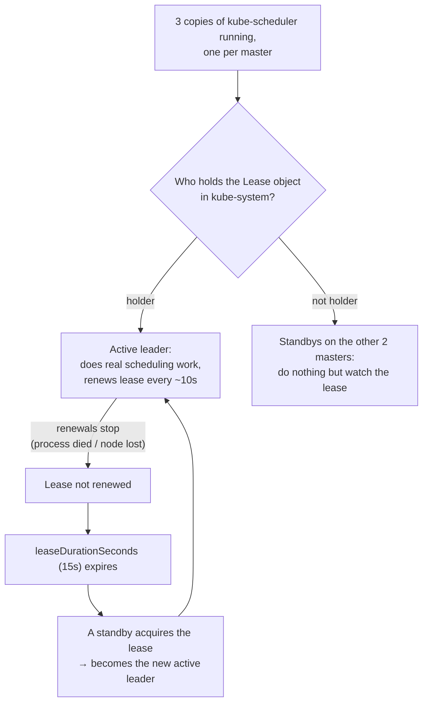
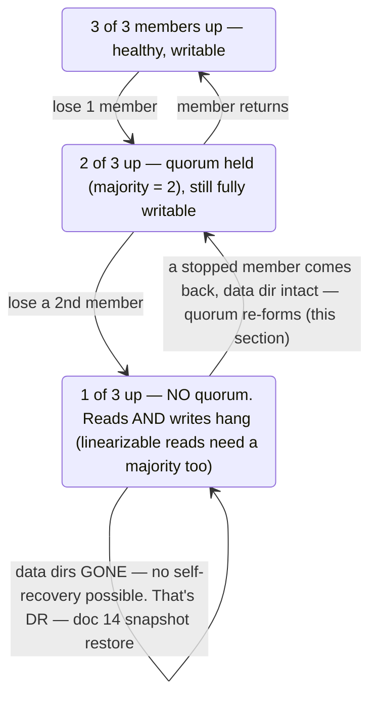

# 13 — High Availability Deep Dive

[08 — Verifying the Cluster](08-verifying-the-cluster.md) proved the
cluster boots correctly; it didn't prove it *survives losing a piece of
itself*. This doc is about triggering real failures on purpose, one at a
time, so you can see which HA mechanism catches each one — and, just as
important, where each mechanism's protection actually ends. Three separate
mechanisms are stacked in this cluster:

| Mechanism | What it protects | Survives | Does NOT survive |
|---|---|---|---|
| HAProxy round-robin ([05](05-load-balancer-haproxy.md)) | Reaching *some* apiserver | 1 of 3 masters unreachable | `server` itself dying — it's a single node, not HA |
| etcd Raft quorum ([03](03-inventory-and-topology.md)'s stacked etcd) | Cluster state (the source of truth) | losing any 1 of 3 members | losing 2 of 3 (quorum lost — this is where DR starts, see [14](14-disaster-recovery.md)) |
| Leader election (kubeadm default) | Exactly one active controller-manager/scheduler | the leader dying — a new one takes over in seconds | nothing controller-manager/scheduler-specific; they're stateless, the lease just moves |

Run everything below from `server` (as `admin`, with `~/.kube/config` from
doc 08 already in place), unless a step says otherwise. Nothing here loses
data — every scenario restarts what it stopped — but do these one at a
time, not layered, so you can tell which mechanism you actually observed.

Prerequisite: a cluster that's passed doc 08's smoke test, so a failure you
cause is the only variable.

## A note on *how* to stop things here

Kubespray deploys `etcd`, `kube-apiserver`, `kube-controller-manager`, and
`kube-scheduler` as **static pods** — kubelet-managed containers defined by
manifest files in `/etc/kubernetes/manifests/` on each master (this is why
`kubectl get pods -n kube-system` in doc 08 lists `etcd-*`,
`kube-apiserver-*`, etc. as real Pods, not systemd services). There's no
`systemctl stop kube-apiserver` here — kubelet would just restart it. To
stop one deliberately, move its manifest out of the directory; kubelet
notices within its sync period (~20s) and kills the container. Move it
back to bring it up again:

```bash
# stop:
sudo mv /etc/kubernetes/manifests/kube-apiserver.yaml /tmp/
# start:
sudo mv /tmp/kube-apiserver.yaml /etc/kubernetes/manifests/
```

`kubelet` and `containerd` themselves, by contrast, *are* systemd services
(kubeadm installs them that way) — used in §3 below to simulate a whole
node going away, not just one component.

## 1. Baseline: who's actually in charge right now

All 3 masters run their own `kube-controller-manager` and `kube-scheduler`
containers, but only one of each is *active* — the rest are idle standbys
blocked on a lease:

```bash
kubectl -n kube-system get lease kube-scheduler kube-controller-manager -o \
  custom-columns=NAME:.metadata.name,HOLDER:.spec.holderIdentity,RENEWED:.spec.renewTime
```

The `HOLDER` column names a specific master (with a random suffix) — that's
the leader for each. It's entirely possible the scheduler's leader is on
`master2` while the controller-manager's is on `master3` — leadership is
independent per component, not per node.

How the lease mechanism actually works — this is what §4 below makes you
watch happen live:



## 2. apiserver loss on the leader-holding master

Watch the LB in one terminal:

```bash
watch -n1 'curl -sk -o /dev/null -w "%{http_code}\n" https://192.168.56.10:6443/version'
```

In another, stop the apiserver on whichever master §1 showed holding a
lease (substitute the real host):

```bash
ssh admin@lab-master1 'sudo mv /etc/kubernetes/manifests/kube-apiserver.yaml /tmp/'
kubectl get nodes    # still works — HAProxy just stopped routing to master1
ssh admin@lab-master1 'sudo mv /tmp/kube-apiserver.yaml /etc/kubernetes/manifests/'
```

This exercises row 1 of the table — the LB, not etcd or leader election.
Give the manifest ~20–30s to reappear as a healthy container
(`ssh admin@lab-master1 'sudo crictl ps | grep apiserver'`) before moving on.

## 3. Simulating a full node crash, not just one process

§2 only stopped one static pod. A real VM crash takes kubelet itself down,
which means *every* static pod on that master — etcd included — stops
being managed at once. That's a materially different, harsher failure:

```bash
ssh admin@lab-master1 'sudo systemctl stop kubelet containerd'
kubectl get nodes                       # still fine — 2 masters, 2/3 etcd quorum
kubectl create deployment ha-check --image=nginx --replicas=1
kubectl rollout status deployment/ha-check --timeout=60s
ssh admin@lab-master1 'sudo systemctl start containerd kubelet'
```

`kubectl create deployment` succeeding matters more than `get nodes` does —
`get` is a read, `create` is a write that has to go through etcd consensus
on the 2 remaining members. Give `master1` a minute to rejoin, then
confirm:

```bash
ssh admin@lab-master1 'sudo ETCDCTL_API=3 etcdctl endpoint health \
  --endpoints=https://127.0.0.1:2379 \
  --cacert=/etc/ssl/etcd/ssl/ca.pem \
  --cert=/etc/ssl/etcd/ssl/member-master1.pem \
  --key=/etc/ssl/etcd/ssl/member-master1-key.pem'
kubectl delete deployment ha-check
```

## 4. Watching leader election actually happen

§1 told you who the leader is; this makes it move and proves the cluster
kept scheduling through the handover — not just that a new leader
eventually got picked:

```bash
LEADER=$(kubectl -n kube-system get lease kube-scheduler -o jsonpath='{.spec.holderIdentity}' | sed -E 's/_.*//')
echo "kube-scheduler leader is on: ${LEADER}"

ssh admin@lab-${LEADER} 'sudo mv /etc/kubernetes/manifests/kube-scheduler.yaml /tmp/'
kubectl create deployment leader-check --image=nginx --replicas=1
kubectl rollout status deployment/leader-check --timeout=30s
kubectl -n kube-system get lease kube-scheduler -o jsonpath='{.spec.holderIdentity}'; echo
ssh admin@lab-${LEADER} 'sudo mv /tmp/kube-scheduler.yaml /etc/kubernetes/manifests/'
kubectl delete deployment leader-check
```

Default lease duration is 15s, so `rollout status` succeeding inside the
30s timeout is the proof — if failover were broken, the Pod would sit
`Pending` (nothing assigning it a node) until the stopped scheduler came
back.

## 5. The etcd quorum boundary — where HA stops and DR starts

Everything above tolerated losing **one** master. This section crosses
that line on purpose, so you can see the difference between *degraded* and
*down* — and that not all "down" is data loss.

The quorum math for a 3-member etcd cluster, as a state machine:



Now cross the line:

```bash
ssh admin@lab-master1 'sudo mv /etc/kubernetes/manifests/etcd.yaml /tmp/'
ssh admin@lab-master2 'sudo mv /etc/kubernetes/manifests/etcd.yaml /tmp/'
# only master3's etcd is left — 1 of 3, no majority

kubectl get nodes    # this will hang and time out, not just fail fast
```

Notice it **hangs**, not `Ready`/`NotReady` — etcd's default reads are
linearizable, meaning even a `GET` needs quorum, so both reads and writes
stop, not just writes. The cluster isn't corrupted; it's correctly
refusing to answer without a majority, because a minority partition can't
be trusted to have the latest state.

Recover it — since `/var/lib/etcd` on `master1`/`master2` was never
touched, this is a quorum recovery, not a restore:

```bash
ssh admin@lab-master1 'sudo mv /tmp/etcd.yaml /etc/kubernetes/manifests/'
ssh admin@lab-master2 'sudo mv /tmp/etcd.yaml /etc/kubernetes/manifests/'
sleep 20
kubectl get nodes    # back once quorum re-forms
```

**Carry this into DR:** what just worked, works *only* because the on-disk
data directory was intact the whole time — the pod came back the moment
kubelet re-managed it. Real disaster recovery is what you need when that
data is actually gone (disk failure, `rm -rf` gone wrong, all 3 members
lost at once) — no manifest move fixes that; you need a snapshot restore.
That's [14 — Disaster Recovery](14-disaster-recovery.md), once this
boundary is clear.

## 6. Worker-side HA: Deployments vs. bare Pods

Control-plane HA keeps the cluster's brain alive; it says nothing about
whether workloads survive a **worker** dying — that's the
controller-manager's replica-count reconciliation, and it only applies to
controller-owned Pods:

```bash
kubectl create deployment worker-ha --image=nginx --replicas=1
kubectl run lonely-pod --image=nginx --restart=Never
kubectl wait --for=condition=Ready pod -l app=worker-ha --timeout=30s
kubectl wait --for=condition=Ready pod/lonely-pod --timeout=30s

DEPLOY_NODE=$(kubectl get pods -l app=worker-ha -o jsonpath='{.items[0].spec.nodeName}')
echo "worker-ha pod is on: ${DEPLOY_NODE}"

ssh admin@${DEPLOY_NODE} 'sudo systemctl stop kubelet containerd'
```

Watch what happens (defaults: node marked `NotReady` after ~40s, Pods on
it evicted after a further 5m):

```bash
watch kubectl get nodes,pods -o wide
```

Expect `worker-ha`'s Pod to eventually get rescheduled onto a healthy node
(the Deployment's ReplicaSet controller notices the gap) — but `lonely-pod`
just sits `Terminating`/gone with nothing recreating it, because nothing
owns it. Bare Pods are a smoke-test convenience, never a real workload
pattern.

Recover and clean up:

```bash
ssh admin@${DEPLOY_NODE} 'sudo systemctl start containerd kubelet'
kubectl delete deployment worker-ha
kubectl delete pod lonely-pod --ignore-not-found
```

## 7. The gap this lab doesn't close: the load balancer itself

Every scenario above assumes `server` is up — every `kubectl` command gets
there through it. `server` is **one VM running one HAProxy process**;
nothing in this topology makes it HA (flagged already in
[05](05-load-balancer-haproxy.md) and
[11 — Security Hardening](11-security-hardening.md) §2):

```bash
ssh admin@lab-server 'sudo systemctl stop haproxy'
kubectl get nodes   # times out — not because the control plane is down, but because you can't reach it
ssh admin@lab-server 'sudo systemctl start haproxy'
```

The masters and etcd are all still fine during this
(`ssh admin@lab-master1 'curl -sk https://127.0.0.1:6443/version'` would
confirm it) — but nothing external can tell, because the only door in just
got locked. Closing this gap for real means a second LB + `keepalived`
sharing a floating VIP, or `kube-vip` static pods on the masters instead of
an external LB — both need topology this 7-VM lab doesn't budget for, but
are worth understanding as the actual production answer.

## Summary

You've now individually triggered and recovered from: apiserver loss,
full-node loss, leader election handover, etcd quorum loss (and exactly why
it's recoverable without a restore), worker-node loss with and without a
controller, and the LB's own single point of failure. That's the complete
HA picture for this lab.

Next: [14 — Disaster Recovery](14-disaster-recovery.md) (etcd
snapshot/restore, full quorum loss *with* data loss, rebuilding a master
from nothing) builds directly on §5 above.
