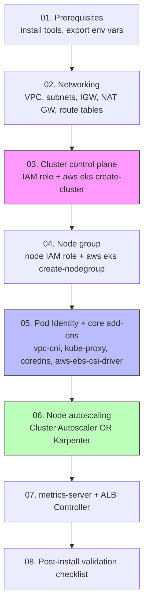

# Overview & Build Sequence

A single-cluster EKS build using **raw AWS CLI** commands only — no `eksctl`, no Terraform. Every VPC resource, IAM role, and cluster component is created with an explicit `aws` command so you can see exactly what EKS needs under the hood. For the multi-region, Terraform + GitOps version of this platform, see [`../../eks-setup-from-scratch/README.md`](../../eks-setup-from-scratch/README.md) instead — this is the "plain" counterpart.

Scope: one VPC, one EKS cluster, one managed node group, the four core add-ons (VPC CNI, kube-proxy, CoreDNS, EBS CSI Driver) wired up via **EKS Pod Identity** (not IRSA/OIDC), node autoscaling (Cluster Autoscaler or Karpenter — your choice), and two essential extras (metrics-server, AWS Load Balancer Controller).

## Build sequence



Follow the docs in numeric order — later steps assume resources from earlier ones already exist. Each doc after [01-prerequisites.md](01-prerequisites.md) opens with a short **"Resume variables"** snippet so you can pick the guide back up in a fresh shell without re-reading everything that came before.

## Doc index

| If you want to... | Read |
|---|---|
| Install tools and set up your shell | [01-prerequisites.md](01-prerequisites.md) |
| Build the VPC | [02-networking-vpc.md](02-networking-vpc.md) |
| Create the EKS control plane | [03-cluster-control-plane.md](03-cluster-control-plane.md) |
| Create the managed node group | [04-node-group.md](04-node-group.md) |
| Install VPC CNI, kube-proxy, CoreDNS, EBS CSI (via Pod Identity) | [05-pod-identity-core-addons.md](05-pod-identity-core-addons.md) |
| Choose and install Cluster Autoscaler or Karpenter | [06-node-autoscaling.md](06-node-autoscaling.md) |
| Install metrics-server and the AWS Load Balancer Controller | [07-metrics-server-and-alb-ingress.md](07-metrics-server-and-alb-ingress.md) |
| Verify the whole build actually works | [08-post-install-validation.md](08-post-install-validation.md) |
| Diagnose a failure | [09-troubleshooting.md](09-troubleshooting.md) |
| Tear the whole thing down | [10-teardown.md](10-teardown.md) |

## Why Pod Identity instead of IRSA

Every add-on/controller in this build (`vpc-cni`, `aws-ebs-csi-driver`, Cluster Autoscaler or Karpenter, the ALB controller) gets its AWS permissions through an **EKS Pod Identity association**, not the older IAM-Roles-for-Service-Accounts (OIDC) pattern. This means you do **not** need to create or associate an OIDC identity provider for this cluster at all — one less moving part than most EKS tutorials assume. See [05-pod-identity-core-addons.md](05-pod-identity-core-addons.md) for the mechanics.

## Repository layout

```
docs/
  00-overview.md                    # this file
  01-prerequisites.md
  02-networking-vpc.md
  03-cluster-control-plane.md
  04-node-group.md
  05-pod-identity-core-addons.md
  06-node-autoscaling.md            # Cluster Autoscaler AND Karpenter, pick one
  07-metrics-server-and-alb-ingress.md
  08-post-install-validation.md
  09-troubleshooting.md
  10-teardown.md
```
