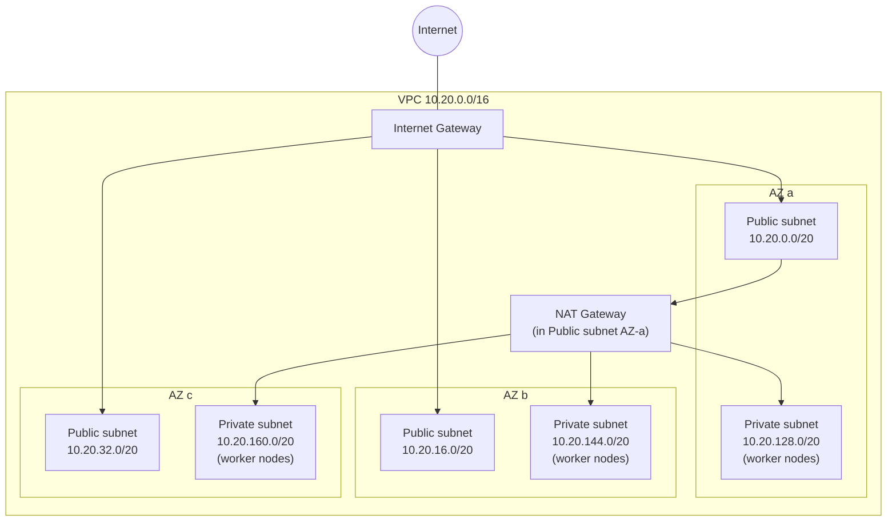

# 02. Networking — VPC

Assumes [01-prerequisites.md](01-prerequisites.md) has been run in this shell (`AWS_REGION`, `CLUSTER_NAME`, `VPC_CIDR` exported).



One NAT Gateway keeps this cheap for a lab/dev build; for production HA, create one NAT Gateway per AZ and point each private route table at the NAT in its own AZ.

## Create the VPC and Internet Gateway

```bash
VPC_ID=$(aws ec2 create-vpc --cidr-block $VPC_CIDR \
  --tag-specifications "ResourceType=vpc,Tags=[{Key=Name,Value=${CLUSTER_NAME}-vpc}]" \
  --query 'Vpc.VpcId' --output text)
aws ec2 modify-vpc-attribute --vpc-id $VPC_ID --enable-dns-hostnames
aws ec2 modify-vpc-attribute --vpc-id $VPC_ID --enable-dns-support

IGW_ID=$(aws ec2 create-internet-gateway \
  --tag-specifications "ResourceType=internet-gateway,Tags=[{Key=Name,Value=${CLUSTER_NAME}-igw}]" \
  --query 'InternetGateway.InternetGatewayId' --output text)
aws ec2 attach-internet-gateway --vpc-id $VPC_ID --internet-gateway-id $IGW_ID
```

## Public and private subnets, one pair per AZ

```bash
AZS=($(aws ec2 describe-availability-zones --filters Name=region-name,Values=$AWS_REGION \
  --query 'AvailabilityZones[0:3].ZoneName' --output text))

PUBLIC_CIDRS=(10.20.0.0/20 10.20.16.0/20 10.20.32.0/20)
PRIVATE_CIDRS=(10.20.128.0/20 10.20.144.0/20 10.20.160.0/20)
PUBLIC_SUBNET_IDS=(); PRIVATE_SUBNET_IDS=()

for i in 0 1 2; do
  PUB_ID=$(aws ec2 create-subnet --vpc-id $VPC_ID --cidr-block ${PUBLIC_CIDRS[$i]} \
    --availability-zone ${AZS[$i]} \
    --tag-specifications "ResourceType=subnet,Tags=[{Key=Name,Value=${CLUSTER_NAME}-public-${AZS[$i]}},{Key=kubernetes.io/cluster/${CLUSTER_NAME},Value=shared},{Key=kubernetes.io/role/elb,Value=1}]" \
    --query 'Subnet.SubnetId' --output text)
  aws ec2 modify-subnet-attribute --subnet-id $PUB_ID --map-public-ip-on-launch
  PUBLIC_SUBNET_IDS+=($PUB_ID)

  PRIV_ID=$(aws ec2 create-subnet --vpc-id $VPC_ID --cidr-block ${PRIVATE_CIDRS[$i]} \
    --availability-zone ${AZS[$i]} \
    --tag-specifications "ResourceType=subnet,Tags=[{Key=Name,Value=${CLUSTER_NAME}-private-${AZS[$i]}},{Key=kubernetes.io/cluster/${CLUSTER_NAME},Value=shared},{Key=kubernetes.io/role/internal-elb,Value=1}]" \
    --query 'Subnet.SubnetId' --output text)
  PRIVATE_SUBNET_IDS+=($PRIV_ID)
done
echo "Public subnets:  ${PUBLIC_SUBNET_IDS[@]}"
echo "Private subnets: ${PRIVATE_SUBNET_IDS[@]}"
```

The `kubernetes.io/role/elb` / `internal-elb` tags matter later — the AWS Load Balancer Controller ([07](07-metrics-server-and-alb-ingress.md)) and Karpenter ([06](06-node-autoscaling.md), if chosen) both auto-discover subnets by these tags.

## NAT Gateway

```bash
EIP_ALLOC=$(aws ec2 allocate-address --domain vpc --query 'AllocationId' --output text)
NAT_GW_ID=$(aws ec2 create-nat-gateway --subnet-id ${PUBLIC_SUBNET_IDS[0]} --allocation-id $EIP_ALLOC \
  --tag-specifications "ResourceType=natgateway,Tags=[{Key=Name,Value=${CLUSTER_NAME}-natgw}]" \
  --query 'NatGateway.NatGatewayId' --output text)
aws ec2 wait nat-gateway-available --nat-gateway-ids $NAT_GW_ID
```

## Route tables

```bash
PUB_RT_ID=$(aws ec2 create-route-table --vpc-id $VPC_ID \
  --tag-specifications "ResourceType=route-table,Tags=[{Key=Name,Value=${CLUSTER_NAME}-public-rt}]" \
  --query 'RouteTable.RouteTableId' --output text)
aws ec2 create-route --route-table-id $PUB_RT_ID --destination-cidr-block 0.0.0.0/0 --gateway-id $IGW_ID >/dev/null
for s in "${PUBLIC_SUBNET_IDS[@]}"; do aws ec2 associate-route-table --subnet-id $s --route-table-id $PUB_RT_ID >/dev/null; done

PRIV_RT_ID=$(aws ec2 create-route-table --vpc-id $VPC_ID \
  --tag-specifications "ResourceType=route-table,Tags=[{Key=Name,Value=${CLUSTER_NAME}-private-rt}]" \
  --query 'RouteTable.RouteTableId' --output text)
aws ec2 create-route --route-table-id $PRIV_RT_ID --destination-cidr-block 0.0.0.0/0 --nat-gateway-id $NAT_GW_ID >/dev/null
for s in "${PRIVATE_SUBNET_IDS[@]}"; do aws ec2 associate-route-table --subnet-id $s --route-table-id $PRIV_RT_ID >/dev/null; done
```

Save `$VPC_ID`, `${PUBLIC_SUBNET_IDS[@]}`, and `${PRIVATE_SUBNET_IDS[@]}` — [03-cluster-control-plane.md](03-cluster-control-plane.md) needs both subnet lists, and [04-node-group.md](04-node-group.md) needs the private list alone.

## Resume variables (new shell)

If you're picking this back up later, reconstruct the IDs by tag instead of redoing the build:

```bash
VPC_ID=$(aws ec2 describe-vpcs --filters Name=tag:Name,Values=${CLUSTER_NAME}-vpc --query 'Vpcs[0].VpcId' --output text)
IGW_ID=$(aws ec2 describe-internet-gateways --filters Name=tag:Name,Values=${CLUSTER_NAME}-igw --query 'InternetGateways[0].InternetGatewayId' --output text)
PUBLIC_SUBNET_IDS=($(aws ec2 describe-subnets --filters Name=vpc-id,Values=$VPC_ID Name=tag:Name,Values="${CLUSTER_NAME}-public-*" --query 'Subnets[].SubnetId' --output text))
PRIVATE_SUBNET_IDS=($(aws ec2 describe-subnets --filters Name=vpc-id,Values=$VPC_ID Name=tag:Name,Values="${CLUSTER_NAME}-private-*" --query 'Subnets[].SubnetId' --output text))
NAT_GW_ID=$(aws ec2 describe-nat-gateways --filter Name=tag:Name,Values=${CLUSTER_NAME}-natgw --query 'NatGateways[0].NatGatewayId' --output text)
```

Next: [03-cluster-control-plane.md](03-cluster-control-plane.md)
