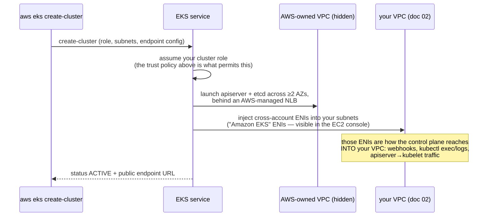

# 03. Cluster IAM Role + EKS Control Plane

Assumes [02-networking-vpc.md](02-networking-vpc.md) is done and `$VPC_ID`, `${PUBLIC_SUBNET_IDS[@]}`, `${PRIVATE_SUBNET_IDS[@]}` are set in this shell (see that doc's "Resume variables" if you're in a new shell).

## Cluster IAM role

```bash
cd ~/eks-plainsetup-tmp

cat > cluster-trust-policy.json <<'EOF'
{
  "Version": "2012-10-17",
  "Statement": [{
    "Effect": "Allow",
    "Principal": { "Service": "eks.amazonaws.com" },
    "Action": "sts:AssumeRole"
  }]
}
EOF

aws iam create-role --role-name ${CLUSTER_NAME}-cluster-role \
  --assume-role-policy-document file://cluster-trust-policy.json
aws iam attach-role-policy --role-name ${CLUSTER_NAME}-cluster-role \
  --policy-arn arn:aws:iam::aws:policy/AmazonEKSClusterPolicy
CLUSTER_ROLE_ARN=$(aws iam get-role --role-name ${CLUSTER_NAME}-cluster-role --query 'Role.Arn' --output text)
```

## Create the cluster

```bash
ALL_SUBNETS="${PUBLIC_SUBNET_IDS[@]} ${PRIVATE_SUBNET_IDS[@]}"
aws eks create-cluster \
  --name $CLUSTER_NAME \
  --kubernetes-version $K8S_VERSION \
  --role-arn $CLUSTER_ROLE_ARN \
  --resources-vpc-config subnetIds=$(IFS=,; echo "${ALL_SUBNETS// /,}"),endpointPublicAccess=true,endpointPrivateAccess=true \
  --tags Name=$CLUSTER_NAME

aws eks wait cluster-active --name $CLUSTER_NAME   # takes ~10 minutes
```

## What `create-cluster` actually does under the hood

The ~10 minutes you spend in `aws eks wait cluster-active` is AWS building a
full HA control plane — the same components you built by hand in
[3.kubernetes-hardway](../../3.kubernetes-hardway/README.md), just invisible
to you:



Key mental-model points:

- **etcd, apiserver, scheduler, controller-manager run in an AWS-owned
  account/VPC you can never see or SSH into.** AWS handles their HA,
  patching, and etcd backups — that's what the ~$0.10/hour cluster fee buys.
- **The cross-account ENIs are the only bridge into your VPC.** Traffic *to*
  the apiserver goes to the managed NLB endpoint; traffic *from* the control
  plane to your nodes (e.g. `kubectl logs`, admission webhooks) comes out of
  those ENIs. This is why the cluster needs your subnet IDs even though no
  control-plane instance lives there.
- **Endpoint flags**: `endpointPublicAccess=true` puts the apiserver on a
  public URL (IAM-authenticated, but internet-reachable — restrict with
  `publicAccessCidrs` for anything real); `endpointPrivateAccess=true` also
  makes it resolvable/reachable inside the VPC, which is how the private-
  subnet nodes in [04](04-node-group.md) will connect without traversing NAT.
- **Authentication is IAM, not client certs**: `kubectl` will call
  `aws eks get-token` (SigV4-signed STS request) per command; the apiserver
  validates it and maps the IAM principal to a Kubernetes user/group. The
  IAM principal that runs `create-cluster` becomes cluster admin
  automatically.

## Configure kubectl

```bash
aws eks update-kubeconfig --name $CLUSTER_NAME --region $AWS_REGION
kubectl get svc   # should return the default `kubernetes` service — confirms auth + connectivity
```

## Resume variables (new shell)

```bash
CLUSTER_ROLE_ARN=$(aws iam get-role --role-name ${CLUSTER_NAME}-cluster-role --query 'Role.Arn' --output text)
aws eks update-kubeconfig --name $CLUSTER_NAME --region $AWS_REGION
```

Next: [04-node-group.md](04-node-group.md)
