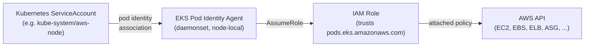

# 05. Pod Identity + Core Add-ons

Assumes [04-node-group.md](04-node-group.md) is done — `kubectl get nodes` shows 2 `Ready` nodes.

## How EKS Pod Identity works



Unlike IRSA, this needs **no OIDC provider** on the cluster — the association is a direct API call (`create-pod-identity-association`) linking a namespace/service-account pair to an IAM role. Every add-on and controller in this build (here, and in [06-node-autoscaling.md](06-node-autoscaling.md) / [07-metrics-server-and-alb-ingress.md](07-metrics-server-and-alb-ingress.md)) reuses the same `pod-identity-trust-policy.json` below.

## Install the Pod Identity Agent

```bash
cd ~/eks-plainsetup-tmp

aws eks create-addon --cluster-name $CLUSTER_NAME --addon-name eks-pod-identity-agent
aws eks wait addon-active --cluster-name $CLUSTER_NAME --addon-name eks-pod-identity-agent
kubectl get daemonset -n kube-system eks-pod-identity-agent
```

## Shared trust policy for all Pod Identity roles

Every IAM role created for a Pod Identity association (in this doc and later docs) uses this same trust policy — write it once:

```bash
cat > pod-identity-trust-policy.json <<'EOF'
{
  "Version": "2012-10-17",
  "Statement": [{
    "Effect": "Allow",
    "Principal": { "Service": "pods.eks.amazonaws.com" },
    "Action": ["sts:AssumeRole", "sts:TagSession"]
  }]
}
EOF
```

## VPC CNI

```bash
aws iam create-role --role-name ${CLUSTER_NAME}-vpc-cni-role \
  --assume-role-policy-document file://pod-identity-trust-policy.json
aws iam attach-role-policy --role-name ${CLUSTER_NAME}-vpc-cni-role \
  --policy-arn arn:aws:iam::aws:policy/AmazonEKS_CNI_Policy
VPC_CNI_ROLE_ARN=$(aws iam get-role --role-name ${CLUSTER_NAME}-vpc-cni-role --query 'Role.Arn' --output text)

aws eks create-pod-identity-association --cluster-name $CLUSTER_NAME \
  --namespace kube-system --service-account aws-node --role-arn $VPC_CNI_ROLE_ARN

aws eks create-addon --cluster-name $CLUSTER_NAME --addon-name vpc-cni --resolve-conflicts OVERWRITE
aws eks wait addon-active --cluster-name $CLUSTER_NAME --addon-name vpc-cni
```

## kube-proxy and CoreDNS (no IAM needed)

```bash
aws eks create-addon --cluster-name $CLUSTER_NAME --addon-name kube-proxy --resolve-conflicts OVERWRITE
aws eks create-addon --cluster-name $CLUSTER_NAME --addon-name coredns --resolve-conflicts OVERWRITE
aws eks wait addon-active --cluster-name $CLUSTER_NAME --addon-name kube-proxy
aws eks wait addon-active --cluster-name $CLUSTER_NAME --addon-name coredns
```

## EBS CSI Driver

```bash
aws iam create-role --role-name ${CLUSTER_NAME}-ebs-csi-role \
  --assume-role-policy-document file://pod-identity-trust-policy.json
aws iam attach-role-policy --role-name ${CLUSTER_NAME}-ebs-csi-role \
  --policy-arn arn:aws:iam::aws:policy/service-role/AmazonEBSCSIDriverPolicy
EBS_CSI_ROLE_ARN=$(aws iam get-role --role-name ${CLUSTER_NAME}-ebs-csi-role --query 'Role.Arn' --output text)

aws eks create-pod-identity-association --cluster-name $CLUSTER_NAME \
  --namespace kube-system --service-account ebs-csi-controller-sa --role-arn $EBS_CSI_ROLE_ARN

aws eks create-addon --cluster-name $CLUSTER_NAME --addon-name aws-ebs-csi-driver --resolve-conflicts OVERWRITE
aws eks wait addon-active --cluster-name $CLUSTER_NAME --addon-name aws-ebs-csi-driver
```

## Verify all five add-ons

```bash
aws eks list-addons --cluster-name $CLUSTER_NAME --output table
kubectl get pods -n kube-system   # aws-node, kube-proxy, coredns, ebs-csi-controller/-node, eks-pod-identity-agent all Running
```

## Resume variables (new shell)

```bash
VPC_CNI_ROLE_ARN=$(aws iam get-role --role-name ${CLUSTER_NAME}-vpc-cni-role --query 'Role.Arn' --output text)
EBS_CSI_ROLE_ARN=$(aws iam get-role --role-name ${CLUSTER_NAME}-ebs-csi-role --query 'Role.Arn' --output text)
```

Next: [06-node-autoscaling.md](06-node-autoscaling.md)
