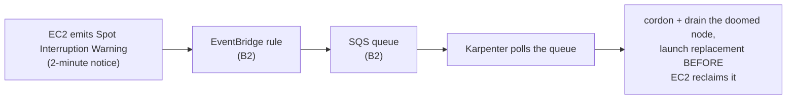

# 06. Node Autoscaling — Cluster Autoscaler or Karpenter

Assumes [05-pod-identity-core-addons.md](05-pod-identity-core-addons.md) is done — `eks-pod-identity-agent` is `ACTIVE` and `pod-identity-trust-policy.json` exists in `~/eks-plainsetup-tmp`.

Pick **one** of the two options below — don't run both against the same cluster, they'll fight over scale-down decisions on the same node group.

| | Cluster Autoscaler | Karpenter |
|---|---|---|
| Scales | The existing `core-ng` managed node group's `desiredSize`, within its `minSize`/`maxSize` | Individual EC2 instances directly, choosing instance type/AZ per pending pod |
| Setup effort | Low — one IAM role, one manifest | Higher — controller IAM role, SQS interruption queue, EventBridge rules, NodePool/EC2NodeClass CRs |
| Bin-packing / instance flexibility | Fixed instance type (`t3.medium`, set in [04](04-node-group.md)) | Picks from any instance type/family matching your `NodePool` constraints — better utilization |
| Scale-up latency | Slower — ASG launch + node bootstrap | Faster — Karpenter launches instances directly, skips ASG launch-config overhead |
| Good fit for | Small/simple clusters, predictable workloads, minimal moving parts | Variable workload shapes, cost-sensitive spot usage, larger clusters |

If you're unsure, start with **Cluster Autoscaler** — it's less to operate and easy to replace with Karpenter later without touching anything in docs 01-05.

---

## Option A: Cluster Autoscaler

### A1. Tag the node group's Auto Scaling Group for discovery

Cluster Autoscaler finds node groups by ASG tags — this doesn't happen automatically, tag it explicitly:

```bash
ASG_NAME=$(aws eks describe-nodegroup --cluster-name $CLUSTER_NAME --nodegroup-name core-ng \
  --query 'nodegroup.resources.autoScalingGroups[0].name' --output text)

aws autoscaling create-or-update-tags --tags \
  "ResourceId=${ASG_NAME},ResourceType=auto-scaling-group,Key=k8s.io/cluster-autoscaler/enabled,Value=true,PropagateAtLaunch=false" \
  "ResourceId=${ASG_NAME},ResourceType=auto-scaling-group,Key=k8s.io/cluster-autoscaler/${CLUSTER_NAME},Value=owned,PropagateAtLaunch=false"
```

### A2. IAM role (via Pod Identity)

```bash
cd ~/eks-plainsetup-tmp

cat > cluster-autoscaler-policy.json <<EOF
{
  "Version": "2012-10-17",
  "Statement": [{
    "Effect": "Allow",
    "Action": [
      "autoscaling:DescribeAutoScalingGroups",
      "autoscaling:DescribeAutoScalingInstances",
      "autoscaling:DescribeLaunchConfigurations",
      "autoscaling:DescribeScalingActivities",
      "autoscaling:DescribeTags",
      "autoscaling:SetDesiredCapacity",
      "autoscaling:TerminateInstanceInAutoScalingGroup",
      "ec2:DescribeInstanceTypes",
      "ec2:DescribeLaunchTemplateVersions",
      "eks:DescribeNodegroup"
    ],
    "Resource": "*"
  }]
}
EOF

aws iam create-policy --policy-name ${CLUSTER_NAME}-cluster-autoscaler-policy \
  --policy-document file://cluster-autoscaler-policy.json
aws iam create-role --role-name ${CLUSTER_NAME}-cluster-autoscaler-role \
  --assume-role-policy-document file://pod-identity-trust-policy.json
aws iam attach-role-policy --role-name ${CLUSTER_NAME}-cluster-autoscaler-role \
  --policy-arn arn:aws:iam::${ACCOUNT_ID}:policy/${CLUSTER_NAME}-cluster-autoscaler-policy
CA_ROLE_ARN=$(aws iam get-role --role-name ${CLUSTER_NAME}-cluster-autoscaler-role --query 'Role.Arn' --output text)
```

### A3. Deploy

```bash
kubectl create namespace cluster-autoscaler
kubectl create serviceaccount cluster-autoscaler -n cluster-autoscaler

aws eks create-pod-identity-association --cluster-name $CLUSTER_NAME \
  --namespace cluster-autoscaler --service-account cluster-autoscaler --role-arn $CA_ROLE_ARN

kubectl apply -n cluster-autoscaler -f https://raw.githubusercontent.com/kubernetes/autoscaler/master/cluster-autoscaler/cloudprovider/aws/examples/cluster-autoscaler-autodiscover.yaml

kubectl -n cluster-autoscaler set image deployment/cluster-autoscaler \
  cluster-autoscaler=registry.k8s.io/autoscaling/cluster-autoscaler:v1.32.0

kubectl -n cluster-autoscaler patch deployment cluster-autoscaler --patch '{"spec":{"template":{"spec":{"containers":[{"name":"cluster-autoscaler","command":["./cluster-autoscaler","--cloud-provider=aws","--balance-similar-node-groups","--skip-nodes-with-system-pods=false","--node-group-auto-discovery=asg:tag=k8s.io/cluster-autoscaler/enabled,k8s.io/cluster-autoscaler/'$CLUSTER_NAME'"]}]}}}}'
```

### A4. Verify

```bash
kubectl -n cluster-autoscaler get pods                                    # Running
kubectl -n cluster-autoscaler logs deploy/cluster-autoscaler | tail -20   # no AWS auth errors

# Force a scale-up: request more pods than the current 2 nodes can hold
kubectl create deployment ca-test --image=nginx --replicas=20 \
  --overrides '{"spec":{"template":{"spec":{"containers":[{"name":"nginx","image":"nginx","resources":{"requests":{"cpu":"500m"}}}]}}}}'
kubectl get nodes -w                 # a 3rd node should join within ~2-3 minutes
kubectl delete deployment ca-test    # scale back down, watch nodes drain and terminate
```

Skip to [07-metrics-server-and-alb-ingress.md](07-metrics-server-and-alb-ingress.md).

---

## Option B: Karpenter

### How Karpenter provisions a node (the flow you're about to build)

```mermaid
sequenceDiagram
    participant P as pending pod
    participant K as Karpenter controller
    participant EC2 as EC2 API
    participant N as new node
    P->>K: scheduler marks pod Unschedulable
    K->>K: match pod requirements (cpu/mem/arch/zone)<br/>against NodePool constraints (B5)
    K->>K: pick cheapest instance type(s) that fit,<br/>from EC2NodeClass's AMI/subnet/SG selectors
    K->>EC2: CreateFleet — launch instance directly<br/>(no ASG, no launch-template edit)
    EC2->>N: instance boots, nodeadm bootstraps kubelet<br/>with the same node role from doc 04
    N->>K: node registers; Karpenter binds a NodeClaim to it
    P->>N: scheduler places the pod (~40–60s end to end)
    Note over K,N: later: consolidation — if pods fit on fewer/cheaper<br/>nodes, Karpenter drains and terminates this one
```

And the spot-interruption path B2 exists for:



Contrast with Option A to see why the table above says what it says:
Cluster Autoscaler can only nudge an existing ASG's `desiredSize` and wait,
so every node is another `t3.medium`; Karpenter talks to the EC2 fleet API
per pending pod, which is why it's faster, instance-type-flexible, and needs
its own IAM/SQS plumbing.

### B1. Prerequisites specific to Karpenter

- `helm` (already in [01-prerequisites.md](01-prerequisites.md))
- The `${CLUSTER_NAME}-node-role` IAM role from [04-node-group.md](04-node-group.md) is reused as-is for Karpenter-launched nodes — it already carries `AmazonEKSWorkerNodePolicy`, `AmazonEC2ContainerRegistryReadOnly`, and `AmazonSSMManagedInstanceCore`, and deliberately excludes `AmazonEKS_CNI_Policy` since VPC CNI runs on Pod Identity ([05](05-pod-identity-core-addons.md)) — consistent for both node-group and Karpenter-launched nodes.
- Subnets from [02-networking-vpc.md](02-networking-vpc.md) are already tagged `kubernetes.io/cluster/${CLUSTER_NAME}=shared` — Karpenter's `EC2NodeClass` will discover them by that tag.

### B2. SQS interruption queue + EventBridge rules

Karpenter watches spot interruption, rebalance, and instance state-change events via this queue — without it, spot node terminations aren't handled gracefully.

```bash
cd ~/eks-plainsetup-tmp

QUEUE_URL=$(aws sqs create-queue --queue-name ${CLUSTER_NAME}-karpenter \
  --attributes '{"MessageRetentionPeriod":"300"}' --query 'QueueUrl' --output text)
QUEUE_ARN=$(aws sqs get-queue-attributes --queue-url $QUEUE_URL --attribute-names QueueArn --query 'Attributes.QueueArn' --output text)

cat > sqs-queue-policy.json <<EOF
{
  "Version": "2012-10-17",
  "Statement": [{
    "Effect": "Allow",
    "Principal": { "Service": ["events.amazonaws.com", "sqs.amazonaws.com"] },
    "Action": "sqs:SendMessage",
    "Resource": "${QUEUE_ARN}"
  }]
}
EOF
aws sqs set-queue-attributes --queue-url $QUEUE_URL --attributes Policy="$(cat sqs-queue-policy.json | jq -c . | jq -Rs .)"

declare -A RULES=(
  [SpotInterruption]='{"source":["aws.ec2"],"detail-type":["EC2 Spot Instance Interruption Warning"]}'
  [RebalanceRecommendation]='{"source":["aws.ec2"],"detail-type":["EC2 Instance Rebalance Recommendation"]}'
  [InstanceStateChange]='{"source":["aws.ec2"],"detail-type":["EC2 Instance State-change Notification"]}'
  [ScheduledChange]='{"source":["aws.health"],"detail-type":["AWS Health Event"]}'
)
for RULE in "${!RULES[@]}"; do
  aws events put-rule --name "${CLUSTER_NAME}-karpenter-${RULE}" --event-pattern "${RULES[$RULE]}"
  aws events put-targets --rule "${CLUSTER_NAME}-karpenter-${RULE}" \
    --targets "Id=1,Arn=${QUEUE_ARN}"
done
```

### B3. Karpenter controller IAM role (via Pod Identity)

```bash
cat > karpenter-controller-policy.json <<EOF
{
  "Version": "2012-10-17",
  "Statement": [
    {
      "Sid": "AllowScopedEC2InstanceActions",
      "Effect": "Allow",
      "Action": ["ec2:RunInstances", "ec2:CreateFleet", "ec2:CreateLaunchTemplate", "ec2:CreateTags", "ec2:TerminateInstances", "ec2:DeleteLaunchTemplate"],
      "Resource": "*"
    },
    {
      "Sid": "AllowScopedEC2InstanceDescribe",
      "Effect": "Allow",
      "Action": [
        "ec2:DescribeInstances", "ec2:DescribeImages", "ec2:DescribeInstanceTypes",
        "ec2:DescribeInstanceTypeOfferings", "ec2:DescribeLaunchTemplates",
        "ec2:DescribeSecurityGroups", "ec2:DescribeSubnets", "ec2:DescribeSpotPriceHistory",
        "ec2:DescribeAvailabilityZones"
      ],
      "Resource": "*"
    },
    { "Sid": "AllowPricing", "Effect": "Allow", "Action": "pricing:GetProducts", "Resource": "*" },
    { "Sid": "AllowSSMReadForAMIs", "Effect": "Allow", "Action": "ssm:GetParameter", "Resource": "arn:aws:ssm:${AWS_REGION}::parameter/aws/service/*" },
    { "Sid": "AllowEKSClusterRead", "Effect": "Allow", "Action": "eks:DescribeCluster", "Resource": "arn:aws:eks:${AWS_REGION}:${ACCOUNT_ID}:cluster/${CLUSTER_NAME}" },
    {
      "Sid": "AllowInstanceProfileManagement",
      "Effect": "Allow",
      "Action": ["iam:GetInstanceProfile", "iam:CreateInstanceProfile", "iam:TagInstanceProfile", "iam:AddRoleToInstanceProfile", "iam:RemoveRoleFromInstanceProfile", "iam:DeleteInstanceProfile"],
      "Resource": "*"
    },
    { "Sid": "AllowPassingNodeRole", "Effect": "Allow", "Action": "iam:PassRole", "Resource": "arn:aws:iam::${ACCOUNT_ID}:role/${CLUSTER_NAME}-node-role" },
    { "Sid": "AllowInterruptionQueueActions", "Effect": "Allow", "Action": ["sqs:DeleteMessage", "sqs:GetQueueUrl", "sqs:ReceiveMessage"], "Resource": "${QUEUE_ARN}" }
  ]
}
EOF

aws iam create-policy --policy-name ${CLUSTER_NAME}-karpenter-controller-policy \
  --policy-document file://karpenter-controller-policy.json
aws iam create-role --role-name ${CLUSTER_NAME}-karpenter-controller-role \
  --assume-role-policy-document file://pod-identity-trust-policy.json
aws iam attach-role-policy --role-name ${CLUSTER_NAME}-karpenter-controller-role \
  --policy-arn arn:aws:iam::${ACCOUNT_ID}:policy/${CLUSTER_NAME}-karpenter-controller-policy
KARPENTER_ROLE_ARN=$(aws iam get-role --role-name ${CLUSTER_NAME}-karpenter-controller-role --query 'Role.Arn' --output text)
```

Cross-check this policy against [Karpenter's official IAM policy](https://raw.githubusercontent.com/aws/karpenter-provider-aws/main/website/content/en/preview/getting-started/getting-started-with-karpenter/cloudformation.yaml) before a production build — IAM requirements evolve between Karpenter releases.

### B4. Install Karpenter

```bash
kubectl create namespace karpenter 2>/dev/null || true

aws eks create-pod-identity-association --cluster-name $CLUSTER_NAME \
  --namespace kube-system --service-account karpenter --role-arn $KARPENTER_ROLE_ARN

helm registry logout public.ecr.aws 2>/dev/null || true
helm upgrade --install karpenter oci://public.ecr.aws/karpenter/karpenter --version "1.1.0" \
  --namespace kube-system \
  --set settings.clusterName=$CLUSTER_NAME \
  --set settings.interruptionQueue=${CLUSTER_NAME}-karpenter \
  --set serviceAccount.name=karpenter \
  --wait

kubectl -n kube-system rollout status deployment/karpenter
```

Pin `--version` to whatever the [current Karpenter release](https://github.com/aws/karpenter-provider-aws/releases) is — `1.1.0` above is illustrative, verify before running.

### B5. NodePool and EC2NodeClass

```bash
cat <<EOF | kubectl apply -f -
apiVersion: karpenter.k8s.aws/v1
kind: EC2NodeClass
metadata:
  name: default
spec:
  amiFamily: AL2023
  role: ${CLUSTER_NAME}-node-role
  subnetSelectorTerms:
    - tags:
        kubernetes.io/cluster/${CLUSTER_NAME}: shared
  securityGroupSelectorTerms:
    - tags:
        aws:eks:cluster-name: ${CLUSTER_NAME}
---
apiVersion: karpenter.sh/v1
kind: NodePool
metadata:
  name: default
spec:
  template:
    spec:
      requirements:
        - key: kubernetes.io/arch
          operator: In
          values: ["amd64"]
        - key: karpenter.sh/capacity-type
          operator: In
          values: ["on-demand", "spot"]
        - key: karpenter.k8s.aws/instance-category
          operator: In
          values: ["c", "m", "r"]
      nodeClassRef:
        group: karpenter.k8s.aws
        kind: EC2NodeClass
        name: default
  limits:
    cpu: 100
  disruption:
    consolidationPolicy: WhenEmptyOrUnderutilized
    consolidateAfter: 1m
EOF
```

`role: ${CLUSTER_NAME}-node-role` tells Karpenter to manage its own instance profile wrapping that role — this is what the `iam:*InstanceProfile*` permissions in B3 are for.

### B6. Verify

```bash
kubectl -n kube-system get pods -l app.kubernetes.io/name=karpenter   # Running
kubectl -n kube-system logs deploy/karpenter | tail -20               # no AccessDenied / AssumeRole errors

# Force a scale-up
kubectl create deployment karpenter-test --image=nginx --replicas=20 \
  --overrides '{"spec":{"template":{"spec":{"containers":[{"name":"nginx","image":"nginx","resources":{"requests":{"cpu":"500m"}}}]}}}}'
kubectl get nodeclaims -w        # new EC2NodeClaims appear within ~30-60s
kubectl get nodes -w             # new nodes join within 1-2 minutes
kubectl delete deployment karpenter-test   # scale back down, watch consolidation reclaim nodes after ~1 minute
```

## Resume variables (new shell)

```bash
# Cluster Autoscaler:
CA_ROLE_ARN=$(aws iam get-role --role-name ${CLUSTER_NAME}-cluster-autoscaler-role --query 'Role.Arn' --output text)

# Karpenter:
QUEUE_URL=$(aws sqs get-queue-url --queue-name ${CLUSTER_NAME}-karpenter --query 'QueueUrl' --output text)
QUEUE_ARN=$(aws sqs get-queue-attributes --queue-url $QUEUE_URL --attribute-names QueueArn --query 'Attributes.QueueArn' --output text)
KARPENTER_ROLE_ARN=$(aws iam get-role --role-name ${CLUSTER_NAME}-karpenter-controller-role --query 'Role.Arn' --output text)
```

Next: [07-metrics-server-and-alb-ingress.md](07-metrics-server-and-alb-ingress.md)
