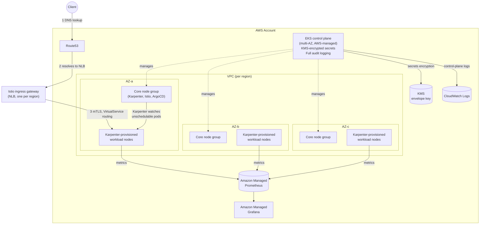

# Platform Overview

This platform runs production EKS across three regions of maturity — `staging` and `prod` in `us-east-1`, and `dr-prod` (warm standby) in `us-west-2` — built entirely from the Terraform in [`terraform/`](../../terraform) and the GitOps manifests in [`kubernetes/`](../../kubernetes).

## Component map

## Decisions and why

| Decision | Choice | Rationale | Doc |
|---|---|---|---|
| Compute / autoscaling | Standard EKS + self-managed **Karpenter** (primary); EKS Auto Mode documented as alternative | Full control over NodePools, spot mixing, custom AMIs | [01](01-compute-karpenter-vs-automode.md) |
| Service mesh | **Istio**, sidecar mode | AWS App Mesh shuts down Sept 30, 2026; Istio + Argo Rollouts is the proven canary/blue-green combo | [04](04-service-mesh-istio.md) |
| GitOps / progressive delivery | **ArgoCD + Argo Rollouts** | Same ecosystem, native Istio traffic-router plugin | [05](05-gitops-argocd-rollouts.md) |
| IAM for controllers | **Pod Identity** (Karpenter, EBS CSI, AMP writer, Velero); IRSA where the addons module defaults to it (LB Controller, external-dns, cert-manager, external-secrets) | Pod Identity is AWS's current recommended default; both mechanisms coexist safely | [03](03-security-iam-encryption.md) |
| Secrets encryption | KMS envelope encryption, `cluster_encryption_config` | AWS requirement for production EKS | [03](03-security-iam-encryption.md) |
| Observability | **Amazon Managed Prometheus + Managed Grafana** (primary), kube-prometheus-stack self-hosted noted as alternative | Durable storage survives a regional cluster loss — matters directly for DR | [06](06-observability-logging.md) |
| HA | Multi-AZ (3 AZs), one NAT gateway per AZ, spread topology for CoreDNS/Istiod/ArgoCD | Standard production baseline | [../dr-ha/01](../dr-ha/01-single-region-multi-az-ha.md) |
| DR | Multi-region active-passive (warm standby, fully built); active-active documented as an extension | Balances cost against recovery time; see the DR docs for the trade-off in full | [../dr-ha/02](../dr-ha/02-multi-region-active-passive-dr.md), [../dr-ha/03](../dr-ha/03-multi-region-active-active-dr.md) |
| State backend | S3 with native locking (`use_lockfile`) | No DynamoDB table to manage; GA since Terraform 1.11 | — |

## Reading order

1. [01 — Karpenter vs EKS Auto Mode](01-compute-karpenter-vs-automode.md) — how nodes get created
2. [02 — Networking & VPC](02-networking-vpc.md) — how the network and DNS are laid out
3. [03 — Security, IAM, Encryption](03-security-iam-encryption.md) — how secrets and identities are protected
4. [04 — Service Mesh (Istio)](04-service-mesh-istio.md) — how traffic moves between services
5. [05 — GitOps (ArgoCD + Rollouts)](05-gitops-argocd-rollouts.md) — how changes get deployed
6. [06 — Observability & Logging](06-observability-logging.md) — how you see what's happening
7. [07 — Ingress & DNS](07-ingress-dns.md) — the full client-request path, end to end
8. [08 — Canary & Blue-Green](08-progressive-delivery-canary-bluegreen.md) — how deployments actually roll out
9. [../dr-ha/](../dr-ha/) — HA and DR, all three tiers
10. [../runbooks/](../runbooks/) — what to actually run during an incident
