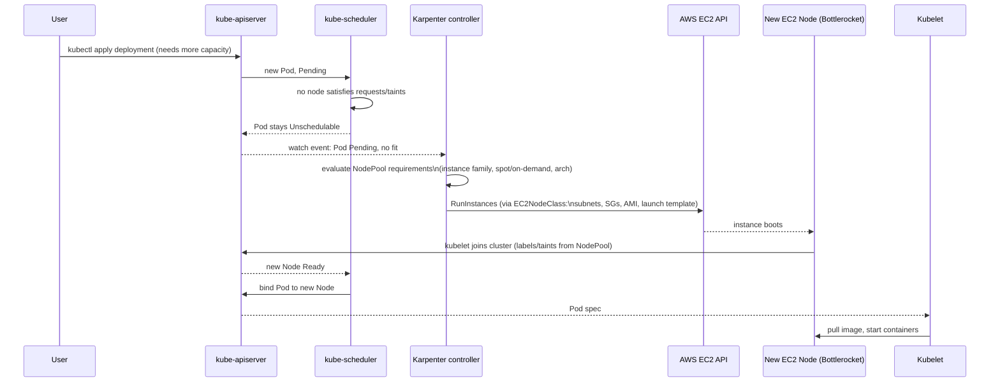

# Compute: Karpenter vs EKS Auto Mode

This platform's primary, fully-built compute path is **standard EKS + self-managed Karpenter** ([`terraform/modules/eks-karpenter`](../../terraform/modules/eks-karpenter)). EKS Auto Mode is a real, supported alternative — documented here in full so you can switch deliberately, not because it's second-class.

## Why they're mutually exclusive

EKS Auto Mode runs its own AWS-managed Karpenter internally, in AWS-owned accounts, and does **not** expose `NodePool`/`EC2NodeClass` CRDs for you to tune. You cannot run self-managed Karpenter NodePools *inside* an Auto Mode cluster's compute — you pick one model per cluster.

| | Standard EKS + self-managed Karpenter | EKS Auto Mode |
|---|---|---|
| Node provisioning control | Full: custom `NodePool`/`EC2NodeClass`, any AMI family, custom user-data, taints, spot/on-demand mix | Auto Mode's own abstraction; Bottlerocket-only, no custom AMI/user-data |
| Visibility | Karpenter controller runs in your cluster — full logs, metrics, events | Runs off-cluster in AWS accounts — troubleshooting requires AWS Support |
| Redundant addons | You install and manage VPC CNI, kube-proxy, CoreDNS, EBS CSI, Pod Identity Agent | All of these become **redundant/blocked** — Auto Mode provides pod networking, service networking, cluster DNS, block storage, load balancer controller, Pod Identity, and node monitoring natively |
| Cost | EC2 price + Karpenter is free (open source) | EC2 price + a per-instance Auto Mode markup |
| Operational burden | You own Karpenter upgrades, NodePool tuning, AMI patching cadence | AWS owns all of it |
| Best fit | Teams that need fine-grained node control, custom AMIs, or already have Karpenter expertise | Teams that want to minimize ops surface and don't need node-level customization |

**This repo's call**: standard EKS + Karpenter, because the platform also needs Istio sidecars with specific node-level tuning (native sidecars, termination grace periods) and a dedicated tainted "core" node group for cluster-critical controllers — both of which need the control Auto Mode doesn't expose.

## How to switch to Auto Mode

Replace [`terraform/modules/eks-cluster`](../../terraform/modules/eks-cluster) and [`terraform/modules/eks-karpenter`](../../terraform/modules/eks-karpenter) module calls with a single cluster resource setting `compute_config.enabled = true` (via `terraform-aws-modules/eks/aws`'s `cluster_compute_config` variable), and delete the [`terraform/modules/eks-core-addons`](../../terraform/modules/eks-core-addons) module call entirely — Auto Mode blocks installing VPC CNI, kube-proxy, CoreDNS, EBS CSI, and Pod Identity Agent as managed addons.

## Karpenter scheduling flow

This is what happens between "you `kubectl apply` a Deployment" and "a new EC2 instance is running your pod":

## Consolidation (scale-down)

Karpenter's `disruption.consolidationPolicy: WhenEmptyOrUnderutilized` (set in the default `NodePool`, [`terraform/modules/eks-karpenter/main.tf`](../../terraform/modules/eks-karpenter/main.tf)) continuously looks for nodes it can terminate — either because they're empty, or because their pods would fit on fewer/cheaper nodes elsewhere. `disruption.budgets` caps this to one node at a time, and blocks all disruption during weekday business hours (`0 8 * * mon-fri`, 10h window) unless a node is completely empty.

## Gotcha: Karpenter consolidation vs Istio sidecar draining

Karpenter's default node termination gives pods a grace period, but an Envoy sidecar with in-flight connections can be killed mid-drain if that grace period is too short. This platform mitigates it two ways (see [`terraform/modules/istio/main.tf`](../../terraform/modules/istio/main.tf) and [`terraform/modules/eks-karpenter/main.tf`](../../terraform/modules/eks-karpenter/main.tf)):

1. **Native sidecars** (`ENABLE_NATIVE_SIDECARS=true`) — Envoy runs as a Kubernetes-native sidecar container, which only receives `SIGTERM` after the main application container has already exited, so it drains connections opened by other pods after the app itself has stopped accepting new work.
2. **`terminationGracePeriod: 5m`** on the NodePool — gives that drain sequence room to actually finish before Karpenter force-terminates the underlying instance.

## Gotcha: Pod Identity Agent must exist before Karpenter's IAM association

Karpenter's controller authenticates via **Pod Identity**, not IRSA. The Pod Identity Agent addon (installed in [`terraform/modules/eks-core-addons`](../../terraform/modules/eks-core-addons)) must exist before Karpenter's Pod Identity association is created, or the controller pod hangs waiting for credentials at startup. This ordering is enforced explicitly via the `pod_identity_agent_dependency` variable passed into the `eks-karpenter` module from every `live/*` stack.
