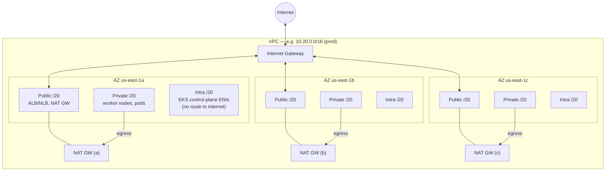
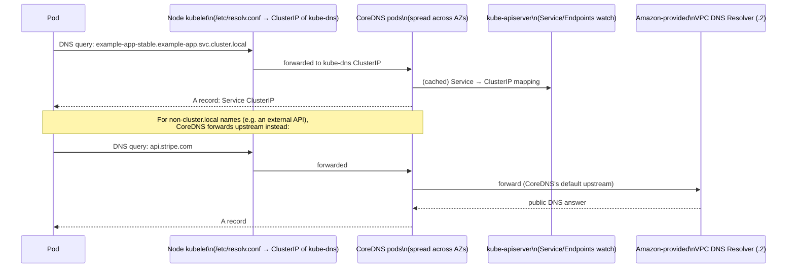

# Networking & VPC

Built by [`terraform/modules/vpc`](../../terraform/modules/vpc), one invocation per environment (`terraform/live/<region>/<env>`). Three tiers per AZ, three AZs minimum (enforced by a variable validation block) — this is what makes single-region HA possible at all; see [../dr-ha/01-single-region-multi-az-ha.md](../dr-ha/01-single-region-multi-az-ha.md).

## Subnet layout

Prod and DR-prod get **one NAT gateway per AZ** (`single_nat_gateway = false`) — a single NAT/AZ failure can't take out egress for the other two AZs. Staging uses one shared NAT gateway to cut cost, since it isn't held to the same availability bar.

## Subnet purpose and tagging

| Tier | Purpose | Key tags |
|---|---|---|
| Public | ALB/NLB placement, NAT gateways | `kubernetes.io/role/elb=1`, `kubernetes.io/cluster/<name>=shared` |
| Private | Worker nodes, pod ENIs | `kubernetes.io/role/internal-elb=1`, `karpenter.sh/discovery=<cluster>` |
| Intra | EKS control-plane cross-account ENIs only — no route to 0.0.0.0/0 in either direction | none (not used for workload placement) |

The `karpenter.sh/discovery` tag on private subnets is what Karpenter's default `EC2NodeClass` (`terraform/modules/eks-karpenter/main.tf`) uses for `subnetSelectorTerms` — no hardcoded subnet IDs anywhere in the Karpenter config.

## VPC Flow Logs

Enabled by default (`enable_flow_log = true`) to CloudWatch — the first thing you want available during a network-layer incident, and cheap enough to leave on permanently.

## DNS resolution flow (in-cluster)

How a pod resolves another Kubernetes Service name (e.g. `example-app-stable.example-app.svc.cluster.local`):

CoreDNS runs on the tainted "core" node group with a `topologySpreadConstraint` across `topology.kubernetes.io/zone` ([`terraform/modules/eks-core-addons/main.tf`](../../terraform/modules/eks-core-addons/main.tf)) — losing one AZ never takes cluster DNS down with it.

## External (client-facing) DNS resolution

Covered end-to-end, with the full request path past DNS resolution, in [07 — Ingress & DNS](07-ingress-dns.md).
