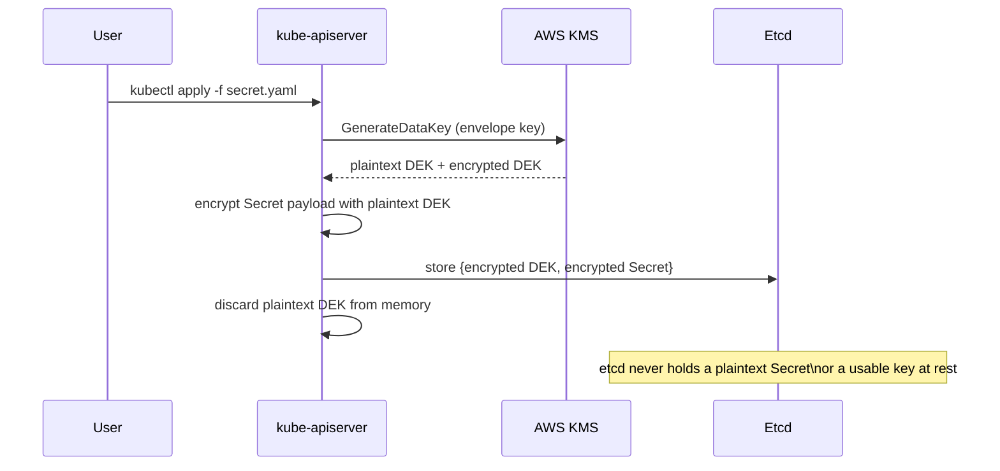
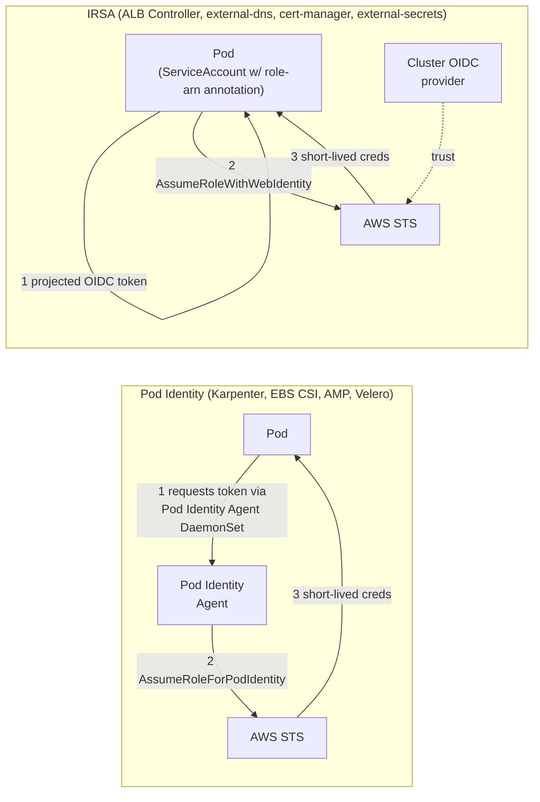

# Security, IAM, and Encryption

## Secrets encryption (KMS envelope encryption)

Every Kubernetes `Secret` is envelope-encrypted at rest in etcd using a customer-managed KMS key ([`terraform/modules/kms`](../../terraform/modules/kms)), wired into the cluster via `encryption_config` in [`terraform/modules/eks-cluster/main.tf`](../../terraform/modules/eks-cluster/main.tf) — this is the Terraform equivalent of the [AWS "enable secrets encryption" guide](https://docs.aws.amazon.com/eks/latest/userguide/enable-kms.html).



The `terraform-aws-modules/eks/aws` module automatically attaches an IAM policy to the EKS cluster role granting `kms:Encrypt/Decrypt/DescribeKey/GenerateDataKey*` scoped to this key — you don't need a separate `aws_kms_grant`, since the key's resource policy already authorizes the account root and IAM handles the rest.

**Prod-only detail**: the prod cluster's key is created with `multi_region = true`. The DR cluster's `kms` module invocation creates an `aws_kms_replica_key` of it (`primary_key_arn` variable), not a new key — this is what lets the DR cluster decrypt anything restored from a Velero backup that was encrypted with the primary key. Secrets in etcd itself are **not** replicated by this — DR is cluster recreation + backup restore, not live etcd failover. See [../dr-ha/02-multi-region-active-passive-dr.md](../dr-ha/02-multi-region-active-passive-dr.md).

## Control-plane logging

All five EKS control-plane log types are enabled and shipped to a KMS-encrypted CloudWatch log group ([`terraform/modules/eks-cluster/main.tf`](../../terraform/modules/eks-cluster/main.tf)) — the Terraform equivalent of the [AWS control-plane logging guide](https://docs.aws.amazon.com/eks/latest/userguide/control-plane-logs.html):

| Log type | What it tells you |
|---|---|
| `api` | Every request to the Kubernetes API server |
| `audit` | Who did what — the record you need for a security incident |
| `authenticator` | IAM ↔ Kubernetes RBAC mapping decisions |
| `controllerManager` | Built-in controller reconciliation loops |
| `scheduler` | Why a pod was (or wasn't) placed on a node |

Retention defaults to 400 days (`log_retention_days`), long enough to cover most compliance/audit windows without manual intervention.

## IAM: Pod Identity vs IRSA

**Pod Identity is the default for anything this repo's own Terraform hand-rolls** (Karpenter, EBS CSI driver, AMP remote-write agent, Velero) — it's AWS's current recommended mechanism: no per-cluster OIDC provider math, no 100-provider account ceiling, reusable roles across clusters, and simpler trust policies.

**IRSA is still used** for the addons installed via `aws-ia/eks-blueprints-addons` (ALB Controller, external-dns, cert-manager) and for the hand-rolled external-secrets/Fluent Bit roles in [`terraform/modules/platform-addons`](../../terraform/modules/platform-addons) — that module's addon submodules default to IRSA as of v1.18. **Both mechanisms are safe to run simultaneously** on one cluster; a cluster can have an OIDC provider and the Pod Identity Agent DaemonSet active at the same time, and neither interferes with the other. This is a deliberate, documented mixed-mode choice, not an inconsistency.



The only place IRSA is *structurally required* (not just "still used here") is **Fargate** — the Pod Identity Agent DaemonSet cannot run on Fargate, since Fargate has no node for a DaemonSet to schedule onto. This platform doesn't use Fargate, so that requirement doesn't currently apply, but it's why `oidc_provider_arn` stays as a cluster output even though most of this repo's own controllers don't use it directly.

## Network policy and mTLS

Pod-to-pod traffic is authenticated and encrypted mesh-wide by default via Istio's `PeerAuthentication` set to `STRICT` mode ([`terraform/modules/istio/main.tf`](../../terraform/modules/istio/main.tf)) — see [04 — Service Mesh](04-service-mesh-istio.md) for the full request-flow diagram through mTLS.

## API endpoint access

`endpoint_private_access` is always `true`. `endpoint_public_access` is exposed but restricted to `admin_cidrs` (never `0.0.0.0/0` — enforced by convention, not a Terraform validation block, so review this on every `tfvars` change). Cluster access itself uses modern **access entries** (`authentication_mode = "API"`), not the legacy `aws-auth` ConfigMap.

## Verify it yourself

```bash
aws eks describe-cluster --name eks-platform-prod --region us-east-1 \
  --query 'cluster.{enc:encryptionConfig,logs:logging.clusterLogging[?enabled==`true`].types}'   # KMS key ARN + all 5 log types
aws eks list-pod-identity-associations --cluster-name eks-platform-prod --region us-east-1       # controllers mapped to roles
aws eks list-access-entries --cluster-name eks-platform-prod --region us-east-1                  # access entries, no aws-auth ConfigMap
```
