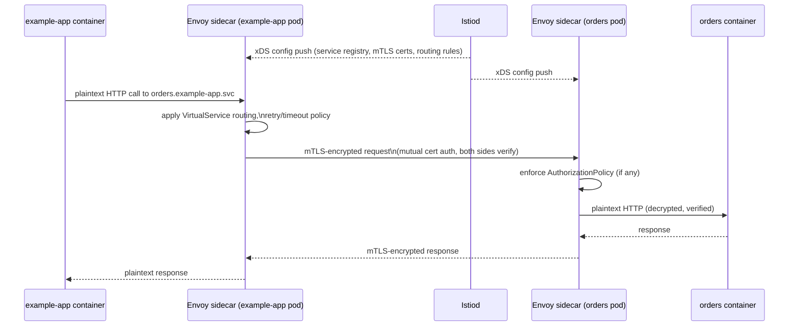

# Service Mesh: Istio

## Why Istio, not AWS App Mesh

**AWS App Mesh is end-of-life**: no new customers since September 24, 2024, and full shutdown **September 30, 2026**. Any comparison of the two must treat that as a hard deadline, not a "consider migrating eventually" — if you're reading this after that date, App Mesh no longer exists as an option at all.

| | Istio (chosen) | AWS App Mesh |
|---|---|---|
| Status | Actively developed, 1.30.x current | **EOL — shuts down Sept 30, 2026** |
| Traffic splitting for canary/blue-green | `VirtualService`/`DestinationRule` weights, natively driven by the Argo Rollouts Istio plugin | Similar concept, but the whole product is being retired |
| mTLS | Mesh-wide `PeerAuthentication`, STRICT by default | Supported, but moot given EOL |
| Multi-cloud/portability | Yes — not AWS-specific | AWS-only |

## Sidecar mode, not ambient

Istio 1.30 ships ambient mode (sidecar-less, GA since 1.24) and is nudging toward Gateway API/`HTTPRoute` as the long-term standard. This platform uses **sidecar injection + `VirtualService`** instead, because the Argo Rollouts Istio plugin's traffic-shifting mechanism (weighted `VirtualService` routes, optionally `DestinationRule` subsets) is the proven, well-documented integration path. Ambient mode's Gateway API plugin for Rollouts is newer and less battle-tested — noted here as a likely future migration, not adopted now.

## Control plane

`istio-base` → `istiod` (2-3 replicas depending on environment, spread on the tainted "core" node group) → `istio-ingressgateway` (autoscaling `Deployment` behind an internet-facing NLB) — see [`terraform/modules/istio/main.tf`](../../terraform/modules/istio/main.tf). Mesh-wide `PeerAuthentication` enforces `STRICT` mTLS: every pod-to-pod call inside the mesh is mutually authenticated and encrypted, with no per-namespace opt-out unless explicitly configured.

## API call flow through the mesh

A request from one in-mesh service to another (e.g. `example-app` calling a downstream `orders` service), after it's already inside the cluster:



Application containers never see TLS or certificates directly — Envoy handles the entire mTLS handshake and certificate rotation transparently, driven by `istiod`'s certificate authority.

## Full external client-to-pod flow

Including the ingress gateway, DNS, and load balancer hops, is covered in [07 — Ingress & DNS](07-ingress-dns.md) — that's the diagram to read for "how does a request from a browser actually reach my pod."

## Gotcha: sidecar draining vs Karpenter node consolidation

Covered in detail in [01 — Compute](01-compute-karpenter-vs-automode.md#gotcha-karpenter-consolidation-vs-istio-sidecar-draining) — native sidecars (`ENABLE_NATIVE_SIDECARS=true`) plus a 5-minute Karpenter `terminationGracePeriod` give in-flight mTLS connections time to drain before a node is terminated.

## Verify it yourself

```bash
istioctl proxy-status                                        # every sidecar SYNCED with istiod (the xDS push path)
kubectl get pods -n example-app -o jsonpath='{.items[0].spec.containers[*].name}'; echo   # istio-proxy injected
istioctl x describe pod $(kubectl get pod -n example-app -o name | head -1 | cut -d/ -f2) -n example-app   # confirms mTLS mode on the workload
```
