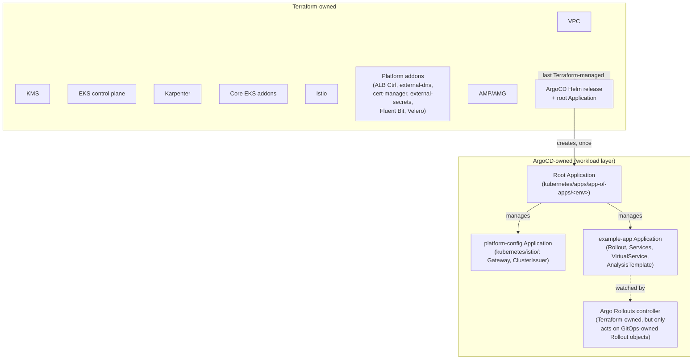
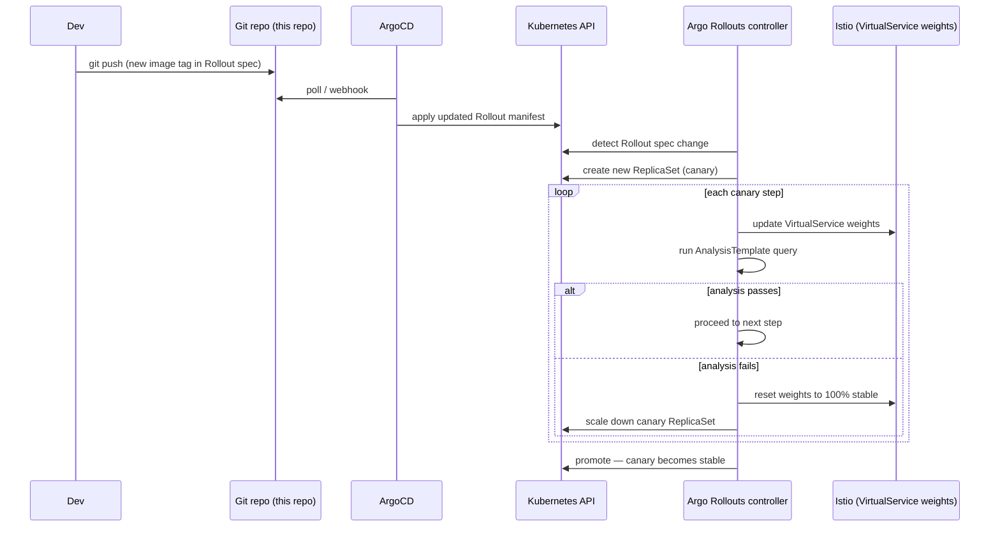

# GitOps: ArgoCD + Argo Rollouts

## The Terraform / GitOps ownership boundary

Two controllers reconciling the same resource is a recipe for a fight neither wins. This platform draws one explicit line:

**Terraform owns everything through** "a working cluster with ArgoCD installed and a root `Application` pointing at this repo": VPC, EKS, Karpenter, core addons, Istio control plane, platform addons, observability, and the ArgoCD Helm release + its root `Application` object. The Argo Rollouts **controller** (a cluster-wide controller + CRDs, treated as infrastructure like Istio) is also Terraform-owned — but the `Rollout` custom resources it acts on are workload-layer, GitOps-owned objects.

**ArgoCD owns everything after that**: `kubernetes/apps/` in this repo, which includes per-app `Rollout`/`Service`/`VirtualService`/`AnalysisTemplate` manifests and any namespace-scoped Istio config (`Gateway`, `ClusterIssuer`) that isn't part of the control-plane install itself.

## Why this avoids the chicken-and-egg problem

The naive approach — "have ArgoCD manage its own Helm release so everything is GitOps" — creates a race: Terraform creates the ArgoCD namespace/release, ArgoCD's root `Application` tries to *also* reconcile that namespace, and whichever actor runs second undoes the other's most recent change. This platform's root `Application` (created in [`terraform/modules/argocd-bootstrap/main.tf`](../../terraform/modules/argocd-bootstrap/main.tf)) points at a path that **excludes** the `argocd` namespace/release entirely — Terraform never needs to "wait" for ArgoCD to finish bootstrapping, and ArgoCD never tries to manage its own installation.

## Per-environment root Applications

Each cluster runs its own ArgoCD instance (not a hub-and-spoke model), so each cluster's root `Application` points at its **own** subfolder: `kubernetes/apps/app-of-apps/staging`, `/prod`, `/dr-prod` — set via the `gitops_root_path` variable on the `argocd-bootstrap` module in each `terraform/live/<region>/<env>/main.tf`. This is what lets `prod`'s ArgoCD sync the `overlays/prod` Kustomize target while `dr-prod`'s ArgoCD syncs `overlays/dr-prod`, without one cluster's ArgoCD ever touching another's workloads.

## Deploy flow

See [08 — Canary & Blue-Green](08-progressive-delivery-canary-bluegreen.md) for the full deployment-strategy detail, and [`kubernetes/apps/workloads/example-app/`](../../kubernetes/apps/workloads/example-app) for the actual manifests.
