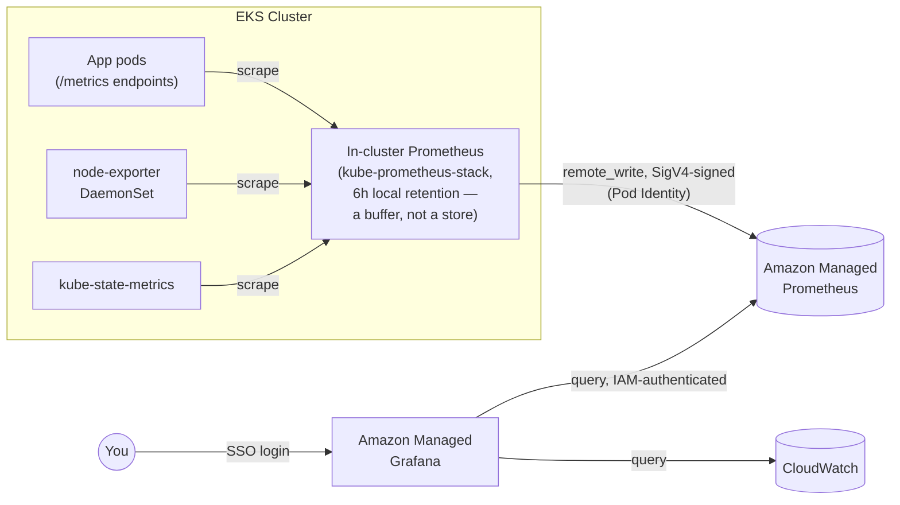
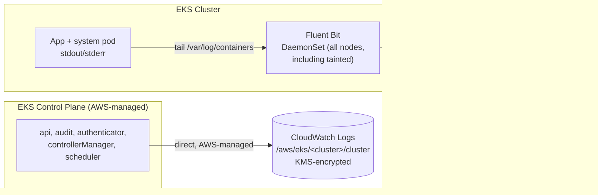

# Observability & Logging

## Why Amazon Managed Prometheus + Managed Grafana

Chosen over a fully self-hosted Prometheus HA/federation setup because **AMP's storage is durable and independent of any single cluster's lifecycle** — directly relevant to the DR story: if the primary region's cluster is lost, its metric history survives in AMP, and a Grafana workspace can query it (or the DR region's own AMP workspace) without having hand-built cross-region Prometheus federation first. See [../dr-ha/02-multi-region-active-passive-dr.md](../dr-ha/02-multi-region-active-passive-dr.md).

**Self-hosted alternative**: [`terraform/modules/observability-amp-amg`](../../terraform/modules/observability-amp-amg) could be swapped for a `kube-prometheus-stack` deployment with its own built-in Grafana and local long-term storage (e.g. Thanos/Mimir) — more control, more cost, more ops burden, no managed-service dependency. Worth it if you have specific compliance reasons data can't leave the cluster's own storage, or need Prometheus features AMP doesn't support (e.g. certain recording rule patterns).

## Metrics flow

The in-cluster Prometheus is intentionally short-retention (6h) — it exists only to scrape and forward, not to be queried directly in normal operation (Argo Rollouts' `AnalysisTemplate` is the one exception: it queries the in-cluster Prometheus directly for low-latency canary analysis, since a remote_write → AMP → query round-trip would add unacceptable lag to a rollout gate).

## Logging flow

Two independent paths — control-plane logs never touch the in-cluster logging stack at all:

Control-plane logs ([03 — Security](03-security-iam-encryption.md#control-plane-logging)) are enabled via `enabled_log_types` on the EKS cluster resource itself — AWS ships them directly to CloudWatch, no in-cluster component involved. Application/system pod logs go through Fluent Bit ([`terraform/modules/platform-addons/main.tf`](../../terraform/modules/platform-addons/main.tf)), which runs as a DaemonSet with a blanket toleration so it schedules on every node, including the tainted "core" group.

## What to actually look at during an incident

| Question | Where |
|---|---|
| Is the API server healthy / who changed what | CloudWatch `/aws/eks/<cluster>/cluster` — `audit` log stream |
| Why isn't my pod scheduling | CloudWatch — `scheduler` log stream, or `kubectl describe pod` |
| Application error rate / latency | Managed Grafana dashboards querying AMP |
| Application error logs | CloudWatch `/eks/<cluster>/application`, filtered by pod/namespace |
| Is a canary rollout's analysis failing, and why | `kubectl argo rollouts get rollout <name>` plus the same Grafana dashboards the `AnalysisTemplate` itself queries |
