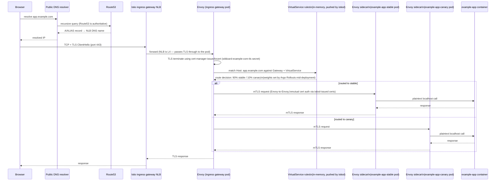

# Ingress & DNS: the full client-to-pod request path

This is the diagram to read if you want to understand, end to end, what happens between a user typing `https://app.example.com` and a pod actually handling the request — from an architect's point of view, every hop, every component that owns it, and which Terraform module or Kubernetes manifest is responsible.

## Component ownership

| Hop | Component | Managed by |
|---|---|---|
| Public DNS | Route53 hosted zone | Existing zone, referenced (not created) by [`terraform/live/global`](../../terraform/live/global) |
| DNS record → NLB | `external-dns` (writes records from Kubernetes `Service`/`Gateway` annotations) | [`terraform/modules/platform-addons`](../../terraform/modules/platform-addons) |
| Load balancer | Istio ingress gateway's NLB (`type: LoadBalancer`, provisioned by the AWS Load Balancer Controller) | [`terraform/modules/istio`](../../terraform/modules/istio) |
| TLS termination | Istio ingress gateway (cert from cert-manager) | [`kubernetes/istio/gateway.yaml`](../../kubernetes/istio/gateway.yaml), [`cluster-issuer.yaml`](../../kubernetes/istio/cluster-issuer.yaml) |
| Routing decision | Istio `VirtualService` | [`kubernetes/apps/workloads/example-app/base/virtualservice.yaml`](../../kubernetes/apps/workloads/example-app/base/virtualservice.yaml) |
| mTLS to the pod | Envoy sidecar ↔ Envoy sidecar | Istio control plane, mesh-wide `STRICT` `PeerAuthentication` |
| Application logic | Your container | ArgoCD-managed `Rollout` |

## End-to-end sequence

## Key things this diagram makes explicit

1. **The NLB is L4, not L7** — it passes TLS straight through; the Istio ingress gateway pod (Envoy) is what actually terminates TLS and makes routing decisions. This is why the NLB's target type is `ip` (pointing directly at gateway pod IPs), not `instance`.
2. **Routing weight is a live, mutable value** — during a canary rollout, the `VirtualService`'s route weights are being actively rewritten by the Argo Rollouts controller, not by a human or by ArgoCD. See [08 — Canary & Blue-Green](08-progressive-delivery-canary-bluegreen.md).
3. **Every hop past the ingress gateway is mTLS** — the browser's TLS session ends at the gateway; everything from there to the pod is a *separate*, mesh-internal mTLS session, invisible to and independent of the client's original TLS handshake.
4. **DNS resolution happens once, outside the cluster entirely** — nothing about which pod serves the request is decided by DNS; DNS only ever resolves to "the load balancer for this region."

## Cross-region behavior (DR)

The DNS step above (`R53 -->> PublicDNS`) is exactly what changes during a regional failover — the record `app.example.com` points at either the primary or DR region's NLB depending on the `terraform/modules/route53-failover` health-check state. See [../dr-ha/02-multi-region-active-passive-dr.md](../dr-ha/02-multi-region-active-passive-dr.md) and [../runbooks/dr-failover-runbook.md](../runbooks/dr-failover-runbook.md) for exactly how and when that flip happens.
