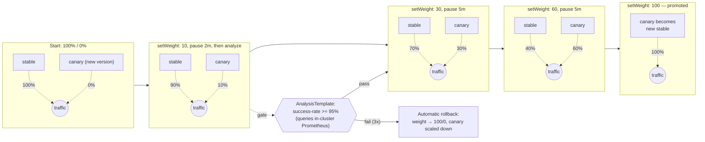
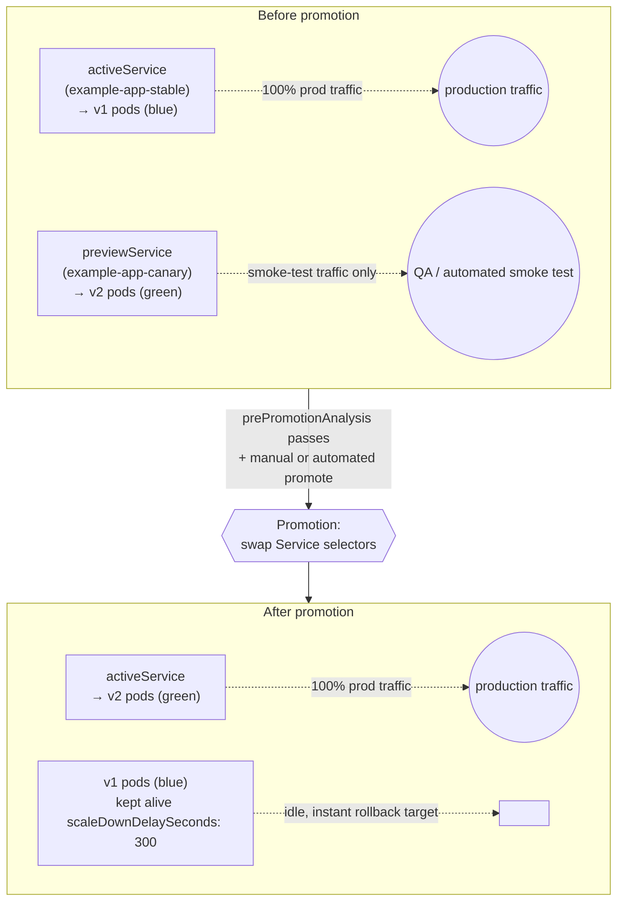

# Canary & Blue-Green Deployments

Both strategies are implemented with **Argo Rollouts**, which replaces `Deployment` with a `Rollout` custom resource of the same shape plus a `strategy` block. Traffic shifting is delegated to Istio (`VirtualService` weights for canary; two `Service` selectors for blue-green) — Argo Rollouts never touches pods' network paths directly, it only mutates Istio/Service objects and lets the mesh do the actual routing.

## Canary (this platform's default — [`kubernetes/apps/workloads/example-app/base/rollout.yaml`](../../kubernetes/apps/workloads/example-app/base/rollout.yaml))

Traffic shifts gradually, with automated analysis gates between steps. A failed gate rolls back automatically — no human has to notice and react.

**When to use it**: continuous, low-risk exposure of a new version to a growing traffic slice, with metrics-driven automated gating. Best for services with reliable success-rate/latency signals and enough traffic volume that a 10% slice is statistically meaningful.

## Blue-Green ([`kubernetes/apps/workloads/example-app/rollout-bluegreen-example.yaml`](../../kubernetes/apps/workloads/example-app/rollout-bluegreen-example.yaml) — illustrative, swap in for the canary strategy)

The new version ("green"/preview) runs at full scale *before* it receives any production traffic, reachable only via its own preview `Service` for smoke testing. Promotion is an instant, all-at-once cutover — not a gradual shift.

**When to use it**: changes too risky or too structurally different to canary safely (schema migrations paired with app changes, anything where serving two versions simultaneously to real users is unacceptable), or where you want a guaranteed-instant, single-command rollback rather than a weight ramp-down. Costs 2x replica capacity for the `scaleDownDelaySeconds` window.

## Rollback

Both strategies support the same rollback primitive — `kubectl argo rollouts undo <name>` (or ArgoCD's own rollback UI, since it's a Git-tracked spec change). Canary auto-rollback via failed `AnalysisTemplate` runs is the default expectation; blue-green rollback is manual/instant since the old ReplicaSet is still warm. See [../runbooks/canary-rollback-runbook.md](../runbooks/canary-rollback-runbook.md) for the exact commands and what to check first.
