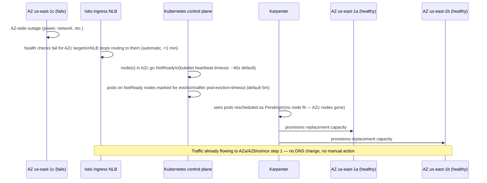

# HA Tier 1: Single-Region, Multi-AZ

**Status: fully built** — this is what `terraform/live/us-east-1/prod` actually deploys. Every other DR tier builds on top of this one.

## What's redundant, and at what layer

| Layer | Redundancy mechanism | Where |
|---|---|---|
| EKS control plane | AWS-managed, multi-AZ by default, no action needed | N/A — inherent to EKS |
| Network | 3 AZs, one NAT gateway per AZ (`single_nat_gateway = false`) | [`terraform/modules/vpc`](../../terraform/modules/vpc) |
| Core system nodes | Managed node group, `min_size: 3`, spread across all 3 private subnets | [`terraform/modules/eks-cluster`](../../terraform/modules/eks-cluster) |
| CoreDNS | `topologySpreadConstraint` on `topology.kubernetes.io/zone`, `replicaCount: 3` | [`terraform/modules/eks-core-addons`](../../terraform/modules/eks-core-addons) |
| Istiod | 3 replicas | [`terraform/modules/istio`](../../terraform/modules/istio) |
| Istio ingress gateway | 3-15 replicas, autoscaling, NLB with cross-zone load balancing enabled | [`terraform/modules/istio`](../../terraform/modules/istio) |
| ArgoCD | `server`/`repoServer`/`applicationSet` at 2 replicas, `redis-ha` enabled | [`terraform/modules/argocd-bootstrap`](../../terraform/modules/argocd-bootstrap) |
| Karpenter controller | 2 replicas (leader election, not active-active) | [`terraform/modules/eks-karpenter`](../../terraform/modules/eks-karpenter) |
| App workloads | `Rollout` replicas spread by the default Kubernetes scheduler across whatever AZs Karpenter provisioned nodes in | Application-level `topologySpreadConstraints` recommended, not yet enforced by default |
| Application data | Not covered — this repo doesn't include a database layer. Whatever you add (RDS, ElastiCache, etc.) needs its own Multi-AZ configuration. | — |

## AZ failure flow

**What's automatic**: NLB traffic shifting away from a failed AZ (health-check driven, sub-minute), Kubernetes marking nodes/pods unhealthy, Karpenter replacing lost capacity in the surviving AZs.

**What's manual**: nothing, for a single-AZ failure — that's the entire point of this tier. If you're doing anything manual in response to one AZ going down, something in the redundancy above isn't actually wired up.

## Testing this tier

The most honest test is a **chaos AZ-drain exercise**: cordon and drain every node in one AZ (`kubectl cordon` + `kubectl drain` on all nodes with `topology.kubernetes.io/zone=us-east-1c`), watch Karpenter replace capacity in the other two AZs, and confirm the NLB and application error rate (via the Grafana dashboards from [../architecture/06-observability-logging.md](../architecture/06-observability-logging.md)) show no sustained impact. Run this in staging first, then periodically in prod during a low-traffic window.
