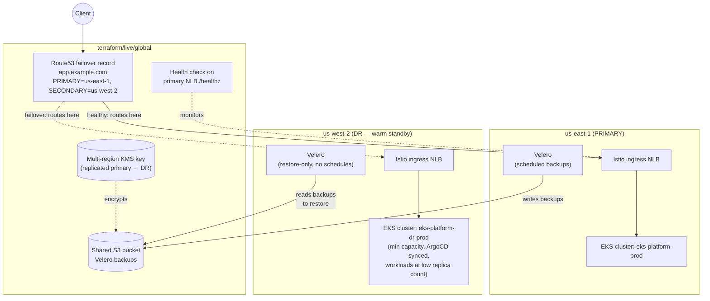
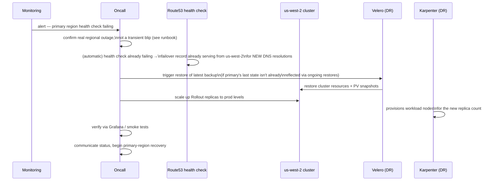

# HA Tier 2: Multi-Region Active-Passive DR

**Status: fully built** — `terraform/live/us-west-2/dr-prod` is a real, running warm-standby cluster, not a paper design. The gap between this tier and Tier 1 is real region loss, not AZ loss: everything in `us-east-1` — control plane, data, DNS — becomes unreachable, and traffic needs to move to `us-west-2`.

## Why "warm standby" and not "cold" or "hot"

| Model | RTO | Steady-state cost | This platform |
|---|---|---|---|
| Cold (DR region provisioned only during failover) | Hours (full Terraform apply + data restore) | Lowest | Not used — too slow for most production SLAs |
| **Warm standby (chosen)** | Minutes (cluster + control plane already running, scale up + DNS flip) | Moderate — full control plane + Istio/ArgoCD/Karpenter running, app workloads scaled low | `terraform/live/us-west-2/dr-prod` |
| Hot / active-active | Seconds (no failover step, both regions already serving traffic) | Highest — full duplicate capacity always on | Tier 3, see [03](03-multi-region-active-active-dr.md) |

The DR cluster runs `eks_karpenter`, `istio`, `argocd_bootstrap`, and `platform_addons` continuously (see [`terraform/live/us-west-2/dr-prod/main.tf`](../../terraform/live/us-west-2/dr-prod/main.tf)) — ArgoCD there is *already* syncing the same Git repo as prod, so application manifests exist and are correct before any failover is triggered. What's *not* running at full scale ahead of time is workload replica count and node capacity — Karpenter provisions that on demand during failover.

## Architecture



## What actually replicates, and what doesn't

This is the single most important thing to understand about this tier — **DR here is cluster recreation + data resync, not live etcd failover**:

- **etcd / Kubernetes Secrets**: region-local, not replicated. The DR cluster has its own etcd; nothing in the primary's etcd is streamed to it.
- **KMS key**: the primary's EKS secrets key is `multi_region = true`; the DR cluster's `kms` module invocation creates an `aws_kms_replica_key` of it ([`terraform/modules/kms/main.tf`](../../terraform/modules/kms/main.tf)). This replicates only the *key material* — it lets the DR region decrypt anything encrypted with that key ARN (e.g. a Velero-backed-up Secret), it does not copy any actual Secret content by itself.
- **Application state (cluster resources + PV data)**: replicated explicitly via **Velero**, scheduled daily in prod (`terraform/live/us-east-1/prod`'s `platform_addons` module, `velero_backup_schedules`), writing to one shared S3 bucket ([`terraform/modules/backup-bucket`](../../terraform/modules/backup-bucket), applied once from `terraform/live/global`). The DR cluster's Velero has no schedules of its own — it only restores.
- **GitOps config (Deployments, Rollouts, VirtualServices, etc.)**: already present in the DR cluster continuously, via its own ArgoCD syncing the same repo — this is *not* part of the Velero backup/restore path at all, since it's declarative and Git-sourced.
- **Anything outside this repo's scope** (RDS, ElastiCache, S3 app data, etc.): needs its own cross-region replication strategy — not covered here, since this repo doesn't provision a data layer.

## Failover sequence



Full step-by-step commands: [../runbooks/dr-failover-runbook.md](../runbooks/dr-failover-runbook.md).

## Apply order for this tier

1. `terraform/live/global` — first pass, `enable_dr_failover_dns = false` (creates the Velero backup bucket + its KMS key only; the DNS failover module needs both regions' outputs, which don't exist yet).
2. `terraform/live/us-east-1/prod` — creates the primary cluster and its multi-region KMS key.
3. `terraform/live/us-west-2/dr-prod` — reads `prod`'s state (`terraform_remote_state`) for the KMS key ARN to replicate, and `global`'s state for the shared Velero bucket name.
4. `terraform/live/global` — second pass, `enable_dr_failover_dns = true`, now that both regions' Istio ingress NLB DNS names/zone IDs exist as outputs.

## RTO / RPO for this tier

- **RPO** (data loss window): bounded by the Velero backup schedule — daily by default (`0 3 * * *`), so up to ~24h of application state (excluding anything ArgoCD/Git already keeps in sync). Tighten the schedule if your data-loss tolerance is smaller; it's a direct cost/RPO trade-off.
- **RTO** (time to recover service): minutes, not hours — the cluster, Istio, ArgoCD, and Karpenter are already running; the work during failover is Velero restore + scaling app replicas + Karpenter provisioning nodes, not standing up infrastructure from scratch.

## Verify it yourself

Confirm the standby is actually warm without triggering anything:

```bash
scripts/kubeconfig.sh dr-prod && kubectl get nodes           # DR cluster live in us-west-2
velero backup get                                            # recent backups visible from the shared bucket (RPO check)
aws route53 list-health-checks --query 'HealthChecks[].{id:Id,type:HealthCheckConfig.Type,target:HealthCheckConfig.FullyQualifiedDomainName}'   # primary health check exists and is being evaluated
```
