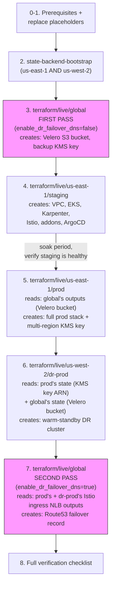
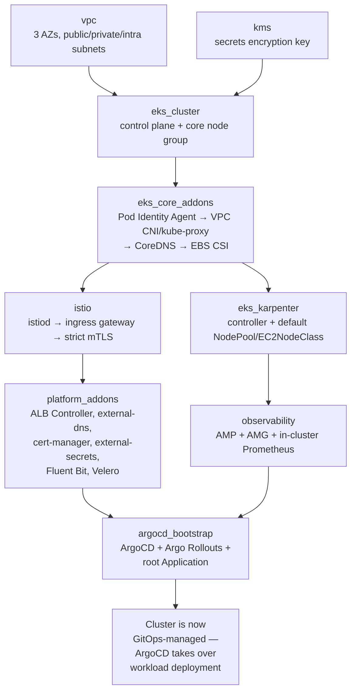

# Installation Guide: Step by Step

This is the single doc to follow top-to-bottom for a first-time install of this platform. It doesn't re-explain *why* things are built the way they are — that's what [`docs/architecture/`](architecture/00-overview.md) and [`docs/dr-ha/`](dr-ha/01-single-region-multi-az-ha.md) are for. This doc is purely the sequence of commands and config edits to go from an empty AWS account to a running, GitOps-managed, multi-region platform.

Follow the steps **in order** — later stacks read earlier stacks' Terraform state via `terraform_remote_state`, so skipping ahead will fail with a missing-state error, not a subtle bug.

## The apply order, and why it can't be reordered



The `global` stack is applied **twice** (highlighted above) because it sits on both ends of a real dependency cycle: it must exist *before* `prod`/`dr-prod` (they read its Velero bucket name), but its DNS failover module can only be created *after* `prod`/`dr-prod` exist (it reads their load balancer outputs). Splitting it into two passes, gated by the `enable_dr_failover_dns` variable, is what breaks the cycle — see [`terraform/live/global/main.tf`](../terraform/live/global/main.tf).

## 0. Prerequisites

### Tools

| Tool | Minimum version | Why |
|---|---|---|
| [Terraform](https://developer.hashicorp.com/terraform/install) | 1.11.0 | S3 native state locking (`use_lockfile`) requires it |
| [AWS CLI](https://docs.aws.amazon.com/cli/latest/userguide/getting-started-install.html) | v2 | `aws eks get-token` is what every Kubernetes/Helm/kubectl provider in this repo authenticates with |
| [kubectl](https://kubernetes.io/docs/tasks/tools/) | matching the cluster's k8s version (1.32) | |
| [helm](https://helm.sh/docs/intro/install/) | 3.x | for manual chart inspection; Terraform's `helm_release` resources don't need the CLI, but you will want it for debugging |
| [kustomize](https://kubectl.docs.kubernetes.io/installation/kustomize/) | any recent | bundled in `kubectl` as `kubectl kustomize`, or install standalone |
| [velero CLI](https://velero.io/docs/main/basic-install/#install-the-cli) | 1.14+ | for [the DR runbook](runbooks/dr-failover-runbook.md) |
| [kubectl-argo-rollouts plugin](https://argo-rollouts.readthedocs.io/en/stable/installation/#kubectl-plugin-installation) | any recent | `kubectl argo rollouts get rollout ...` |
| `dig` or equivalent | — | verifying DNS during setup and failover |

### AWS account

- An AWS account (or a dedicated one per environment, if you separate staging/prod/dr by account rather than by VPC — this repo assumes one account, three environments, two regions; adjust the backend bucket names and IAM boundary if you split by account).
- An IAM principal (user or role) with permissions to create: VPC/networking, EKS, EC2, IAM roles/policies, KMS keys, S3 buckets, Route53 records, CloudWatch log groups, Amazon Managed Prometheus/Grafana workspaces. Full `AdministratorAccess` is the pragmatic starting point for a first install; narrow it down once the exact resource set is stable.
- A registered domain with an existing Route53 hosted zone. This repo **reads** an existing zone (`data "aws_route53_zone"` in [`terraform/live/global/main.tf`](../terraform/live/global/main.tf)) — it does not create or transfer domain registration for you.
- A Git remote (GitHub, GitLab, etc.) hosting a copy of this repo, reachable by the ArgoCD instances you're about to create. ArgoCD needs read access to it — a public repo needs nothing extra; a private repo needs a deploy key or token configured in ArgoCD's `repositories` config (not covered by this guide — see the [ArgoCD private repo docs](https://argo-cd.readthedocs.io/en/stable/user-guide/private-repositories/)).

## 1. Replace every placeholder value

Nothing in this repo will apply successfully against your account until these are real values. Two categories:

### 1a. `ACCOUNT_ID` in Terraform backend/remote-state blocks

Every `versions.tf`, and the `terraform_remote_state` blocks in `main.tf`/`providers.tf`, reference two bucket names that don't exist yet:

```
eks-platform-tfstate-us-east-1-ACCOUNT_ID
eks-platform-tfstate-us-west-2-ACCOUNT_ID
```

You'll get the real bucket names from Step 2 below — **do not hand-guess the account ID substitution before that step**, since the bucket name Terraform actually creates includes a randomly-stable but not-hand-derivable suffix pattern only if you changed `terraform/modules/state-backend-bootstrap/variables.tf`'s `project` default; otherwise it's deterministic (`eks-platform-tfstate-<region>-<account_id>`), so you can safely pre-substitute your 12-digit AWS account ID now if you already know it:

```bash
cd eks-setup-from-scratch
ACCOUNT_ID=$(aws sts get-caller-identity --query Account --output text)
grep -rl "ACCOUNT_ID" terraform/ | xargs sed -i '' "s/ACCOUNT_ID/${ACCOUNT_ID}/g"   # macOS (BSD sed)
# grep -rl "ACCOUNT_ID" terraform/ | xargs sed -i "s/ACCOUNT_ID/${ACCOUNT_ID}/g"   # Linux (GNU sed)
```

### 1b. Domain and repo placeholders

```bash
DOMAIN="app.example.com"          # replace with your real subdomain
ZONE="example.com"                # replace with your real hosted zone
REPO_URL="https://github.com/your-org/eks-setup-from-scratch.git"   # replace with your real repo URL

grep -rl "example\.com" . --include="*.tf" --include="*.yaml" --include="*.md" \
  | xargs sed -i '' "s/example\.com/${ZONE}/g"     # macOS
grep -rl "your-org/eks-setup-from-scratch" . --include="*.tf" --include="*.yaml" \
  | xargs sed -i '' "s#https://github.com/your-org/eks-setup-from-scratch.git#${REPO_URL}#g"   # macOS
```

(Drop the `''` after `-i` on Linux/GNU sed.) Review the diff afterward (`git diff`) — a couple of files use `app.example.com` specifically (the client-facing FQDN) versus `*.example.com`/`example.com` (the zone and wildcard cert) — [`kubernetes/istio/gateway.yaml`](../kubernetes/istio/gateway.yaml), [`kubernetes/istio/cluster-issuer.yaml`](../kubernetes/istio/cluster-issuer.yaml), and the `overlays/*/kustomization.yaml` VirtualService host patches are the ones to check by hand if your subdomain isn't literally `app`.

### 1c. Terraform variable files

For each of `terraform/live/us-east-1/staging`, `terraform/live/us-east-1/prod`, `terraform/live/us-west-2/dr-prod`:

```bash
cp terraform.tfvars.example terraform.tfvars
```

Then edit `terraform.tfvars` in each: set `admin_cidrs` to your real office/VPN egress CIDR (never leave `0.0.0.0/0`), `route53_zone_arns` to your real hosted zone ARN (`aws route53 list-hosted-zones` to find it), and `gitops_repo_url` to your real repo URL. `terraform.tfvars` is gitignored — it will never accidentally get committed.

## 2. Bootstrap Terraform state backends (manual, one-time, per region)

```bash
cd terraform/modules/state-backend-bootstrap
terraform init
terraform apply -var="region=us-east-1"
terraform output bucket_name
# then, for the DR region's own bucket:
terraform apply -var="region=us-west-2"
terraform output bucket_name
```

Confirm the bucket names match what you substituted in step 1a (`eks-platform-tfstate-us-east-1-<account-id>` and `eks-platform-tfstate-us-west-2-<account-id>`). If your account ID substitution was wrong, fix it now — every subsequent `terraform init` depends on these bucket names being correct.

## 3. `terraform/live/global` — first pass

```bash
cd ../../live/global
terraform init
terraform plan    # enable_dr_failover_dns defaults to false — this should only plan the Velero backup bucket + its KMS key
terraform apply
```

This creates the shared Velero backup bucket and its dedicated multi-region KMS key — nothing region-specific yet. The Route53 failover module is intentionally skipped this pass (it needs both regional clusters' outputs, which don't exist yet).

## 4. `terraform/live/us-east-1/staging` — first real cluster

This is your fastest feedback loop — always validate changes here before touching `prod`. The same module sequence runs for `prod` and `dr-prod` in steps 5-6 — this is what a single `terraform apply` is actually doing under the hood, in dependency order (see [`terraform/live/us-east-1/staging/main.tf`](../terraform/live/us-east-1/staging/main.tf)):



```bash
cd ../us-east-1/staging
terraform init
terraform plan     # read it — this creates real, billable AWS resources
terraform apply    # takes ~20-25 minutes: VPC, EKS control plane, node group, Karpenter, Istio, addons, ArgoCD
```

### Verify

```bash
aws eks update-kubeconfig --name eks-platform-staging --region us-east-1
kubectl get nodes -o wide                     # 2-4 "core" nodes, Ready
kubectl get pods -n kube-system                # vpc-cni, kube-proxy, coredns, ebs-csi, pod-identity-agent all Running
kubectl get pods -n istio-system               # istiod Running
kubectl get pods -n istio-ingress              # istio-ingressgateway Running, Service has an EXTERNAL-IP (NLB)
kubectl get pods -n kube-system -l app.kubernetes.io/name=karpenter
kubectl get pods -n argocd                     # server, repo-server, application-controller, applicationset-controller
kubectl get applications -n argocd             # "root", "platform-config", "example-app" — should reach Synced/Healthy
kubectl get rollout example-app -n example-app
```

If `root` Application isn't `Synced`, check ArgoCD can actually reach your Git remote:

```bash
kubectl -n argocd logs deploy/argocd-repo-server | tail -50
```

### Smoke-test Karpenter

```bash
kubectl argo rollouts scale example-app --replicas=20 -n example-app
kubectl get nodeclaims -w        # new EC2NodeClaims should appear within ~30-60s
kubectl get nodes -w             # new nodes join within 1-2 minutes
kubectl argo rollouts scale example-app --replicas=2 -n example-app   # scale back down, watch consolidation
```

## 5. `terraform/live/us-east-1/prod`

Only proceed once staging has run clean for a reasonable soak period.

```bash
cd ../prod
terraform init
terraform plan
terraform apply    # same ~20-25 minute shape as staging, larger sizing
aws eks update-kubeconfig --name eks-platform-prod --region us-east-1
```

Run the same verification block as step 4. Additionally confirm Velero is actually running and has a schedule:

```bash
kubectl -n velero get pods
velero schedule get
velero backup get   # empty until the first 03:00 UTC run, or trigger one manually:
velero backup create manual-test-backup
```

## 6. `terraform/live/us-west-2/dr-prod`

Depends on `prod`'s state (KMS key ARN) and `global`'s state (Velero bucket name) — both must already be applied.

```bash
cd ../../us-west-2/dr-prod
terraform init
terraform plan
terraform apply
aws eks update-kubeconfig --name eks-platform-dr-prod --region us-west-2
```

Verify the same way as staging/prod, plus confirm Velero here can see the shared bucket and the primary's backups:

```bash
kubectl -n velero get pods
velero backup get    # should show the SAME backups as the prod cluster listed, since it's the same S3 bucket
```

## 7. `terraform/live/global` — second pass (DNS failover)

Now that both regional clusters exist and have real Istio ingress NLBs:

```bash
cd ../../global
```

Edit `terraform.tfvars` (create it if it doesn't exist) or pass `-var` flags:

```bash
terraform apply \
  -var="enable_dr_failover_dns=true" \
  -var="route53_zone_name=${ZONE}" \
  -var="app_fqdn=${DOMAIN}"
```

### Verify

```bash
dig +short ${DOMAIN}                     # should resolve to the PRIMARY (us-east-1) NLB
aws route53 get-health-check-status --health-check-id "$(terraform output -raw primary_health_check_id)"
curl -sf https://${DOMAIN}/healthz
```

## 8. Full post-install checklist

- [ ] `kubectl get nodes` clean on all three clusters (staging, prod, dr-prod)
- [ ] All ArgoCD `Application`s `Synced`/`Healthy` on all three clusters
- [ ] `curl https://${DOMAIN}/healthz` succeeds through the real public DNS path
- [ ] TLS certificate is valid (`curl -v` shows a cert issued by Let's Encrypt, not a self-signed fallback) — if not, check `kubectl -n istio-ingress describe certificate wildcard-<zone>-tls` and cert-manager logs; DNS-01 propagation can take a few minutes on first issuance
- [ ] Amazon Managed Grafana workspace is reachable (`terraform output amg_workspace_endpoint` from the `prod` stack) and shows data from AMP
- [ ] A test canary rollout actually shifts traffic — bump the image tag in [`kubernetes/apps/workloads/example-app/base/rollout.yaml`](../kubernetes/apps/workloads/example-app/base/rollout.yaml), push, and watch `kubectl argo rollouts get rollout example-app -n example-app --watch`
- [ ] `velero backup get` shows completed backups in prod, and the DR cluster's Velero can see the same list
- [ ] Route53 health check on the primary region shows `Success`

## Troubleshooting

| Symptom | Likely cause | Where to look |
|---|---|---|
| `terraform init` fails with "no available releases match the given constraints" on `hashicorp/aws` or `hashicorp/helm` | Provider version pins drifted from what the pulled module versions require | Check `versions.tf` in the failing stack; this repo pins `aws ~> 6.0`, `helm ~> 3.0` deliberately because `terraform-aws-modules/eks/aws` v21.x and the addon submodules require them |
| Karpenter never provisions nodes | Pod Identity Agent not ready before Karpenter's association was created | `kubectl -n kube-system get pods -l app.kubernetes.io/name=eks-pod-identity-agent`; also check `kubectl -n kube-system logs deploy/karpenter` |
| `cert-manager` `Certificate` stuck `False` | DNS-01 challenge record not propagating, or the cert-manager IAM role can't write to the zone | `kubectl -n istio-ingress describe certificate wildcard-<zone>-tls`, `kubectl -n cert-manager logs deploy/cert-manager` |
| ArgoCD `Application` stuck `OutOfSync`/`Unknown` | Repo URL wrong, or ArgoCD can't authenticate to a private repo | `kubectl -n argocd logs deploy/argocd-repo-server`; confirm `gitops_repo_url` matches what you set in step 1b |
| `terraform apply` on `dr-prod` fails reading `terraform_remote_state` | `prod` or `global` haven't been applied yet, or the bucket/key in the `data` block doesn't match | Re-check step 1a's substitution and confirm `terraform/live/us-east-1/prod` was actually applied first |
| Route53 not failing over during a real test | Health check target/path wrong, or `enable_dr_failover_dns` still `false` | `aws route53 get-health-check-status`, confirm step 7 was actually run with the flag set |

## Tearing everything down

Destroy in **reverse** of the apply order — each stack's remote-state reads make forward-order destruction fail partway through:

```bash
cd terraform/live/us-west-2/dr-prod && terraform destroy
cd ../../us-east-1/prod && terraform destroy
cd ../staging && terraform destroy
cd ../../global && terraform destroy
# state-backend-bootstrap last, and only if you're fully done with this account:
cd ../../modules/state-backend-bootstrap && terraform destroy -var="region=us-east-1"
terraform destroy -var="region=us-west-2"
```

Note `aws_s3_bucket`/`aws_kms_key` resources in this repo don't set `force_destroy`/have short deletion windows deliberately — expect the state buckets and KMS keys to resist deletion or enter a pending-deletion window rather than vanish instantly. That's intentional, not a bug.
