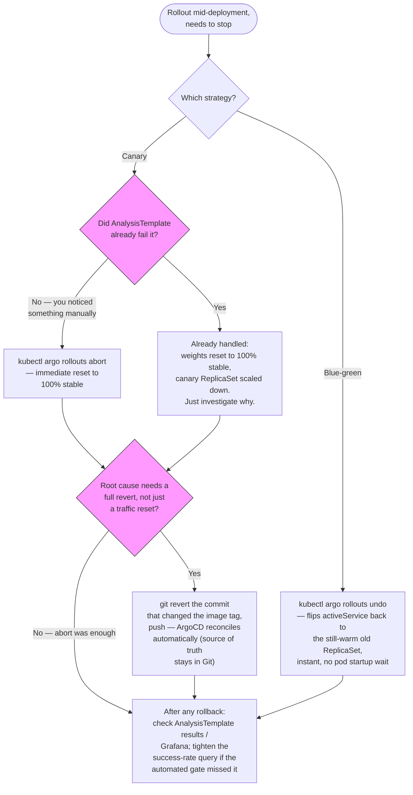

# Runbook: Canary Rollback

Use this when a `Rollout` is mid-deployment and needs to stop — either the automated `AnalysisTemplate` already caught it, or you noticed something the automated gate didn't.

## Decision flow



## If the automated analysis already failed

Argo Rollouts has already reset the `VirtualService` weights to 100% stable and scaled down the canary ReplicaSet — no action needed to stop the bad traffic. Confirm and investigate:

```bash
kubectl argo rollouts get rollout example-app -n example-app --watch
kubectl argo rollouts status example-app -n example-app
```

Look at `Status: Degraded` and the `AnalysisRun` that failed:

```bash
kubectl get analysisruns -n example-app
kubectl describe analysisrun <name> -n example-app
```

## Manual abort (you noticed something the automated gate didn't)

```bash
kubectl argo rollouts abort example-app -n example-app
```

This immediately resets traffic to 100% stable and stops the rollout, without waiting for the current `pause` step to time out.

## Full rollback to the previous Git-tracked version

Aborting stops the *in-progress* rollout, but leaves the "new" spec as the target. To actually go back to the last known-good version:

```bash
kubectl argo rollouts undo example-app -n example-app
```

Or, since this platform is GitOps-managed, the more correct action for anything beyond an immediate stop-the-bleeding abort is to **revert the change in Git** (revert the image tag / Rollout spec change in `kubernetes/apps/workloads/example-app/`) and let ArgoCD reconcile — this keeps Git as the source of truth rather than leaving cluster state that doesn't match any commit.

```bash
git revert <commit-that-changed-the-image-tag>
git push
# ArgoCD picks it up automatically (automated sync + selfHeal are both enabled)
```

## Blue-green rollback

If the app is using the blue-green strategy ([`rollout-bluegreen-example.yaml`](../../kubernetes/apps/workloads/example-app/rollout-bluegreen-example.yaml)) instead of canary, rollback is simpler — the old ("blue") ReplicaSet is kept warm for `scaleDownDelaySeconds` (5 minutes by default) after promotion specifically so this is fast:

```bash
kubectl argo rollouts undo example-app -n example-app
```

This flips `activeService` back to the still-warm blue ReplicaSet instantly — no pod startup wait, unlike a canary rollback which relies on the stable ReplicaSet already being at full weight (which it usually still is, since canary steps ramp up slowly).

## After any rollback

- [ ] Check `AnalysisTemplate` results / Grafana dashboards to understand *why* — don't just retry the same image tag.
- [ ] If the automated gate caught it correctly, no process change needed. If it *didn't* catch something you noticed manually, consider whether the `success-rate` query in [`analysistemplate.yaml`](../../kubernetes/apps/workloads/example-app/base/analysistemplate.yaml) needs a tighter threshold or an additional metric (latency, specific error codes).
