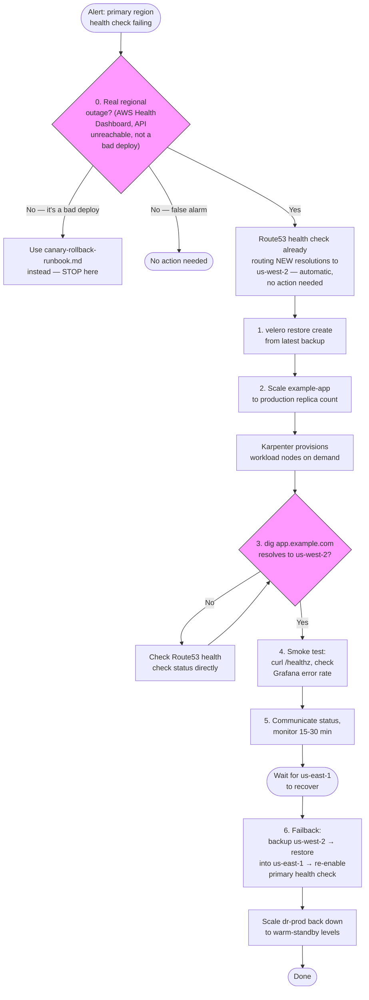

# Runbook: DR Failover (us-east-1 → us-west-2)

Use this when the primary region (`us-east-1`) is confirmed down — not for a single-AZ issue (Tier 1 HA handles that automatically, see [../dr-ha/01-single-region-multi-az-ha.md](../dr-ha/01-single-region-multi-az-ha.md); nothing in this runbook should be needed for an AZ failure).

## Flow



## 0. Confirm this is real

Route53's health check on the primary NLB will already have started routing new DNS resolutions to `us-west-2` automatically — that part needs no action. Before doing anything else in this runbook:

- [ ] Check the AWS Health Dashboard for an active `us-east-1` event.
- [ ] Confirm the primary cluster's API server is actually unreachable (`aws eks describe-cluster --name eks-platform-prod --region us-east-1`), not just the ingress path.
- [ ] Rule out a bad deploy (check recent ArgoCD sync history / Argo Rollouts state) — a bad deploy needs [canary-rollback-runbook.md](canary-rollback-runbook.md), not a regional failover.

## 1. Restore application state in the DR cluster

```bash
aws eks update-kubeconfig --name eks-platform-dr-prod --region us-west-2

# Confirm Velero can see the shared backup bucket and recent backups exist
velero backup get

# Restore the most recent backup (adjust name)
velero restore create --from-backup <latest-daily-backup-name>

# Watch restore progress
velero restore describe <restore-name> --details
```

If restores have been running continuously (recommended for tighter RPO) rather than only on-demand here, this step may already be current — check `velero backup get` timestamps against how long the outage has been happening before assuming you need a fresh restore.

## 2. Scale application workloads to production capacity

The DR cluster runs at warm-standby replica counts by default ([`kubernetes/apps/workloads/example-app/overlays/dr-prod/kustomization.yaml`](../../kubernetes/apps/workloads/example-app/overlays/dr-prod/kustomization.yaml)).

```bash
kubectl argo rollouts scale example-app --replicas=6 -n example-app
```

Karpenter provisions the nodes for this automatically — watch it happen:

```bash
kubectl get nodeclaims -w
kubectl get pods -n example-app -w
```

If capacity doesn't appear within a few minutes, check the NodePool's `limits` in [`terraform/modules/eks-karpenter/main.tf`](../../terraform/modules/eks-karpenter/main.tf) — the DR NodePool's ceiling matches prod's (`2000` vCPU / `4000Gi`), so this shouldn't be the bottleneck, but confirm.

## 3. Verify DNS has actually moved

```bash
dig app.example.com
# Should resolve to the us-west-2 NLB's DNS name / IPs
```

If it hasn't, check the Route53 health check status directly:

```bash
aws route53 get-health-check-status --health-check-id <id from terraform output>
```

## 4. Smoke test

```bash
curl -sf https://app.example.com/healthz
```

Check the Grafana dashboards ([../architecture/06-observability-logging.md](../architecture/06-observability-logging.md)) for error rate and latency against the DR region's AMP workspace.

## 5. Communicate and monitor

- [ ] Update status page / notify stakeholders.
- [ ] Watch error rates and Karpenter scaling events for the first 15-30 minutes post-failover.
- [ ] Do **not** begin primary-region recovery work that could interfere with `us-west-2` state until traffic has stabilized.

## 6. Failback (once us-east-1 recovers)

Failback is deliberately **not automatic** — Route53's failover record will route back to `us-east-1` the moment its health check passes again, which could happen before the primary cluster's application state is actually caught up with what happened in `us-west-2` during the outage.

1. Confirm `us-east-1`'s EKS cluster and all pods are healthy, but do **not** let its health check pass yet if you need to control the exact cutover moment — you can temporarily disable the health check or widen its failure threshold.
2. Run a Velero backup **from** `us-west-2` (temporarily add a schedule or trigger one manually) capturing everything that changed during the incident.
3. Restore that backup into `us-east-1`.
4. Re-enable the primary health check and let Route53 route back naturally, or force it by disabling the `us-west-2` target temporarily.
5. Scale `dr-prod` back down to warm-standby replica counts once traffic has fully returned to `us-east-1`.
