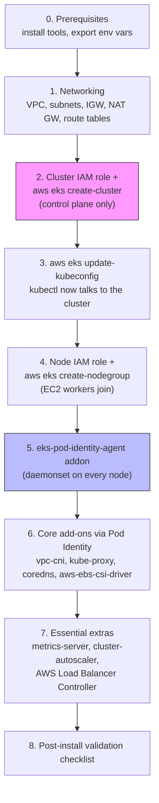
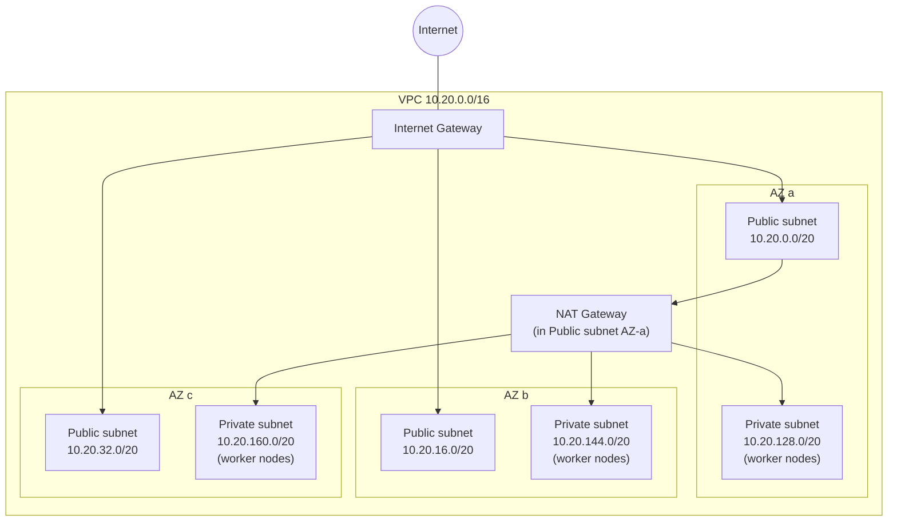
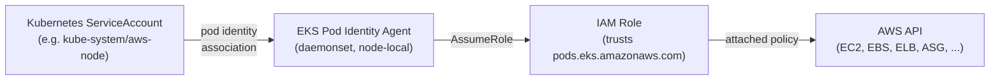

# EKS Cluster Installation Guide — Plain AWS CLI

This is a from-scratch, **raw AWS CLI** build of a single EKS cluster — no `eksctl`, no Terraform. Every VPC resource, IAM role, and cluster component is created with an explicit `aws` command so you can see exactly what EKS needs under the hood. If you want the multi-region, Terraform + GitOps version of this platform, see [`../eks-setup-from-scratch/docs/installation-guide.md`](../../eks-setup-from-scratch/docs/installation-guide.md) instead — this guide is the "plain" counterpart.

Scope: one VPC, one EKS cluster, one managed node group, the four core add-ons (VPC CNI, kube-proxy, CoreDNS, EBS CSI Driver) wired up via **EKS Pod Identity** (not IRSA/OIDC), plus three essential extras (metrics-server, Cluster Autoscaler, AWS Load Balancer Controller).

Follow the sections in order — later steps assume resources (VPC, cluster, node group) from earlier steps already exist.

## Architecture at a glance



Two things worth calling out before you start:

- **Pod Identity instead of IRSA.** Every add-on/controller here (`vpc-cni`, `aws-ebs-csi-driver`, cluster-autoscaler, the ALB controller) gets its AWS permissions through an **EKS Pod Identity association**, not the older IAM-Roles-for-Service-Accounts (OIDC) pattern. This means you do **not** need to create or associate an OIDC identity provider for this cluster at all — one less moving part than most EKS tutorials assume.
- **Managed node group, not self-managed EC2/ASG.** "Raw CLI" here means raw calls to the EKS/EC2/IAM APIs, not hand-rolling launch templates and Auto Scaling Groups yourself — `aws eks create-nodegroup` still uses a single command but every input (role, subnets, sizing) is explicit.

## 0. Prerequisites

### Tools

| Tool | Minimum version | Why |
|---|---|---|
| [AWS CLI](https://docs.aws.amazon.com/cli/latest/userguide/getting-started-install.html) | v2.15+ | `aws eks create-pod-identity-association` and `AL2023` node AMI types require a recent v2 build |
| [kubectl](https://kubernetes.io/docs/tasks/tools/) | matching your cluster's k8s version | |
| [jq](https://jqlang.github.io/jq/download/) | any recent | parsing CLI JSON output into shell variables throughout this guide |
| [helm](https://helm.sh/docs/intro/install/) | 3.x | used only for the AWS Load Balancer Controller install in step 7 |
| `curl` | — | downloading the ALB controller's IAM policy and CRDs |

### AWS account

- An IAM principal with permissions to create VPCs/subnets/route tables/NAT gateways, IAM roles/policies, EKS clusters/nodegroups/addons/pod-identity-associations, and EC2 instances. `AdministratorAccess` is the pragmatic starting point for a first build.
- Enough EIP quota for at least one NAT Gateway (default account quota is 5, this guide uses 1).

### Export environment variables

Every command below references these — export them once per shell session:

```bash
export AWS_REGION=us-east-1
export CLUSTER_NAME=plain-eks-cluster
export ACCOUNT_ID=$(aws sts get-caller-identity --query Account --output text)

# Confirm the k8s version you pick is still supported before hardcoding it:
aws eks describe-addon-versions --kubernetes-version 1.32 --query 'addons[0].addonName' >/dev/null \
  && echo "1.32 is queryable" || echo "check https://docs.aws.amazon.com/eks/latest/userguide/kubernetes-versions.html for current supported versions"
export K8S_VERSION=1.32

export VPC_CIDR=10.20.0.0/16
mkdir -p ~/eks-plainsetup-tmp && cd ~/eks-plainsetup-tmp   # scratch dir for policy JSON files this guide writes
```

## 1. Networking



One NAT Gateway keeps this cheap for a lab/dev build; for production HA, create one NAT Gateway per AZ and point each private route table at the NAT in its own AZ.

```bash
# --- VPC + IGW ---
VPC_ID=$(aws ec2 create-vpc --cidr-block $VPC_CIDR \
  --tag-specifications "ResourceType=vpc,Tags=[{Key=Name,Value=${CLUSTER_NAME}-vpc}]" \
  --query 'Vpc.VpcId' --output text)
aws ec2 modify-vpc-attribute --vpc-id $VPC_ID --enable-dns-hostnames
aws ec2 modify-vpc-attribute --vpc-id $VPC_ID --enable-dns-support

IGW_ID=$(aws ec2 create-internet-gateway \
  --tag-specifications "ResourceType=internet-gateway,Tags=[{Key=Name,Value=${CLUSTER_NAME}-igw}]" \
  --query 'InternetGateway.InternetGatewayId' --output text)
aws ec2 attach-internet-gateway --vpc-id $VPC_ID --internet-gateway-id $IGW_ID

# --- 3 AZs for this region ---
AZS=($(aws ec2 describe-availability-zones --filters Name=region-name,Values=$AWS_REGION \
  --query 'AvailabilityZones[0:3].ZoneName' --output text))

# --- Public + private subnets, one pair per AZ ---
PUBLIC_CIDRS=(10.20.0.0/20 10.20.16.0/20 10.20.32.0/20)
PRIVATE_CIDRS=(10.20.128.0/20 10.20.144.0/20 10.20.160.0/20)
PUBLIC_SUBNET_IDS=(); PRIVATE_SUBNET_IDS=()

for i in 0 1 2; do
  PUB_ID=$(aws ec2 create-subnet --vpc-id $VPC_ID --cidr-block ${PUBLIC_CIDRS[$i]} \
    --availability-zone ${AZS[$i]} \
    --tag-specifications "ResourceType=subnet,Tags=[{Key=Name,Value=${CLUSTER_NAME}-public-${AZS[$i]}},{Key=kubernetes.io/cluster/${CLUSTER_NAME},Value=shared},{Key=kubernetes.io/role/elb,Value=1}]" \
    --query 'Subnet.SubnetId' --output text)
  aws ec2 modify-subnet-attribute --subnet-id $PUB_ID --map-public-ip-on-launch
  PUBLIC_SUBNET_IDS+=($PUB_ID)

  PRIV_ID=$(aws ec2 create-subnet --vpc-id $VPC_ID --cidr-block ${PRIVATE_CIDRS[$i]} \
    --availability-zone ${AZS[$i]} \
    --tag-specifications "ResourceType=subnet,Tags=[{Key=Name,Value=${CLUSTER_NAME}-private-${AZS[$i]}},{Key=kubernetes.io/cluster/${CLUSTER_NAME},Value=shared},{Key=kubernetes.io/role/internal-elb,Value=1}]" \
    --query 'Subnet.SubnetId' --output text)
  PRIVATE_SUBNET_IDS+=($PRIV_ID)
done
echo "Public subnets:  ${PUBLIC_SUBNET_IDS[@]}"
echo "Private subnets: ${PRIVATE_SUBNET_IDS[@]}"

# --- NAT Gateway (single, in the first public subnet) ---
EIP_ALLOC=$(aws ec2 allocate-address --domain vpc --query 'AllocationId' --output text)
NAT_GW_ID=$(aws ec2 create-nat-gateway --subnet-id ${PUBLIC_SUBNET_IDS[0]} --allocation-id $EIP_ALLOC \
  --tag-specifications "ResourceType=natgateway,Tags=[{Key=Name,Value=${CLUSTER_NAME}-natgw}]" \
  --query 'NatGateway.NatGatewayId' --output text)
aws ec2 wait nat-gateway-available --nat-gateway-ids $NAT_GW_ID

# --- Route tables ---
PUB_RT_ID=$(aws ec2 create-route-table --vpc-id $VPC_ID \
  --tag-specifications "ResourceType=route-table,Tags=[{Key=Name,Value=${CLUSTER_NAME}-public-rt}]" \
  --query 'RouteTable.RouteTableId' --output text)
aws ec2 create-route --route-table-id $PUB_RT_ID --destination-cidr-block 0.0.0.0/0 --gateway-id $IGW_ID >/dev/null
for s in "${PUBLIC_SUBNET_IDS[@]}"; do aws ec2 associate-route-table --subnet-id $s --route-table-id $PUB_RT_ID >/dev/null; done

PRIV_RT_ID=$(aws ec2 create-route-table --vpc-id $VPC_ID \
  --tag-specifications "ResourceType=route-table,Tags=[{Key=Name,Value=${CLUSTER_NAME}-private-rt}]" \
  --query 'RouteTable.RouteTableId' --output text)
aws ec2 create-route --route-table-id $PRIV_RT_ID --destination-cidr-block 0.0.0.0/0 --nat-gateway-id $NAT_GW_ID >/dev/null
for s in "${PRIVATE_SUBNET_IDS[@]}"; do aws ec2 associate-route-table --subnet-id $s --route-table-id $PRIV_RT_ID >/dev/null; done
```

Save the subnet IDs — you'll pass both lists to `create-cluster` and the private list alone to `create-nodegroup`.

## 2. Cluster IAM role + create the EKS control plane

```bash
cat > cluster-trust-policy.json <<'EOF'
{
  "Version": "2012-10-17",
  "Statement": [{
    "Effect": "Allow",
    "Principal": { "Service": "eks.amazonaws.com" },
    "Action": "sts:AssumeRole"
  }]
}
EOF

aws iam create-role --role-name ${CLUSTER_NAME}-cluster-role \
  --assume-role-policy-document file://cluster-trust-policy.json
aws iam attach-role-policy --role-name ${CLUSTER_NAME}-cluster-role \
  --policy-arn arn:aws:iam::aws:policy/AmazonEKSClusterPolicy
CLUSTER_ROLE_ARN=$(aws iam get-role --role-name ${CLUSTER_NAME}-cluster-role --query 'Role.Arn' --output text)

ALL_SUBNETS="${PUBLIC_SUBNET_IDS[@]} ${PRIVATE_SUBNET_IDS[@]}"
aws eks create-cluster \
  --name $CLUSTER_NAME \
  --kubernetes-version $K8S_VERSION \
  --role-arn $CLUSTER_ROLE_ARN \
  --resources-vpc-config subnetIds=$(IFS=,; echo "${ALL_SUBNETS// /,}"),endpointPublicAccess=true,endpointPrivateAccess=true \
  --tags Name=$CLUSTER_NAME

aws eks wait cluster-active --name $CLUSTER_NAME   # takes ~10 minutes
```

## 3. Configure kubectl

```bash
aws eks update-kubeconfig --name $CLUSTER_NAME --region $AWS_REGION
kubectl get svc   # should return the default `kubernetes` service — confirms auth + connectivity
```

## 4. Node IAM role + managed node group

```bash
cat > node-trust-policy.json <<'EOF'
{
  "Version": "2012-10-17",
  "Statement": [{
    "Effect": "Allow",
    "Principal": { "Service": "ec2.amazonaws.com" },
    "Action": "sts:AssumeRole"
  }]
}
EOF

aws iam create-role --role-name ${CLUSTER_NAME}-node-role \
  --assume-role-policy-document file://node-trust-policy.json
for POLICY in AmazonEKSWorkerNodePolicy AmazonEC2ContainerRegistryReadOnly AmazonSSMManagedInstanceCore; do
  aws iam attach-role-policy --role-name ${CLUSTER_NAME}-node-role \
    --policy-arn arn:aws:iam::aws:policy/$POLICY
done
NODE_ROLE_ARN=$(aws iam get-role --role-name ${CLUSTER_NAME}-node-role --query 'Role.Arn' --output text)
```

Note `AmazonEKS_CNI_Policy` is deliberately **not** attached here — the VPC CNI gets its AWS permissions via Pod Identity in step 6 instead, so the node role stays minimal. `AmazonSSMManagedInstanceCore` gives you Session Manager shell access to nodes without opening SSH.

```bash
PRIVATE_SUBNETS_CSV=$(IFS=,; echo "${PRIVATE_SUBNET_IDS[*]}")

aws eks create-nodegroup \
  --cluster-name $CLUSTER_NAME \
  --nodegroup-name core-ng \
  --node-role $NODE_ROLE_ARN \
  --subnets $PRIVATE_SUBNET_IDS \
  --instance-types t3.medium \
  --ami-type AL2023_x86_64_STANDARD \
  --disk-size 30 \
  --scaling-config minSize=2,maxSize=6,desiredSize=2 \
  --labels role=core

aws eks wait nodegroup-active --cluster-name $CLUSTER_NAME --nodegroup-name core-ng   # ~3-5 minutes

kubectl get nodes -o wide   # 2 nodes, Ready
```

## 5. EKS Pod Identity: how add-ons get AWS permissions



Unlike IRSA, this needs **no OIDC provider** on the cluster — the association is a direct API call (`create-pod-identity-association`) linking a namespace/service-account pair to an IAM role. Install the agent first; every add-on below depends on it.

```bash
aws eks create-addon --cluster-name $CLUSTER_NAME --addon-name eks-pod-identity-agent
aws eks wait addon-active --cluster-name $CLUSTER_NAME --addon-name eks-pod-identity-agent
kubectl get daemonset -n kube-system eks-pod-identity-agent
```

## 6. Core add-ons

Each of these already runs self-managed (unmanaged) on the cluster since `create-cluster`/`create-nodegroup`, except CoreDNS/EBS CSI which need nodes to schedule on. `--resolve-conflicts OVERWRITE` converts the existing self-managed workload into an EKS-managed add-on in place.

### 6a. VPC CNI (via Pod Identity)

```bash
cat > pod-identity-trust-policy.json <<'EOF'
{
  "Version": "2012-10-17",
  "Statement": [{
    "Effect": "Allow",
    "Principal": { "Service": "pods.eks.amazonaws.com" },
    "Action": ["sts:AssumeRole", "sts:TagSession"]
  }]
}
EOF

aws iam create-role --role-name ${CLUSTER_NAME}-vpc-cni-role \
  --assume-role-policy-document file://pod-identity-trust-policy.json
aws iam attach-role-policy --role-name ${CLUSTER_NAME}-vpc-cni-role \
  --policy-arn arn:aws:iam::aws:policy/AmazonEKS_CNI_Policy
VPC_CNI_ROLE_ARN=$(aws iam get-role --role-name ${CLUSTER_NAME}-vpc-cni-role --query 'Role.Arn' --output text)

aws eks create-pod-identity-association --cluster-name $CLUSTER_NAME \
  --namespace kube-system --service-account aws-node --role-arn $VPC_CNI_ROLE_ARN

aws eks create-addon --cluster-name $CLUSTER_NAME --addon-name vpc-cni --resolve-conflicts OVERWRITE
aws eks wait addon-active --cluster-name $CLUSTER_NAME --addon-name vpc-cni
```

### 6b. kube-proxy and CoreDNS (no IAM needed)

```bash
aws eks create-addon --cluster-name $CLUSTER_NAME --addon-name kube-proxy --resolve-conflicts OVERWRITE
aws eks create-addon --cluster-name $CLUSTER_NAME --addon-name coredns --resolve-conflicts OVERWRITE
aws eks wait addon-active --cluster-name $CLUSTER_NAME --addon-name kube-proxy
aws eks wait addon-active --cluster-name $CLUSTER_NAME --addon-name coredns
```

### 6c. EBS CSI Driver (via Pod Identity)

```bash
aws iam create-role --role-name ${CLUSTER_NAME}-ebs-csi-role \
  --assume-role-policy-document file://pod-identity-trust-policy.json
aws iam attach-role-policy --role-name ${CLUSTER_NAME}-ebs-csi-role \
  --policy-arn arn:aws:iam::aws:policy/service-role/AmazonEBSCSIDriverPolicy
EBS_CSI_ROLE_ARN=$(aws iam get-role --role-name ${CLUSTER_NAME}-ebs-csi-role --query 'Role.Arn' --output text)

aws eks create-pod-identity-association --cluster-name $CLUSTER_NAME \
  --namespace kube-system --service-account ebs-csi-controller-sa --role-arn $EBS_CSI_ROLE_ARN

aws eks create-addon --cluster-name $CLUSTER_NAME --addon-name aws-ebs-csi-driver --resolve-conflicts OVERWRITE
aws eks wait addon-active --cluster-name $CLUSTER_NAME --addon-name aws-ebs-csi-driver
```

### Verify all four

```bash
aws eks list-addons --cluster-name $CLUSTER_NAME --output table
kubectl get pods -n kube-system   # aws-node, kube-proxy, coredns, ebs-csi-controller/-node all Running
```

## 7. Essential extras

### 7a. metrics-server

No IAM needed — it only talks to the kubelet API inside the cluster.

```bash
kubectl apply -f https://github.com/kubernetes-sigs/metrics-server/releases/latest/download/components.yaml
kubectl wait --for=condition=available --timeout=120s deployment/metrics-server -n kube-system
```

### 7b. Cluster Autoscaler (via Pod Identity)

```bash
cat > cluster-autoscaler-policy.json <<EOF
{
  "Version": "2012-10-17",
  "Statement": [{
    "Effect": "Allow",
    "Action": [
      "autoscaling:DescribeAutoScalingGroups",
      "autoscaling:DescribeAutoScalingInstances",
      "autoscaling:DescribeLaunchConfigurations",
      "autoscaling:DescribeScalingActivities",
      "autoscaling:DescribeTags",
      "autoscaling:SetDesiredCapacity",
      "autoscaling:TerminateInstanceInAutoScalingGroup",
      "ec2:DescribeInstanceTypes",
      "ec2:DescribeLaunchTemplateVersions",
      "eks:DescribeNodegroup"
    ],
    "Resource": "*"
  }]
}
EOF

aws iam create-policy --policy-name ${CLUSTER_NAME}-cluster-autoscaler-policy \
  --policy-document file://cluster-autoscaler-policy.json
aws iam create-role --role-name ${CLUSTER_NAME}-cluster-autoscaler-role \
  --assume-role-policy-document file://pod-identity-trust-policy.json
aws iam attach-role-policy --role-name ${CLUSTER_NAME}-cluster-autoscaler-role \
  --policy-arn arn:aws:iam::${ACCOUNT_ID}:policy/${CLUSTER_NAME}-cluster-autoscaler-policy
CA_ROLE_ARN=$(aws iam get-role --role-name ${CLUSTER_NAME}-cluster-autoscaler-role --query 'Role.Arn' --output text)

kubectl create namespace cluster-autoscaler
kubectl create serviceaccount cluster-autoscaler -n cluster-autoscaler

aws eks create-pod-identity-association --cluster-name $CLUSTER_NAME \
  --namespace cluster-autoscaler --service-account cluster-autoscaler --role-arn $CA_ROLE_ARN

kubectl apply -n cluster-autoscaler -f https://raw.githubusercontent.com/kubernetes/autoscaler/master/cluster-autoscaler/cloudprovider/aws/examples/cluster-autoscaler-autodiscover.yaml
kubectl -n cluster-autoscaler set image deployment/cluster-autoscaler \
  cluster-autoscaler=registry.k8s.io/autoscaling/cluster-autoscaler:v1.32.0
kubectl -n cluster-autoscaler patch deployment cluster-autoscaler \
  --patch '{"spec":{"template":{"spec":{"containers":[{"name":"cluster-autoscaler","command":["./cluster-autoscaler","--cloud-provider=aws","--balance-similar-node-groups","--skip-nodes-with-system-pods=false","--node-group-auto-discovery=asg:tag=k8s.io/cluster-autoscaler/enabled,k8s.io/cluster-autoscaler/'$CLUSTER_NAME'"]}]}}}}'
```

The `k8s.io/cluster-autoscaler/enabled` and `k8s.io/cluster-autoscaler/<cluster-name>` tags need to exist on the node group's underlying Auto Scaling Group — EKS managed node groups add these automatically, so no extra tagging step is required here.

### 7c. AWS Load Balancer Controller (via Pod Identity)

```bash
curl -o alb-iam-policy.json https://raw.githubusercontent.com/kubernetes-sigs/aws-load-balancer-controller/v2.9.2/docs/install/iam_policy.json
aws iam create-policy --policy-name ${CLUSTER_NAME}-alb-controller-policy --policy-document file://alb-iam-policy.json
aws iam create-role --role-name ${CLUSTER_NAME}-alb-controller-role \
  --assume-role-policy-document file://pod-identity-trust-policy.json
aws iam attach-role-policy --role-name ${CLUSTER_NAME}-alb-controller-role \
  --policy-arn arn:aws:iam::${ACCOUNT_ID}:policy/${CLUSTER_NAME}-alb-controller-policy
ALB_ROLE_ARN=$(aws iam get-role --role-name ${CLUSTER_NAME}-alb-controller-role --query 'Role.Arn' --output text)

kubectl create serviceaccount aws-load-balancer-controller -n kube-system

aws eks create-pod-identity-association --cluster-name $CLUSTER_NAME \
  --namespace kube-system --service-account aws-load-balancer-controller --role-arn $ALB_ROLE_ARN

kubectl apply -k "github.com/aws/eks-charts/stable/aws-load-balancer-controller/crds?ref=master"

helm repo add eks https://aws.github.io/eks-charts
helm repo update
helm install aws-load-balancer-controller eks/aws-load-balancer-controller \
  -n kube-system \
  --set clusterName=$CLUSTER_NAME \
  --set serviceAccount.create=false \
  --set serviceAccount.name=aws-load-balancer-controller \
  --set region=$AWS_REGION \
  --set vpcId=$VPC_ID

kubectl -n kube-system rollout status deployment/aws-load-balancer-controller
```

## 8. Post-installation validation checklist

```bash
# --- Cluster & nodes ---
kubectl get nodes -o wide                          # [ ] 2 nodes, STATUS=Ready
kubectl cluster-info                                # [ ] control plane + CoreDNS URLs resolve

# --- Add-ons ---
aws eks list-addons --cluster-name $CLUSTER_NAME --output table            # [ ] all 5 addons listed
aws eks describe-addon --cluster-name $CLUSTER_NAME --addon-name vpc-cni \
  --query 'addon.status'                            # [ ] "ACTIVE" (repeat for kube-proxy, coredns, aws-ebs-csi-driver, eks-pod-identity-agent)
kubectl get pods -n kube-system                     # [ ] aws-node, kube-proxy, coredns x2, ebs-csi-controller x2, ebs-csi-node, eks-pod-identity-agent all Running

# --- Pod Identity wiring ---
aws eks list-pod-identity-associations --cluster-name $CLUSTER_NAME --output table   # [ ] 4 associations (aws-node, ebs-csi-controller-sa, cluster-autoscaler, aws-load-balancer-controller)

# --- metrics-server ---
kubectl top nodes                                   # [ ] returns CPU/memory, not an error
kubectl top pods -A

# --- EBS CSI: dynamic PVC provisioning actually works ---
cat <<'EOF' | kubectl apply -f -
apiVersion: v1
kind: PersistentVolumeClaim
metadata:
  name: ebs-test-claim
spec:
  accessModes: ["ReadWriteOnce"]
  storageClassName: gp2
  resources:
    requests:
      storage: 1Gi
EOF
kubectl get pvc ebs-test-claim -w                   # [ ] STATUS becomes Bound within ~30s
kubectl delete pvc ebs-test-claim

# --- Cluster Autoscaler ---
kubectl -n cluster-autoscaler get pods              # [ ] cluster-autoscaler pod Running
kubectl -n cluster-autoscaler logs deploy/cluster-autoscaler | tail -20   # [ ] no AWS auth errors (AccessDenied means the pod identity association didn't take)

# --- AWS Load Balancer Controller ---
kubectl -n kube-system get pods -l app.kubernetes.io/name=aws-load-balancer-controller   # [ ] 2 replicas Running
kubectl -n kube-system logs deploy/aws-load-balancer-controller | tail -20               # [ ] no AccessDenied errors

# --- End-to-end: a real Service of type LoadBalancer actually provisions an ALB/NLB ---
kubectl create deployment hello --image=nginx
kubectl expose deployment hello --port=80 --type=LoadBalancer \
  --overrides '{"metadata":{"annotations":{"service.beta.kubernetes.io/aws-load-balancer-type":"nlb"}}}'
kubectl get svc hello -w                             # [ ] EXTERNAL-IP populates within ~2 minutes
curl -sf http://$(kubectl get svc hello -o jsonpath='{.status.loadBalancer.ingress[0].hostname}')   # [ ] returns nginx welcome page
kubectl delete svc hello deployment hello            # clean up the smoke test
```

## Troubleshooting

| Symptom | Likely cause | Where to look |
|---|---|---|
| `create-nodegroup` fails immediately | Node role missing a required managed policy, or subnets don't have enough free IPs | `aws eks describe-nodegroup ... --query 'nodegroup.health'` |
| Nodes join but stay `NotReady` | VPC CNI pods (`aws-node`) crashlooping — usually the Pod Identity association for `kube-system/aws-node` wasn't created before the addon | `kubectl -n kube-system logs ds/aws-node`; re-check `aws eks list-pod-identity-associations` |
| `AccessDenied` in cluster-autoscaler or ALB controller logs | Pod Identity association points at the wrong service account name/namespace, or the IAM policy wasn't attached before the pod started | Confirm `kubectl get sa <name> -n <namespace>` exists and matches the association exactly; restart the pod after fixing (`kubectl delete pod ...`) — credentials are fetched at pod start |
| PVC stuck `Pending` | `aws-ebs-csi-driver` addon not `ACTIVE`, or its Pod Identity association missing | `kubectl -n kube-system get pods -l app=ebs-csi-controller`, `kubectl describe pvc <name>` |
| `Service type=LoadBalancer` never gets an `EXTERNAL-IP` | ALB controller not running, or subnets missing the `kubernetes.io/role/elb` / `internal-elb` tags from step 1 | `kubectl -n kube-system logs deploy/aws-load-balancer-controller`; re-check subnet tags with `aws ec2 describe-subnets` |
| `aws eks create-addon --resolve-conflicts OVERWRITE` still errors on conflict | A previous manual edit to the self-managed manifest changed a field EKS won't silently overwrite | Retry with `--resolve-conflicts OVERWRITE` (not `NONE`); as a last resort delete the conflicting resource and let the addon recreate it |

## Tearing everything down

Destroy in **reverse** order — the ALB controller and cluster-autoscaler must go before the node group (they run pods that hold AWS resources like ALBs), and the NAT Gateway/EIP must go before the VPC will delete cleanly.

```bash
helm uninstall aws-load-balancer-controller -n kube-system
kubectl delete namespace cluster-autoscaler
kubectl delete -f https://github.com/kubernetes-sigs/metrics-server/releases/latest/download/components.yaml

for ASSOC_ID in $(aws eks list-pod-identity-associations --cluster-name $CLUSTER_NAME --query 'associations[].associationId' --output text); do
  aws eks delete-pod-identity-association --cluster-name $CLUSTER_NAME --association-id $ASSOC_ID
done

aws eks delete-nodegroup --cluster-name $CLUSTER_NAME --nodegroup-name core-ng
aws eks wait nodegroup-deleted --cluster-name $CLUSTER_NAME --nodegroup-name core-ng

aws eks delete-cluster --name $CLUSTER_NAME
aws eks wait cluster-deleted --name $CLUSTER_NAME

for ROLE in cluster-role node-role vpc-cni-role ebs-csi-role cluster-autoscaler-role alb-controller-role; do
  ROLE_NAME=${CLUSTER_NAME}-${ROLE}
  for POLICY_ARN in $(aws iam list-attached-role-policies --role-name $ROLE_NAME --query 'AttachedPolicies[].PolicyArn' --output text 2>/dev/null); do
    aws iam detach-role-policy --role-name $ROLE_NAME --policy-arn $POLICY_ARN
  done
  aws iam delete-role --role-name $ROLE_NAME 2>/dev/null
done
aws iam delete-policy --policy-arn arn:aws:iam::${ACCOUNT_ID}:policy/${CLUSTER_NAME}-cluster-autoscaler-policy
aws iam delete-policy --policy-arn arn:aws:iam::${ACCOUNT_ID}:policy/${CLUSTER_NAME}-alb-controller-policy

aws ec2 delete-nat-gateway --nat-gateway-id $NAT_GW_ID
aws ec2 wait nat-gateway-deleted --nat-gateway-ids $NAT_GW_ID
aws ec2 release-address --allocation-id $EIP_ALLOC

for s in "${PUBLIC_SUBNET_IDS[@]}" "${PRIVATE_SUBNET_IDS[@]}"; do aws ec2 delete-subnet --subnet-id $s; done
aws ec2 delete-route-table --route-table-id $PUB_RT_ID
aws ec2 delete-route-table --route-table-id $PRIV_RT_ID
aws ec2 detach-internet-gateway --vpc-id $VPC_ID --internet-gateway-id $IGW_ID
aws ec2 delete-internet-gateway --internet-gateway-id $IGW_ID
aws ec2 delete-vpc --vpc-id $VPC_ID
```

NAT Gateway deletion takes a few minutes — the EIP release and VPC delete will fail with a dependency error if you race ahead of `nat-gateway-deleted`.
