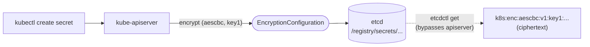
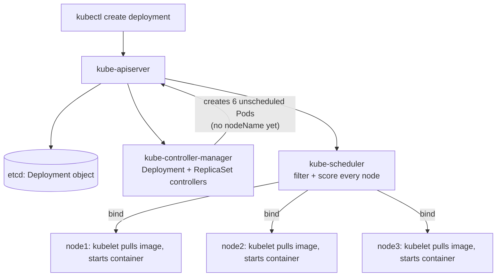
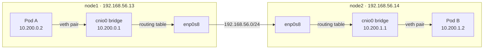
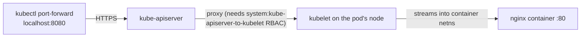
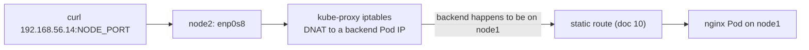
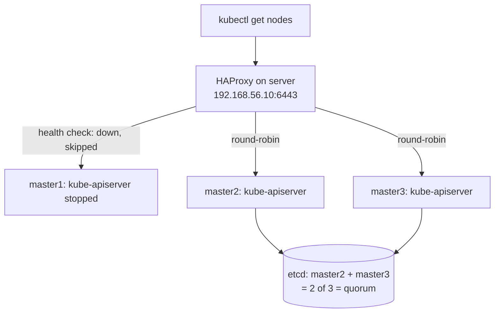

# 12 — Smoke Test

Run from your **client machine** unless noted. This exercises every layer
built in this guide: secrets encryption, scheduling across all 3 workers,
cross-node pod networking, kubelet log/exec APIs, and Services.

## 1. Data encryption at rest

```bash
kubectl create secret generic kubernetes-the-hard-way \
  --from-literal="mykey=mydata"
```

**Run on:** any one of `master1`/`master2`/`master3`. Read the raw etcd
value and confirm it's encrypted (`k8s:enc:aescbc:v1:key1` prefix, not
plaintext `mydata`):

```bash
sudo ETCDCTL_API=3 etcdctl get /registry/secrets/default/kubernetes-the-hard-way \
  --endpoints=https://127.0.0.1:2379 \
  --cacert=/etc/etcd/ca.pem \
  --cert=/etc/etcd/kubernetes.pem \
  --key=/etc/etcd/kubernetes-key.pem \
  | hexdump -C | head
```

### What's actually happening



`kube-apiserver` intercepts every write to a resource type listed in
`encryption-config.yaml` (doc 04) — `secrets`, here — and runs it through
the configured provider chain before persisting to etcd. `aescbc` is
first in that chain, so it's what gets used for writes (`identity` only
matters for reading old, pre-encryption data during a rotation). etcd
itself has no idea encryption is happening — it just stores whatever
bytes it's given, which is exactly why reading directly via `etcdctl`
shows raw ciphertext: that path never goes through `kube-apiserver`'s
decrypt-on-read step. `kubectl get secret` *would* show plaintext, since
that request round-trips through the apiserver.

## 2. Deployments schedule across all workers

```bash
kubectl create deployment nginx --image=nginx --replicas=6
kubectl rollout status deployment/nginx
kubectl get pods -o wide
```

Confirm the `NODE` column shows a spread across `node1`, `node2`, and
`node3` — not all landing on one node (the default scheduler spreads by
resource fit, so with 6 replicas and 3 idle nodes you should see roughly
2 per node).

### What's actually happening



`kubectl create deployment` only ever creates one object — the
`kube-controller-manager` process does the rest, in two steps that are
easy to conflate: the Deployment controller creates a ReplicaSet, and the
ReplicaSet controller creates the actual Pod objects to match
`--replicas`. Every one of those 6 Pods starts with an empty `.spec.nodeName`
— `kube-scheduler` is a separate watch loop that only cares about Pods in
that state, runs its filter/score algorithm against `node1-3`, and writes
the winning node's name back via a `Binding` (an actual API write, not
just an in-memory decision). Only once that `nodeName` is set does the
matching node's `kubelet` even notice the Pod exists and start pulling
`nginx` — nothing schedules until `kube-scheduler` says so, and nothing
on the node moves until `kubelet` sees itself named.

## 3. Cross-node pod networking

Pick two pod IPs from step 2 that landed on **different** nodes (from the
`kubectl get pods -o wide` output), then, from inside one pod, curl the
other:

```bash
POD_A=$(kubectl get pods -l app=nginx -o jsonpath='{.items[0].metadata.name}')
POD_B_IP=$(kubectl get pods -l app=nginx -o jsonpath='{.items[1].status.podIP}')
kubectl exec ${POD_A} -- curl -s -o /dev/null -w "%{http_code}\n" http://${POD_B_IP}
```

Expect `200`. A timeout here almost always means a missing route from
[10 — Pod Network Routes](10-pod-network-routes.md).

### What's actually happening on the wire



Pod A's network namespace has one interface: one end of a **veth
pair** (a virtual point-to-point cable). The other end is plugged into
`cnio0`, the Linux bridge the `bridge` CNI plugin created (doc 08 §5) —
every pod's veth-host-end is a port on it. Since `10.200.1.2` isn't a
local bridge port, the bridge hands the packet to the host's own kernel,
whose **routing table** matches the static route from doc 10
(`10.200.1.0/24 via 192.168.56.14`) and sends it out `enp0s8` — with
`ipMasq: true` from the CNI config, SNAT'd to `node1`'s own IP as it
leaves, which is also why the return path needs no special handling on
`node2`.

It crosses the plain host-only network — no overlay, no encapsulation,
just a real L3 hop, which is the entire reason doc 10's routes have to
exist by hand here. `node2`'s routing table sees `10.200.1.0/24` as a
directly-connected bridge subnet (a *delivery* decision, not the
*forwarding* decision `node1` made) and hands it to `cnio0`, which ARPs
for `10.200.1.2` and delivers across Pod B's veth pair into its
namespace.

That asymmetry — forwarding decision on the source node, delivery
decision on the destination node — is exactly what an overlay CNI like
Cilium's VXLAN ([13 — Migrating to Cilium](13-migrating-to-cilium.md))
collapses into a single tunnel decision, which is why that migration
deletes doc 10 entirely.

## 4. Port forwarding

```bash
POD_NAME=$(kubectl get pods -l app=nginx -o jsonpath='{.items[0].metadata.name}')
kubectl port-forward ${POD_NAME} 8080:80 &
sleep 2
curl -s http://127.0.0.1:8080 | head -5
kill %1
```

### What's actually happening



Unlike a raw SSH tunnel, `kubectl port-forward` never connects to the
node directly — the whole stream tunnels *through* `kube-apiserver`,
which proxies it on to whichever node's `kubelet` actually owns the pod.
That's the same apiserver-to-kubelet path (and the same
`system:kube-apiserver-to-kubelet` ClusterRole from
[06 §7](06-bootstrapping-control-plane.md#7-rbac-allow-kube-apiserver-to-talk-to-kubelets))
that `logs` and `exec` use next — which is exactly why all three (§4-6)
fail together if that RBAC binding is missing, and why the doc groups
them under one troubleshooting note instead of three.

## 5. Logs

```bash
kubectl logs ${POD_NAME}
```

## 6. Exec

```bash
kubectl exec -ti ${POD_NAME} -- nginx -v
```

If steps 4-6 hang or 403, re-check the RBAC binding from
[06 — Bootstrapping the Control Plane §7](06-bootstrapping-control-plane.md#7-rbac-allow-kube-apiserver-to-talk-to-kubelets).

## 7. Services (NodePort)

```bash
kubectl expose deployment nginx --port 80 --type NodePort
NODE_PORT=$(kubectl get svc nginx -o jsonpath='{.spec.ports[0].nodePort}')
curl -s -o /dev/null -w "%{http_code}\n" http://192.168.56.13:${NODE_PORT}
curl -s -o /dev/null -w "%{http_code}\n" http://192.168.56.14:${NODE_PORT}
curl -s -o /dev/null -w "%{http_code}\n" http://192.168.56.15:${NODE_PORT}
```

Expect `200` from all three node IPs regardless of which node actually
hosts a given nginx pod — that's `kube-proxy`'s iptables rules routing
NodePort traffic to the right backend cluster-wide.

### What's actually happening



Every one of `node1-3` runs `kube-proxy`, and every one of them
programs the *same* NodePort rule — so it doesn't matter which node's IP
you curl, all three DNAT to whichever Pod(s) actually back the Service.
If the request lands on a node with no local backend (as drawn above:
you curled `node2`, but the Pod is on `node1`), the DNAT'd packet then
has to leave the node entirely and cross the pod network exactly like
[§3](#3-cross-node-pod-networking) — same veth/bridge/routing-table path,
just kicked off by a NodePort hit instead of a direct pod-to-pod curl.

## 8. Control-plane HA (optional, destructive-ish but reversible)

With 3 masters, the cluster tolerates losing any one node — both the
apiserver (via the LB) and etcd (via quorum) stay fully functional.

**Run on:** client machine — the `ssh admin@lab-master1` calls below reach
out to `master1` for you; you stay on your own shell throughout.

```bash
ssh admin@lab-master1 'sudo systemctl stop kube-apiserver'
kubectl get nodes   # should still succeed, served by master2/master3 via the LB
ssh admin@lab-master1 'sudo systemctl start kube-apiserver'
```

To specifically confirm etcd quorum survives a single-node loss (not just
the apiserver), stop etcd itself on one master and confirm writes still
work through the other two.

**Run on:** client machine (same as above — `ssh` reaches `master1` for
you).

```bash
ssh admin@lab-master1 'sudo systemctl stop etcd'
kubectl create namespace etcd-ha-test   # a write, not just a read — proves quorum held
kubectl delete namespace etcd-ha-test
ssh admin@lab-master1 'sudo systemctl start etcd'
```

### What's actually happening



Two independent mechanisms are being tested, not one — that's why the
doc has you stop `kube-apiserver` and `etcd` separately rather than
together. Stopping just `kube-apiserver` on `master1` only exercises
HAProxy's `tcp-check` (doc 07): it marks that backend down within a
health-check interval and simply stops sending it new connections, same
as [14 §2](14-ha-deep-dive.md#2-apiserver-loss-on-the-leader-holding-master-repeat-of-128-watched-live).
Stopping `etcd` on `master1` instead tests something one layer deeper —
Raft quorum. `master2` and `master3` are still 2 of the original 3
members, still a majority, so writes (`kubectl create namespace`, not
just a read) keep working with no HAProxy involvement at all in that
part of the picture. Losing a *second* member at the same time is a
different, much less forgiving scenario — that's
[14 §5](14-ha-deep-dive.md#5-the-etcd-quorum-boundary--where-ha-stops-and-dr-starts)
and [15 — Disaster Recovery](15-disaster-recovery.md), not this smoke test.

## Cleanup of smoke-test objects

```bash
kubectl delete deployment nginx
kubectl delete svc nginx
kubectl delete secret kubernetes-the-hard-way
```

If everything above passed, the cluster is fully functional end to end.

Next: [14 — High Availability Deep Dive](14-ha-deep-dive.md) to actually
explore *why* it survives what it survives, rather than just confirming
that it does. If you'd rather swap the hand-rolled CNI/kube-proxy setup
for Cilium + Hubble first, that's
[13 — Migrating to Cilium](13-migrating-to-cilium.md) — optional, and
13/14 don't depend on each other either order. [16 — Cleanup](16-cleanup.md)
is there whenever you're done experimenting, not a required next step.
